# 4.6.1 超弹性材料行为

### 4.6.1 超弹性材料行为

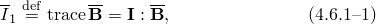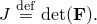**产品：** Abaqus/Standard  Abaqus/Explicit

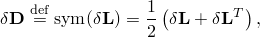超弹性材料的本构行为在"超弹性材料行为，"第4.6.1节中以各向同性响应的背景讨论。然而，许多工业和技术上感兴趣的材料由于其微观结构中存在优选方向而表现出各向异性弹性行为。这类材料的例子包括常见工程材料（如纤维增强复合材料、增强橡胶和木材）以及软生物组织（如动脉壁和心脏组织中发现的那样）。在这些材料在大变形下由于其微观结构的重新排列（如纤维方向随变形而重新取向）而表现出高度各向异性和非线性弹性行为。这些非线性效应的模拟需要在各向异性超弹性框架内制定的本构模型。
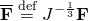
超弹性材料用"应变能势"描述，这定义了单位参考体积（初始构型中的体积）中材料存储的应变能，作为该点变形的函数。各向异性超弹性材料应变能势的表示使用两种不同的公式：基于应变的和基于不变量的。
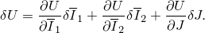### 基于应变的公式

在这种情况下应变能函数直接用合适应变张量的分量表示，如Green应变张量（见"应变测量，"第1.4.2节）：

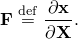其中是Green应变，是右Cauchy-Green应变张量，是变形梯度，是单位矩阵。在不丧失一般性的情况下，应变能函数可以写为形式

其中是修正Green应变张量，是右Cauchy-Green应变的畸变部分，是体积变化。

基于应变的公式模型中的基本假设是优选材料方向最初在参考（无应力）构型中与正交坐标系对齐。这些方向只有在变形后才可能变得非正交。这种应变能函数形式的例子包括广义Fung型形式（见下文"广义Fung形式"）。

从[公式4.6.3-1](04s06a125.md)，的变分给出为

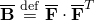使用虚功原理，应变能势的变分可以写为

（见[公式4.6.1-7](04s06a123.md)）。

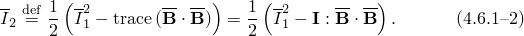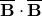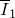对于可压缩材料，应变变分是任意的，因此此方程定义此类材料的应力分量为

和

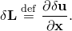

当材料响应几乎是不可压缩时，纯位移公式（其中应变不变量从有限元模型的运动学变量计算）可能表现不佳。一个困难是从数值角度来看，刚度矩阵几乎是奇异的，因为材料的有效体积模量相对于其有效剪切模量非常大，从而给离散化平衡方程的求解带来困难。类似地，在Abaqus/Explicit中，高体积模量增加了膨胀波速度，从而大大减少了稳定时间增量。为了避免这些问题，Abaqus/Standard为此类情况提供了一种"混合"公式（参考"超弹性材料行为，"第4.6.1节）。
### 基于不变量的公式

利用纤维增强复合材料的连续体理论（Spencer，[1984](07s01a01-References.md)），应变能函数可以直接用变形张量和纤维方向的不变量表示。例如，考虑由族纤维增强的各向同性超弹性矩阵组成的复合材料。参考构型中纤维的方向由一组单位向量表征（，）。假设应变能不仅依赖于变形，还依赖于纤维方向，提出以下形式：
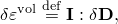
材料的应变能必须在参考构型中矩阵和纤维都经历刚体旋转时保持不变。然后，遵循Spencer（[1984](07s01a01-References.md)），应变能可以表达为张量和向量的不变量不可约标量集合的各向同性函数：
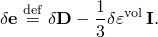
其中和是第一和第二偏应变不变量；是体积比（或第三应变不变量）；且和是、和的*伪不变量*，定义为

项是几何常数（独立于变形），等于参考构型中任意两族纤维方向之间夹角的余弦，
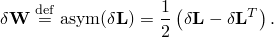

与基于应变的公式不同，在基于不变量的公式中，纤维方向在初始构型中不需要是正交的。不变量能量函数的一个例子是[Holzapfel、Gasser和Ogden（2000）](07s01a01-References.md)为动脉壁提出的形式（见下文"Holzapfel-Gasser-Ogden形式"）。
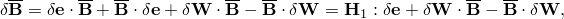
从[公式4.6.3-4](04s06a125.md)，的变分给出为
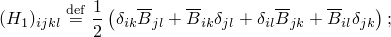

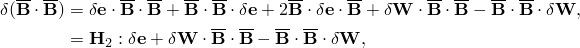
使用虚功原理（[公式4.6.3-3](04s06a125.md)）并经过一些冗长推导，发现可压缩材料的应力分量给出为
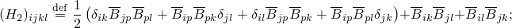
和
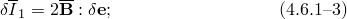
其中和。
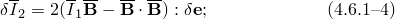### 应变能势的特定形式

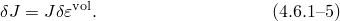Abaqus中提供了几种应变能势的特定形式。不可压缩或几乎不可压缩模型包括：

广义Fung形式和

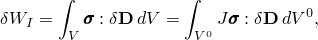Holzapfel-Gasser-Ogden形式。

此外，Abaqus提供了通过两组用户子程序支持用户定义的应变能势形式的通用能力：一组用于基于应变的公式，一组用于基于不变量的公式。
### 广义Fung形式
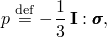
Abaqus中的广义Fung应变能势基于[Fung等（1979）](07s01a01-References.md)提出的二维指数形式，遵循[Humphrey（1995）](07s01a01-References.md)适当地推广到任意三维状态。它具有以下形式：
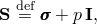
其中*U*是单位参考体积的应变能，*c*和*D*是温度依赖的材料参数，是弹性体积比，定义为
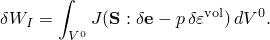
其中是各向异性材料常数的无量纲对称四阶张量，可以是温度依赖的，是修正Green应变张量的分量。

弹性体积比，，将总体积比*J*和热体积比由

给出，其中
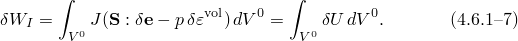
Abaqus支持广义Fung模型的两种形式：各向异性和正交各向异性。必须指定的独立分量的数量取决于材料的各向异性程度：对于完全各向异性情况为21，对于正交各向异性情况为9。
