# 4.6.2 超弹性和超泡沫常数的拟合

### 4.6.2 超弹性和超泡沫常数的拟合

**产品：** Abaqus/Standard  Abaqus/Explicit

在本节中，我们将推导将超弹性（多项式、Ogden、Arruda-Boyce和Van der Waals形式）和超泡沫常数拟合到实验测试数据所需的方程。此外，将描述使用Drucker准则检查材料稳定性的过程。

对于超弹性模型，在将超弹性常数拟合到测试数据时，假定完全不可压缩，除了体积测试。
### 多项式应变能势的应力-应变关系

超弹性多项式形式可以由Abaqus拟合到阶由于Mooney-Rivlin势对应于情况这些说明也适用于通过将更高阶系数设为零来设置。能量势如下：

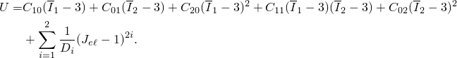

变形模式以主伸长来表征。现在为多项式形式推导名义应力-应变关系，
### 单轴模式

偏应变不变量为
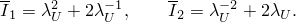
们调用虚功原理推导名义应力-应变关系，
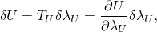
此可得
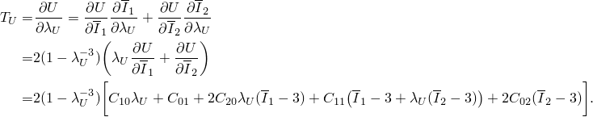

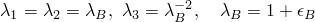### 双轴模式

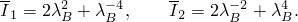偏应变不变量为

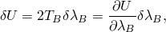虚功

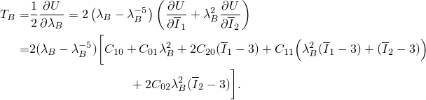此可得

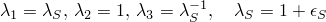
### 平面（纯剪切）模式

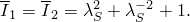
偏应变不变量为
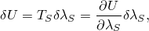
虚功
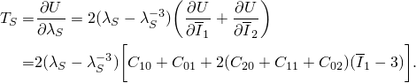
此可得
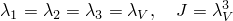

### 体积模式

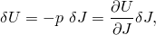

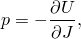从虚功

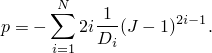此可得

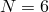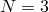

### 减缩多项式应变能势的应力-应变关系

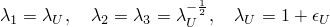超弹性减缩多项式形式可以由Abaqus拟合到阶对于减缩多项式与Yeoh模型相同，对于保留了neo-Hookean模型；因此，以下也适用于这些形式。减缩多项式能量势如下：

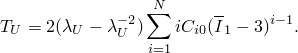循上一节中的论证，我们为减缩多项式推导名义应力-应变关系。
### 单轴模式

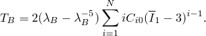

### 双轴模式

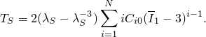

### 平面（纯剪切）模式

### 体积模式
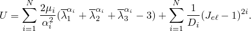

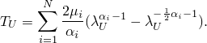### 超弹性Ogden应变能势的应力-应变关系

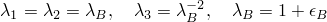超弹性Ogden形式可以拟合到阶

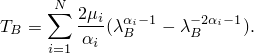循与多项式形式相同的方法，我们可以推导Ogden形式的名义应力-应变方程。
### 单轴模式

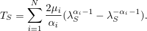

### 双轴模式

### 平面（纯剪切）模式

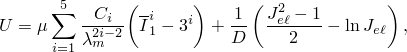

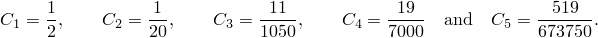
### 体积模式

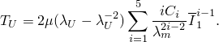

### 超弹性Arruda-Boyce应变能势的应力-应变关系

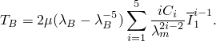超弹性Arruda-Boyce势具有以下形式：

中

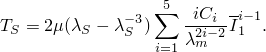循与多项式形式相同的方法，我们可以推导Arruda-Boyce势的名义应力-应变方程。
### 单轴模式

### 双轴模式

### 平面（纯剪切）模式

### 体积模式
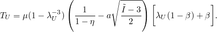

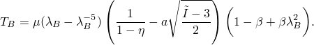### 超弹性Van der Waals能量势的应力-应变关系

超弹性Van der Waals势，也称为Kilian模型，具有以下形式：

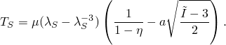中

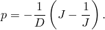遵循与多项式形式相同的方法，我们可以推导Van der Waals形式的名义应力-应变关系。
### 单轴模式

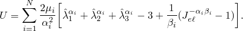
### 双轴模式
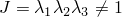

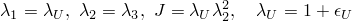

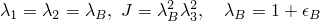### 平面（纯剪切）模式

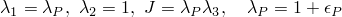

### 体积模式
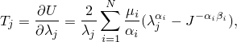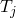

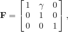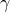### 超泡沫应变能势的应力-应变关系

超泡沫势是Hill应变能势的修正形式，可以拟合到阶

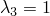

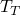变形模式以主伸长和体积比*J*来表征。弹性体泡沫是不可压缩的：横向伸长/或测试数据中独立指定为单个值，取决于横向变形或通过有效泊松比的定义。
### 单轴模式

### 双轴模式

### 平面模式
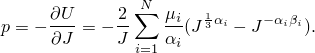

上述三种变形模式的通用名义应力-应变关系为

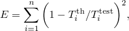中加载方向的伸长。
### 简单剪切模式

简单剪切变形用变形梯度描述，

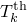中剪切应变。还要注意对于这个变形，名义剪切应力

中剪切平面中的主伸长，与剪切应变系如下：

直于剪切平面的方向的伸长为

简单剪切变形过程中产生的横向应力作为Poynting效应的结果）是

### 体积模式

体积变形描述为

力*p*通过以下关系与体积比*J*相关

### 最小二乘拟合

给定实验数据，材料常数通过最小二乘拟合程序确定，该程序最小化应力相对误差。对于*n*个名义应力-名义应变数据对，相对误差测度*E*被最小化，

中测试数据的应力值，线性的；因此，可以使用线性最小二乘程序。Ogden、Arruda-Boyce和Van der Waals势在其某些系数中是非线性的，因此需要使用非线性最小二乘程序。
### 多项式模型的线性最小二乘拟合

对于完整多项式模型，我们可以将上面推导的
中依赖于应力状态（单轴、双轴或平面）的函数，如上所述。于一阶多项式（或Mooney-Rivlin形式），于二阶多项式。为最小化相对误差，我们需要设置

导致以下一组*M*个方程：

个*M*方程的线性组可以容易地求解以定义系数

为拟合体积系数，需要求解*N*个方程组

中

用户给出。这个方程组可以容易地求解
### 减缩多项式模型的线性最小二乘拟合

对于减缩多项式模型，我们可以将上面推导的中函数次依赖于应力状态和伸长，如上所述，*N*是减缩多项式的阶数，可以取直到值。以下也适用于Yeoh和neo-Hookean形式，因为这些模型是减缩多项式的特例，别为。

遵循与完整多项式相同的论证，我们得到*N*个方程组

个方程组可以容易地求解系数体积系数使用与通用多项式模型相同的程序拟合。
### 非线性最小二乘拟合

Ogden、Arruda-Boyce和Van der Waals势在其某些系数中是非线性的；因此，需要非线性最小二乘拟合程序。我们使用[Twizell和Ogden（1986）](07s01a01-References.md)公式中的Marquard-Levenberg算法。设这些超弹性模型的系数，其中*m*是贡献偏量行为的系数数量。具体来说，对于Ogden模型，对于Arruda-Boyce模型，对于Van der Waals模型，系数通过迭代方程找到

中*r*是迭代计数，*n*是数据点数量，

相对误差向量，

相对误差向量关于系数导数。

对于获得Newton算法；对于非常小的值获得最速下降法。因此，Marquard-Levenberg算法代表了这两种方法之间的折衷：如果误差增大则增加值，否则减少。
### Ogden模型的非线性最小二乘拟合

在初始化，参数线性最小二乘拟合获得。在上述迭代程序中，使用以下导数：

中

### Arruda-Boyce模型的非线性最小二乘拟合

Arruda-Boyce模型关于剪切模量线性的，但关于锁定伸长非线性的。锁定伸长初始化为其中用户指定测试数据中的最大伸长。给定这个锁定伸长，初始剪切模量线性最小二乘拟合获得。

在上述迭代程序中，使用以下导数：

### Van der Waals模型的非线性最小二乘拟合

Van der Waals模型关于剪切模量线性的，但关于锁定伸长全局交互参数*a*和混合参数非线性的。锁定伸长初始化为其中用户指定测试数据中的最大伸长。给定锁定伸长的这个猜测，我们利用[Kilian等（1986）](07s01a01-References.md)提出的表达式来初始化全局交互参数

变量混合参数初始化为给定这些初始值，剪切模量用线性最小二乘拟合程序初始化。

在上述迭代程序中，使用以下导数：

在导数中

在平面情况下因此，失。
### Drucker稳定性检查

Abaqus检查上述三种变形模式的材料Drucker稳定性。Drucker稳定性条件要求从对数应变无穷小变化得出的Kirchhoff应力变化满足不等式

使用不等式变为

此要求切向材料刚度于材料稳定性满足是正定的。

对于这里考虑的各向同性弹性公式，不等式可以用主应力和应变表示：

### 多项式形式

对于两个超弹性模型，假定不可压缩，Kirchhoff应力等于Cauchy应力：因此

外，我们可以为静水压力选择任何值而不影响应变。对于稳定性计算，一个方便的选择是这给出我们

穷小应变变化通过以下方程与伸长率的变化相关

力来自应变能，而应变能又来自应变不变量或伸长的变化。

应力变化和应变变化之间的关系由矩阵方程描述

中

对于材料稳定性，须是正定的；因此有必要

于所有相关的。
### Ogden形式

对于Ogden形式，我们遵循与多项式形式相同的方法。使用我们有

们检查其正定性的材料刚度

### Arruda-Boyce形式

对于剪切模量锁定伸长正值，Arruda-Boyce形式始终是稳定的。因此，只需检查系数即可确定材料是否满足Drucker稳定性。
### Van der Waals形式

当Van der Waals模型在其由出的 admissible 伸长范围内使用时，其稳定性取决于全局交互参数*a*，对于初始剪切模量锁定伸长确定 admissible 伸长范围，我们需要找到方程

于每种应力状态——单轴、双轴和平面——的邻的两个正实根，使用简单的二分法。
### 超泡沫

对于单轴、双轴、平面和体积变形模式，Kirchhoff应力-应变关系为

全微分并使用

于我们不能使用不可压缩性假设，我们必须使用所有三个主应力和应变分量以及阵，

体地，

中

对于简单剪切情况，主伸长剪切应变算（如前所述）。因此，在检查简单剪切变形期间的材料稳定性时使用相同形式的方程。

对于材料稳定性（即正定的）必须满足以下条件：

### 参考

### 参考

"Hyperelastic behavior of rubberlike materials,"  Section 22.5.1 of the Abaqus Analysis User's Guide

"Hyperelastic behavior in elastomeric foams,"  Section 22.5.2 of the Abaqus Analysis User's Guide
