# 4.6.3 各向异性超弹性材料行为

### 4.6.3 各向异性超弹性材料行为

**产品：** Abaqus/Standard  Abaqus/Explicit

超弹性材料的本构行为在"超弹性材料行为"，第4.6.1节中从各向同性响应的角度进行了讨论。然而，许多工业和技术上感兴趣的材料由于其微观结构中存在的优选方向而表现出各向异性弹性行为。这类材料的例子包括 common 工程材料（如纤维增强复合材料、加固橡胶和木材）以及软生物组织（如动脉壁和心脏组织中的组织）。在这些材料的大变形中，由于微观结构的重排（如纤维方向随变形的再取向），它们表现出高度的各向异性和非线性弹性行为。模拟这些非线性效应需要在各向异性超弹性框架内制定的本构模型。

超弹性材料用"应变能势"来描述，它定义了材料中每单位参考体积（初始构型中的体积）在该点变形时储存的应变能，作为该点变形的函数。各向异性超弹性材料的应变能势表示使用两种不同的公式：基于应变的公式和基于不变量的公式。

### 基于应变的公式

在这种情况下，应变能函数直接用合适应变张量的分量表示，如 Green 应变张量（参见"应变度量"，第1.4.2节）：

其中  是 Green 应变， 是右 Cauchy-Green 应变张量， 是变形梯度， 是单位矩阵。不失一般性，应变能函数可以写成形式
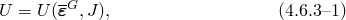
其中  是修正 Green 应变张量， 是右 Cauchy-Green 应变的偏斜部分， 是体积变化。

基于应变公式的模型中的基本假设是，优选材料方向在参考（无应力）构型中最初与正交坐标系对齐。这些方向只有在变形后才可能变得不正交。这种形式的应变能函数的例子包括广义 Fung 型形式（参见下文"广义 Fung 形式"）。

从[公式 4.6.3-1](04s06a125.md)， 的变分为
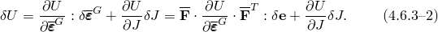
利用虚功原理，应变能势的变分可以写成
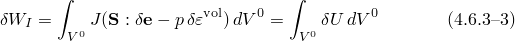
（参见[公式 4.6.1-7](04s06a123.md)）。

对于可压缩材料，应变变分是任意的，因此该方程为这类材料定义了应力分量为
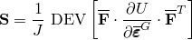
和
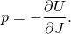

当材料响应几乎不可压缩时，纯位移公式（本构模型从有限元模型的运动学变量计算应变不变量）可能表现不佳。一个困难是从数值角度看，刚度矩阵几乎是奇异的，因为材料的有效体积模量相对于其有效剪切模量非常大，从而给离散平衡方程的求解带来困难。类似地，在 Abaqus/Explicit 中，高体积模量增加了膨胀波速度，从而大大减少了稳定时间增量。为了避免此类问题，Abaqus/Standard 为此类情况提供了一种"混合"公式（参阅"超弹性材料行为"，第4.6.1节）。

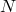### 基于不变量的公式

利用纤维增强复合材料的连续体理论（Spencer，[1984](07s01a01-References.md)），应变能函数可以直接用变形张量和纤维方向的不变量表示。例如，考虑一种由各向同性超弹性基体和  族纤维组成的复合材料。纤维在参考构型中的方向由一组单位向量 （）表征。假设应变能不仅依赖于变形，还依赖于纤维方向，提出以下形式：

材料的应变能必须保持不变，如果基体和纤维在参考构型中经历相同的刚体旋转。那么，按照 Spencer（[1984](07s01a01-References.md)），应变能可以表示为张量  和向量  的不可约标量不变量集合的各向同性函数，这些不变量构成完整基：

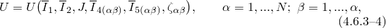其中  和  是第一和第二偏斜应变不变量；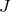 是体积比（或第三应变不变量）； 和  是 、 和 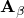 的*伪不变量*，定义为

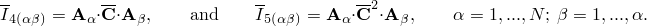项 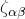 是几何常数（与变形无关），等于参考构型中任意两族纤维方向之间夹角的余弦，

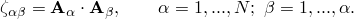

与基于应变公式的情况不同，在基于不变量的公式中，纤维方向在初始构型中不必是正交的。不变量能量函数的一个例子是 [Holzapfel、Gasser 和 Ogden（2000）](07s01a01-References.md)为动脉壁提出的形式（参见下文"Holzapfel-Gasser-Ogden 形式"）。

从[公式 4.6.3-4](04s06a125.md)， 的变分为

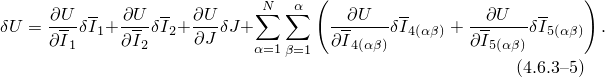

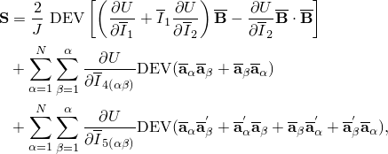利用虚功原理（[公式 4.6.3-3](04s06a125.md)）并经过一些冗长的推导，发现可压缩材料的应力分量为

和

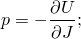其中 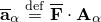 和 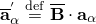。

### 应变能势的特殊形式

Abaqus 中提供了应变能势的几种特殊形式。不可压缩或近似不可压缩模型包括：

广义 Fung 形式；和

Holzapfel-Gasser-Ogden 形式。
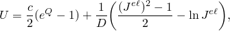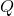
此外，Abaus 提供了一种通用能力，通过两组用户子程序支持用户定义的应变能势形式：一组用于基于应变的公式，一组用于基于不变量的公式。

**广义 Fung 形式**
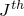
Abaqus 中的广义 Fung 应变能势基于 [Fung 等人（1979）](07s01a01-References.md)提出的二维指数形式，按照 [Humphrey（1995）](07s01a01-References.md)适当地推广到任意三维状态。它具有以下形式：

其中 *U* 是每单位参考体积的应变能，*c* 和 *D* 是温度相关的材料参数， 是弹性体积比， 定义为

其中  是各向异性材料常数的无量纲对称四阶张量，可以是温度相关的， 是修正 Green 应变张量的分量。

弹性体积比  将总体积比 *J* 和热体积比  关联起来：

 由下式给出

其中  是从温度和热膨胀系数获得的主热膨胀应变。

初始偏斜弹性张量  和体积模量  由下式给出

Abaqus 支持广义 Fung 模型的两种形式：各向异性和正交各向异性。必须指定的独立分量  的数量取决于材料的各向异性程度：完全各向异性情况下为21个，正交各向异性情况下为9个。

**Holzapfel-Gasser-Ogden 形式**

Holzapfel-Gasser-Ogden（HGO）应变能势形式专门为动脉壁和类似的三维纤维增强软组织建模而制定。该应变能函数基于连续体理论，使用基于不变量的公式，假设材料由各向同性基体和两族嵌入的可压缩胶原纤维组成。该模型捕捉了纤维增强软组织响应中观察到的显著各向异性和非线性。它具有以下形式：

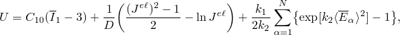其中 *U* 是每单位参考体积的应变能，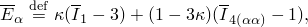 和  是应变能函数的参数， 是体积比（或第三不变量），而  和 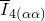 是与两族纤维相关的伪不变量，定义为

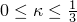和

其中  是两族纤维之间的初始纤维角， 是描述与纤维方向 *i* 相关的主方向单位向量的分量，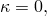 是右 Cauchy-Green 变形张量的分量。

该模型可与几乎不可压缩和可压缩材料行为一起使用。初始偏斜弹性张量  和体积模量  与广义 Fung 模型相同，由公式给出。

对于完全各向异性材料，必须指定21个独立的材料参数。对于 HGO 模型，由于材料的对称性要求减少到9个独立的材料参数。

### 参考

### 参考

"超弹性行为"，Abaqus Analysis User's Guide 第21.7节

"关于使用 Abaqus 进行超弹性分析的准则"，Abaqus Analysis User's Guide 第21.7.1节
