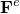
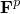
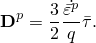
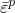

# 4.7.2 永久变形

### 4.7.2 永久变形

**产品：** Abaqus/Standard  Abaqus/Explicit

Abaqus可用于模拟在初次加载后卸载时常见于填充弹性体中的永久变形。

### 采用的方法

Abaqus使用具有相关流动规则的各向同性硬化Mises塑性来捕获永久变形。由于底层材料本质上是超弹性的，塑性计算基于变形梯度乘以分解为弹性和塑性分量：

其中是变形梯度的弹性部分，表示超弹性行为，是变形梯度的塑性部分，表示无应力中间配置。

基于Mises屈服条件相关流动规则的变形率张量的塑性部分为：

在上述方程中，是Kirchoff应力张量的偏部分，是有效Kirchoff应力，是等效塑性应变。所得方程组使用Weber和Anand（1990）以及Simo（1992）概述的标准技术求解。

有关使用上述方法的应用程序，请参见Govindarajan等人（2007）。

### 参考

### 参考

"Abaqus Analysis User's Guide"第23.7.1节"橡胶类材料中的永久变形"
