# 4.8.3 频域粘弹性

### 4.8.3 频域粘弹性

**产品：** Abaqus/Standard

许多弹性体应用涉及以稳态振动形式的动态加载，在这种情况下，材料中的耗散损耗（材料粘弹性行为的"粘性"部分）必须被建模才能获得有用的结果。在这类问题的大多数中，结构首先被静态预加载，而这种预加载通常涉及弹性体的大变形。该预加载的响应是基于弹性体部分纯弹性行为计算的——即，我们假设预加载被施加了足够长的时间，以便材料中的任何粘性响应有时间衰减。

因此，此类问题的动态分析是研究关于预变形弹性状态的动态粘弹性响应。在一些此类情况中，我们可以合理地假设振动幅度足够小，以至于动态阶段的运动学和材料响应都可以作为关于预变形状态的线性扰动处理。Abaqus/Standard中提供的小振幅粘弹性振动能力基于Morman和Nagtegaal（1983）的描述，并使用"直接稳态动态分析"第2.6.1节中描述的过程。其对特定应用的适用性将取决于振动相对于可能的运动非线性（动态加载期间发生的附加应变和旋转必须足够小，使得运动学的线性化是合理的）的幅度，以及相对于材料响应中可能的非线性，以及本节描述的粘弹性模型中的特定本构假设——特别是下面描述的预应变和时间效应分离的假设。

在"超弹性材料行为"第4.6.1节中，展示了具有应变能势的弹性体材料中真应力（Cauchy应力）的变化率由以下给出

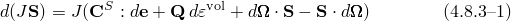对于应力的偏斜部分，

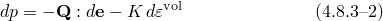对于可压缩材料中的等效压力应力。这些方程中的各种量在"超弹性材料行为"第4.6.1节中定义。对于完全不可压缩材料，的所有分量为零，等效压力应力仅由结构加载定义，因此第二个方程不适用。

对于关于预变形状态的小粘弹性振动，我们将振动期间发生的附加运动线性化，使得[方程4.8.3-1](04s08a130.md)和[方程4.8.3-2](04s08a130.md)中量的微分可以解释为附加增量值，

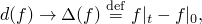对于任意量*f*，其中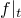是振动期间某时刻*f*的当前值，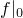是*f*的参考值；即，是*f*在静态（长期）预加载结束时的值，振动期间*f*在此值附近波动。

通过将[方程4.8.3-1](04s08a130.md)和[方程4.8.3-2](04s08a130.md)的解释应用于附加运动的增量弹性本构行为，现在将其推广以包括粘性耗散以及材料中的弹性响应，遵循Lianis（1965），得到

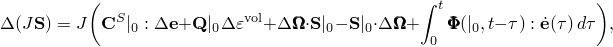对于偏斜部分，以及对于可压缩材料，

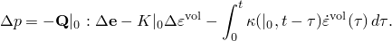

在这些表达式中，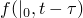表示*f*依赖于在小型动态振动之前发生的弹性预变形（状态在处），在振动开始和当前时间*t*之间的时间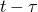进行评估。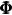和是定义材料响应粘性部分的函数：该符号旨在暗示这些是弹性预变形和时间的函数。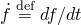是量的时间变化率。

Abaqus中提供的粘性行为定义和的简化是基于假设该粘性行为表现出时间和预应变效应的分离；即，

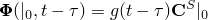和

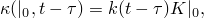其中和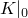是振动前材料在其预变形状态下的"有效弹性"。这个假设简单地意味着，在预变形状态下材料小型运动期间粘性行为的测量仅取决于预变形到有效弹性也取决于该预变形的程度。有实验证据表明这种简化适用于某些实际材料（见Morman（1979）的讨论）。利用这个假设，材料行为粘性部分的定义简化为寻找时间的标量函数*g*和*k*（对于完全不可压缩材料仅*g*），对于小扰动的本构响应简化为

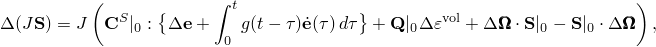对于偏斜部分，以及对于可压缩材料，

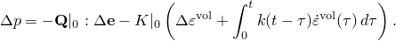

在Abaqus中，此模型仅针对直接解和基于子空间的稳态动态分析程序提供，其中我们假设动态响应是稳态谐波振动，因此我们可以写成

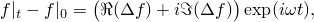其中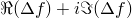是变量*f*的复振幅。

将粘性松弛函数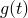和的傅里叶变换定义为

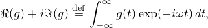和

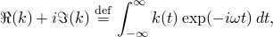允许本构模型对于这种谐波运动以线性形式写成

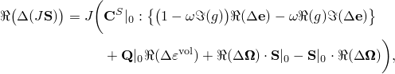对于偏斜部分，以及

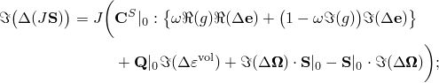对于可压缩材料，以及

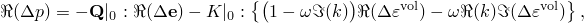和

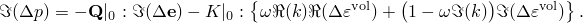

因此，材料的粘性行为简化为将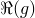、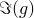、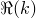和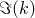定义为频率的函数。

当纯位移公式用于可压缩材料时，动态响应的虚功方程为

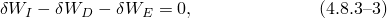其中

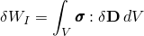是内部虚功，

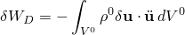是达朗贝尔力（是原始构型中材料的质量密度）的虚功，

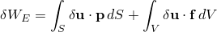是外部规定表面牵引力每当前表面积和体力每当前体积的虚功。

对于这里考虑的线性化扰动，我们将[方程4.8.3-3](04s08a130.md)改写为增量形式，得到

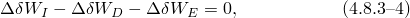其中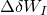从[方程4.6.1-12](04s06a123.md)获得，解释为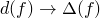；

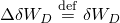和

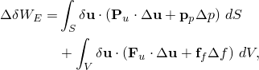其中

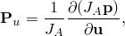是当前与参考表面积的比值；

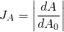

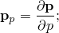

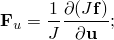

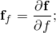且*p*和*f*是外部规定的牵引力，因此和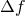是外部规定的牵引力增量。注意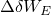包括依赖于的项：这些项在引入有限元插值时产生"载荷刚度矩阵"。

当运动是谐波时，我们可以将这些量重新表述为

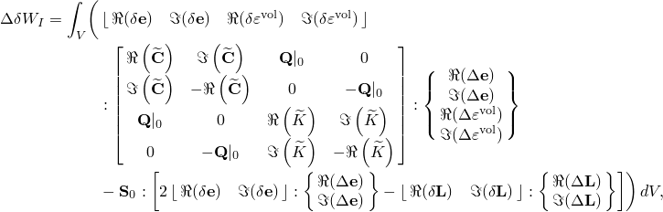其中

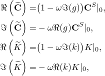

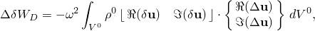和

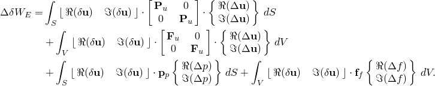

在这些表达式中，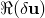和被理解为独立变量。因此，当将有限元位移插值代入[方程4.8.3-4](04s08a130.md)时，我们获得一个线性的、依赖频率的系统，可以针对每个频率求解模型节点自由度的实部和虚部。同样，"超弹性材料行为"第4.6.1节中描述的几乎不可压缩行为和完全不可压缩行为的增强变分原理可用于获得谐波粘弹性振动问题的线性、依赖频率的系统。不能使用基于模态叠加的稳态动态分析过程，因为所假设的粘性行为不对应于少量Rayleigh阻尼，这是基于模态叠加的谐波响应的要求。

### 参考

### 参考

"Abaqus Analysis User's Guide"第22.7.2节"频域粘弹性"
