# 5.1.1 物体间的小滑动相互作用
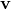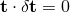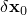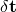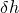
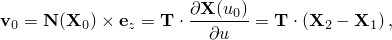### 5.1.1 物体间的小滑动相互作用

**产品：** Abaqus/Standard

在Abaqus/Standard中包含了对两个物体之间的小滑动接触进行建模的能力。使用此公式，接触表面只能进行相对较小滑动，但允许物体任意旋转。小滑动接触的计算成本比有限滑动接触低，后者参见"可变形体之间的有限滑动相互作用"第5.1.2节。

小滑动能力可用于模拟两个可变形体之间或一个可变形体与一个刚性体之间的相互作用，适用于二维和三维。使用此方法，一个表面定义提供"主"表面，另一个表面定义提供"从"表面。然后强制执行从表面节点不穿透主表面的运动约束。接触表面不需要匹配网格；然而，当网格最初匹配时可以获得最佳精度。对于最初不匹配的网格，可以通过谨慎地指定初始调整来提高精度，以确保所有应初始接触的从节点位于主表面上。

小滑动接触能力通过四个内部接触元素实现，这些元素设计用于处理以下运动约束：

从节点与可变形主表面之间的二维接触，

从节点与刚性主表面之间的二维接触，
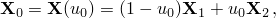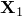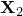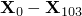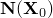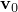
从节点与可变形主表面之间的三维接触，

从节点与刚性主表面之间的三维接触。这些元素用户无法访问，Abaqus会根据相应主表面的性质自动用适当的元素类型覆盖从表面。

### 基于最近邻相互作用切平面的识别
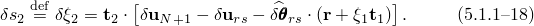
尽管使用四种内部元素类型来模拟Abaqus/Standard支持的各种小滑动接触相互作用，但所有四种公式都基于以下概念：给定的从节点始终与同一组主表面节点相互作用。该节点子集最初由Abaqus分析输入文件处理器从未变形模型定义中确定，从而避免了分析过程中"跟踪"从节点的需要。这组到主表面上最接近从节点的点的最近邻节点用于参数化接触平面，从节点将在分析期间与该平面相互作用。接下来针对二维从节点与一阶主表面相互作用的情况说明此概念。该公式可以推广到二阶以及三维情况，但在此不再讨论。

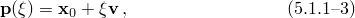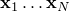考虑从表面上的三个节点102、103和104与由节点1、2和3组成的主表面之间的接触相互作用。

在开始搜索主表面上将与之相互作用的从表面上每个节点的节点子集之前，计算主表面上所有节点的单位法向量。例如，单位法向量通过对段1-2和2-3的单位法向量进行平均来计算。用户还可以指定主表面上每个节点的法向量。在距离每个段末端一定距离处计算附加单位法向量，其中是分数，是段的长度；例如，。目前，的值设置为0.5，用户无法更改此值。然后使用这些单位法向量来定义主表面上任意点处的平滑变化法向量。

为主表面上的从节点计算"锚"点，使得由从节点和形成的向量与法向量重合。假设对从节点103的锚点的搜索揭示位于段1-2上。然后我们发现
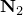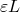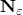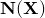
其中和分别是节点1和2的坐标，计算使得与重合。此外，处的接触平面切线方向选择为与垂直；即，

其中是（常数）旋转矩阵。

小滑动接触约束通过要求从节点103与切线平面相互作用来实现，该切线平面的当前锚点坐标在任何时候由

给出，其中和，且其当前切线方向由

给出，其中和。由于上述点和向量的表达式来自点和的重心（仿射）组合，即
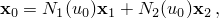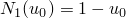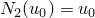
接触平面将根据平移、缩放（拉伸）和旋转等仿射变换正确映射。
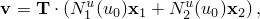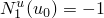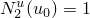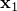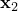
接下来，假设对从节点104的锚点的搜索揭示锚点与主节点2重合。在这种情况下，锚点选择为，或者用三个主节点1、2和3的坐标表示为
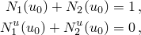
其中，，且。处的接触切线方向 просто是

但是，我们希望用三个节点1、2和3的坐标来表示，以便跟踪切线平面的演化。为此，我们从方程
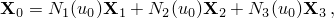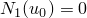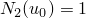
求解，满足重心约束
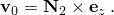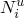
重心约束确保所得接触平面切线方向的表达式在平移和旋转等仿射变换下表现正确。
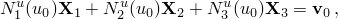
### 作为约束变分原理的接触公式
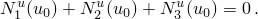
在每个可能与主表面接触的从节点处，我们构建过盈度量（节点穿透主表面）和相对滑移度量。这些运动度量然后与适当的拉格朗日乘子技术一起使用，以引入接触和摩擦的表面相互作用理论，如"接触压力定义"第5.2.1节和"库仑摩擦"第5.2.3节所述。

在二维中，从点到主线的过盈沿单位接触法向确定，其中参数化直线，通过找到从节点到直线的垂直于切向量的向量。数学上，我们将所需条件表示为

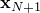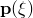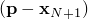当

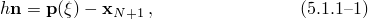类似地，在三维中，从点到主平面的过盈沿单位接触法向确定，其中参数化平面，通过找到从节点到平面的垂直于切向量的向量。数学上，我们将所需条件表示为

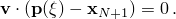当

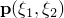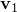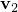如果在给定的从节点处，在该节点处表面之间没有接触，则不需要进一步的表面相互作用计算。如果，表面处于接触状态。接触约束通过引入拉格朗日乘子来强制执行，其值提供接触点的接触压力。为了强制执行接触约束，我们需要一阶变分；对于牛顿迭代，我们需要二阶变分。同样，如果要在接触表面之间传递摩擦力，则需要在公式中使用相对滑移的一阶变分和二阶变分。接下来描述所有四种小滑动接触公式的一些推导。

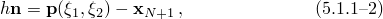### 二维小滑动可变形接触公式

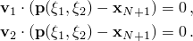对于二维小滑动可变形接触的情况，与从节点关联的接触线上的点表示为

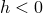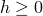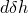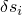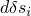其中，如前所述，线的锚点和切向量是当前主节点坐标的函数。因此，向量通常是非单位向量。方程的线性化给出

其中、和。

取方程与的点积得到以下表达式：

同样，取方程与归一化切向量的点积并设置得到以下滑移变化表达式：

可以通过线性化方程并应用上述技术来推导和的合适表达式。由于所得表达式不提供理解此能力额外洞察力，此处不再介绍。

### 三维小滑动可变形接触公式

三维小滑动可变形接触公式是先前二维公式的直接推广。与从节点关联的接触平面上的点表示为

其中平面的锚点和两个切向量是当前主节点坐标的函数。方程的线性化给出

其中和。

取方程与的点积得到以下表达式：

类似地，取方程与的点积并设置得到第一个滑移分量变化的表达式：

类似地，取方程与的点积并设置得到第二个滑移分量变化的表达式：

### 二维小滑动刚性接触公式

二维小滑动刚性接触的公式通过利用接触平面的演化完全由刚体参考节点的运动决定这一事实从其可变形对应部分推导出来。

假设刚性参考节点经历由位移向量和旋转向量描述的运动，则接触平面锚点的当前坐标为

其中是产生旋转的正交矩阵（见"旋转变量"第1.3.1节），是从刚性参考节点到锚点的当前位置向量。旋转矩阵还用于获取接触平面的当前切线和当前法线如下：

其中和分别是初始接触切线和法线。 根据定义，刚性表面不能拉伸；因此，与从节点关联的刚性接触线上的点表示为

其中，与方程中的向量不同，切线始终是单位向量。

对方程和的线性化给出锚坐标和一阶变化表达式：

用替换方程中的，注意，并代入和得到以下表达式：

对的方程进行类似处理得到以下表达式：

### 三维小滑动刚性接触公式

三维小滑动刚性接触公式也可以通过推广前面介绍的一些表达式从其可变形对应部分推导出来。特别地，在此公式中刚性参考节点可以经历由旋转向量描述的任意有限旋转。因此，锚点坐标和接触平面切线的变化公式推广为

其中是与我们之前解释的线性化旋转相关的斜对称矩阵（见"旋转变量"第1.3.1节）。

用替换方程中的方程，并通过代入和得到以下表达式：

### 参考

### 参考

"Abaqus Analysis User's Guide"第38.1.1节"Abaqus/Standard中的接触公式"
