# 5.1.2 可变形体之间的有限滑动相互作用

### 5.1.2 可变形体之间的有限滑动相互作用

**产品：** Abaqus/Standard

Abaqus/Standard提供了两种 formulations 用于模拟两个可变形体之间的相互作用。第一种是小滑动 formulation，其中接触表面只能发生相对较小的滑动，但允许表面的任意旋转。这种 formulation 在"物体间的小滑动相互作用"第5.1.1节中讨论。第二种是有限滑动 formulation，可能出现有限振幅的分离和滑动以及表面的任意旋转。二维和轴对称分析以及管中管分析的 formulation 在本节中讨论。

根据接触问题的类型，用户有两种方法指定有限滑动能力：（1）通过识别和配对潜在接触表面来定义可能的接触条件；（2）使用接触单元。使用第一种方法时，Abaqus会自动生成适当的接触单元。

在具有非对称变形的轴对称问题中，可以使用ISL21A和ISL22A单元来模拟与CAXA或SAXA单元的接触。管内滑动可以使用ITT21和ITT31单元来模拟。

要定义两个表面之间的滑动界面，其中一个表面（"从"表面）被ISL或ITT单元覆盖。另一个表面（"主"表面）被定义为由一系列按顺序排列的节点组成的滑线表面。滑线本身可以由线性或二次段组成。如果使用平滑，这些段用二次或三次段连接，以实现完全的斜率连续性。平滑过程在本节后面描述。

### 二维和轴对称滑线单元

考虑从表面上的节点  与主表面段 、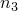、（由节点描述）之间的接触，其中节点数量取决于段的阶数。对于线性段，节点数为2；对于二次段，节点数为3。对于线性滑线的平滑段，节点数也为3；对于二次滑线的平滑段，节点数为5。如果接触发生在两个段的（凸）顶点处，则只有一个节点将进入方程。典型的线性段如图5.1.2-1所示，二次段如图5.1.2-2所示。平滑段在本节后面显示。

为了推导控制这些单元的方程，我们考虑滑线平面中的坐标。对于轴对称单元，该平面与二维空间重合。首先，我们确定从表面上最接近点  的段上的点 。我们还确定该点处段的法向  和切向 。点  和法向  可以通过以下关系与过盈量  相关联

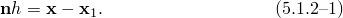

图5.1.2-1 线性滑线段。

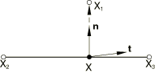

图5.1.2-2 二次滑线段。

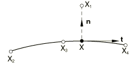由于  在段上，其位置完全由该段的插值函数 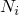、位置  以及作为段一部分的节点位置 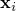、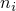 定义。这允许我们写出[方程5.1.2-1](05s01a133.md)的表达式

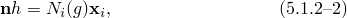其中 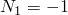 和 、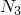、 是  的函数。例如，对于线性段，你得到 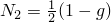、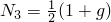。对于二次段，使用 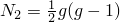、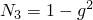、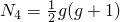。对于滑线的平滑段可获得类似的表达式。滑线上点  处的切向  通过以下方式得到

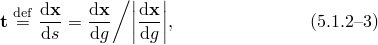其中

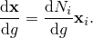点  的位置由法向和切向必须正交的条件决定，这导致以下关于  的方程：

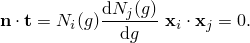对于线性段，这产生一个可以直接求解的线性方程。对于二次和三次段，这导致三阶或五阶方程，必须迭代求解。方程使用牛顿法求解，在使用牛顿法之前使用若干次二分法来找到真正的最小距离解。

为了获得接触/滑动方程，位置方程（[方程5.1.2-2](05s01a133.md)）被线性化。这种线性化产生

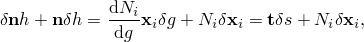其中  是滑动量。在接触方向上，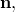 这产生

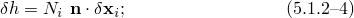而在滑动方向上，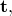 得到

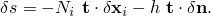假设滑动仅在节点  在滑线上时才相关；因此，假设 。由此可得

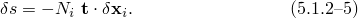为了获得初始应力刚度项，必须计算  和  的二阶变分。从[方程5.1.2-4](05s01a133.md)可得

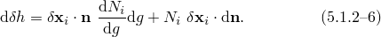第一项可以借助[方程5.1.2-5](05s01a133.md)很容易地用 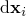 表示：

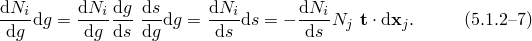法向的变化率可以重新表示为

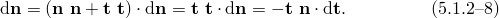在这个方程中，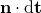 可以从[方程5.1.2-3](05s01a133.md)获得：

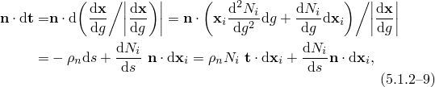其中使用了[方程5.1.2-5](05s01a133.md) 和 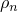（段曲率）定义为

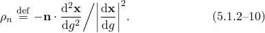对于直线段， 显然为零。将[方程5.1.2-7](05s01a133.md)至[方程5.1.2-9](05s01a133.md)代入[方程5.1.2-6](05s01a133.md)得到最终结果：

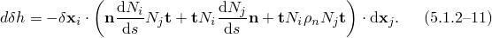这个表达式是对称的，正如所预期的。 的二阶变分可以沿类似路线推导：

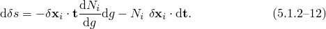

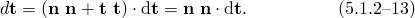将[方程5.1.2-7](05s01a133.md)、[方程5.1.2-9](05s01a133.md) 和 [方程5.1.2-13](05s01a133.md)代入[方程5.1.2-12](05s01a133.md)得到

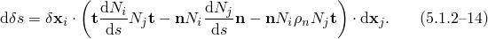这个表达式是非对称的。如果在滑平面内没有滑动发生， 和  的二阶变分为零 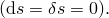

### 管-管界面单元

在管-管界面单元的情况下，假设内管可以作为从表面，外管作为主表面。管-管界面单元与轴对称滑线单元在两个方面不同。首先，假设管之间存在有限的间隙，这使得即使发生接触，分离距离  也是有限的。其次，对于三维单元ITT31，在管横截面平面内存在第二个可能的局部切向方向。ITT单元的推导与ISL单元的推导非常相似。接触方程可以写成形式

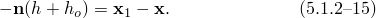其中  是外管上可能与内管上点  接触的点，如图5.1.2-3所示。

图5.1.2-3 管-管接触。

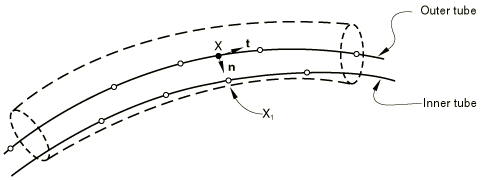

在这个方程中，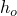 是管之间的（正）径向间隙。与ISL单元类似的方式，接触方程可以写成形式

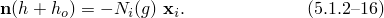与[方程5.1.2-2](05s01a133.md) 相比，符号反转与作为内部接触性质相对于常规滑线单元的外部接触性质有关。[方程5.1.2-16](05s01a133.md) 的线性化形式为

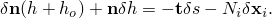与之前一样，我们假设在接触期间 。在接触方向上，这产生

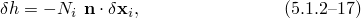而在沿管道方向上，

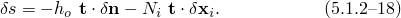使用 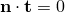，很容易得到

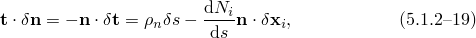它将[方程5.1.2-18](05s01a133.md)转化为

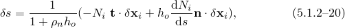其中  是由[方程5.1.2-10](05s01a133.md)定义的段曲率。对于三维管-管界面单元，可以定义横向局部切向方向 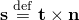，这产生

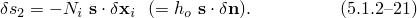

初始应力刚度项再次通过对 、 和  的二阶变分得到。从[方程5.1.2-17](05s01a133.md)可得

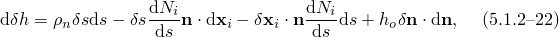并结合[方程5.1.2-19](05s01a133.md) 和 [方程5.1.2-21](05s01a133.md) 可得

将[方程5.1.2-20](05s01a133.md) 和 [方程5.1.2-23](05s01a133.md)代入[方程5.1.2-22](05s01a133.md)得到

这个表达式是对称的。在  方向上，虚功项具有形式

结合[方程5.1.2-18](05s01a133.md)这产生

对于二阶变分可得

其中横向段曲率  定义为

在这个表达式中，涉及  的项对于单元类型ITT21为零。将[方程5.1.2-20](05s01a133.md) 和 [方程5.1.2-27](05s01a133.md)代入[方程5.1.2-26](05s01a133.md)得到

在  方向上，只需考虑  的一阶变分：

结合[方程5.1.2-20](05s01a133.md)、[方程5.1.2-23](05s01a133.md) 和 [方程5.1.2-27](05s01a133.md) 可得

代入[方程5.1.2-30](05s01a133.md)这产生

### 滑线平滑

在沿滑线的两个段的交界处，可能出现斜率不连续。这种不连续可能导致收敛问题，因为在迭代期间接触点可能在两个段之间来回移动。因此，平滑段之间的过渡是有用的。首先考虑两个线性段之间的过渡（图5.1.2-4）。

图5.1.2-4 线性段之间的过渡。

两个段的交界处由位于段上的点  和  之间的Hermite多项式连接：

因此， 和  的位置由用户直接指定范围内的平滑因子   决定。

我们选择  作为平滑段上的参数坐标，其中 。在  的极值处，坐标为  和 ，对于坐标导数，我们选择

利用Hermite插值函数，我们可以计算段上点  的位置作为  的函数：

合并上述方程得到

平滑实际上是用二阶多项式完成的。在界面接触和摩擦方程的 formulation 中，平滑段的处理与常规段的处理相同。二次段之间的过渡如图5.1.2-5所示。

图5.1.2-5 二次段之间的过渡。

可以容易地确定，在这种情况下

对于坐标导数，我们选择

与之前一样， 由用户直接指定。将这些方程代入Hermite形状函数得到

如果  和 ，这些方程简化为用于线性段之间平滑的相同方程。

对于具有节点  和  的线性段与具有节点 、 和  的二次段之间的过渡，公式变为

坐标导数为

因此，

对于具有节点 、 和  的二次段与具有节点  和  的线性段之间的过渡，公式变为

坐标导数为

因此，

与"纯"线性-线性和二次-二次段过渡相比，在"混合"线性-二次和二次-线性情况下，只有交界节点  项发生变化。

### 自接触

自接触可用于表面折叠并接触自身的情况。为表面上的每个节点内部生成适当的接触单元。一个节点允许与表面的所有段接触，但与该节点相邻的段除外。由于一个节点同时是主和从（产生对称的主-从关系），如果接口两侧的网格完全匹配，则会发生过度约束。例如，如果在二维中只有一对节点匹配，由于在接口主侧进行的平滑，不会出现问题。为了避免因过度约束导致的求解器问题，三维自接触仅在使用惩罚型接触时激活。

接触单元的数学处理与上述描述相同，在二维中有一些修改。当表面的两个相邻段形成尖锐裂纹时，接触算法变为纯主-从而不是对称的，以防止冗余接触约束。任意选择这两个段中最短的为从，最长的为主。

### 参考

### 参考

"Abaqus/Standard中的接触 formulations，" Abaqus Analysis User's Guide 第38.1.1节

"管-管接触单元，" Abaqus Analysis User's Guide 第40.3.1节

"滑线接触单元，" Abaqus Analysis User's Guide 第40.4.1节