# 5.1.3 可变形体与刚性体之间的有限滑动相互作用

### 5.1.3 可变形体与刚性体之间的有限滑动相互作用

**产品：** Abaqus/Standard

Abaqus/Standard提供了两种公式来模拟可变形体与任意形状刚性体之间的相互作用，该刚性体可能在建模的历史过程中移动。第一种是小滑动公式，其中接触表面只能进行相对较小的滑动，但允许表面任意旋转。该公式在"物体间的小滑动相互作用"第5.1.1节中讨论。第二种是有限滑动公式，其中可能出现有限振幅的分离和滑动以及表面的任意旋转。该公式在本节中讨论。

有限滑动刚性接触能力通过一系列接触元素实现，Abaqus根据与用户指定的接触对关联的数据自动生成这些元素。在每个积分点，这些元素构建一个过盈度量（可变形体表面上的点穿透刚性表面的程度）和相对剪切滑动度量。然后将这些运动度量与适当的拉格朗日乘子技术一起使用，以引入表面相互作用理论（接触和摩擦）。Abaqus提供了一系列相互作用理论库——这些可以被认为是"表面本构模型"库。在本节中我们仅讨论相互作用的表面的运动学。表面本构模型在第4章"力学本构理论"中描述。

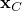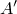设是变形网格上的一个点，当前坐标为。设是"刚体参考节点"——定义刚性体位置的节点——当前坐标为。设是刚性体表面上最接近且其法线穿过的点。定义从到的向量。图中展示了这些量描述的几何。

设是从到的距离沿：表面的"过盈"。根据上述定义，

然后，如果在该点处表面之间没有接触，不需要在该点进行进一步的表面相互作用计算。这里是发生接触的间隙以下。对于"硬"表面，但Abaqus/Standard还允许引入"软化"表面，其中可能不为零（尽管通常与其他尺寸相比非常小）。如果表面处于接触状态。为了强制执行接触约束，我们需要的一阶变分，和它的二阶变分。这些量现在推导。

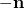设是表面上处的局部正交距离测量表面坐标。测量沿切向的距离：这些切线根据Abaqus关于空间中表面切线的标准约定构建。当点移动和刚性体移动时，投射点将随之移动。运动由两部分组成：由刚体运动引起的运动和相对于刚体的运动

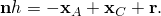其中是点的"滑动"。法线也会由于刚性表面的旋转和沿表面滑动而改变

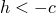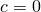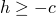接触方程的线性化形式变为

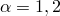对于"硬"接触完全成立，对于软接触我们也将假设。线性化运动方程变为

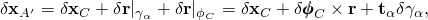该方程可以分解为法向分量和切向分量，产生接触方程，

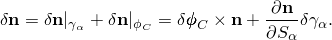和滑移方程，

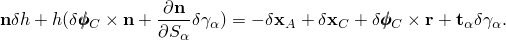为了获得的二阶变分，再次假设。此外，假设，这对于相对"硬"接触是准确的。然后直接可得

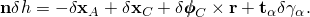从线性化运动方程可得

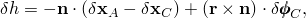我们使用了。 第一项对应于绕点刚体旋转的向量的二阶变分（见"旋转变量"第1.3.1节）：

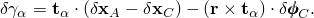表达式中第二项使用先前使用的沿表面"滑动"表达式获得：

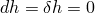第三项来自刚体旋转表达式：

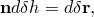最后，第四项通过沿表面坐标微分获得：

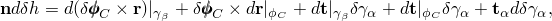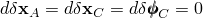其中

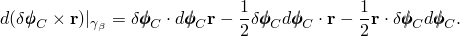是表面曲率矩阵。

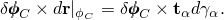将最后四个表达式代入二阶变分表达式得

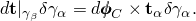如在一阶变分中，可以将二阶变分分解为法向和切向分量。对于法向分量发现

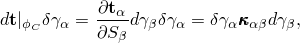对于切向分量，

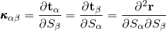涉及的表达式可以简化一些。观察因此，

类似地

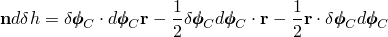如果局部表面坐标系是通过将切向笛卡尔坐标投影到表面上创建的，则可以容易地确定最后一项消失。因此，我们将假设二阶变分中最后一项为零。通过在二阶变分表达式中代入滑移一阶变化的表达式，得到最终结果。

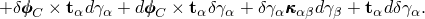方程中的前两项仅在发生滑动时需要包含，而表达式仅在传递摩擦力时需要考虑。

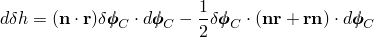对于动态应用，我们需要速度项和加速度项来正确计算冲击力和冲量。这些项是

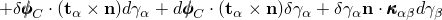（这与的一阶变分形式相同）；和

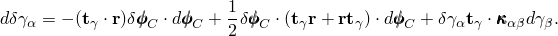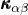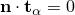### 参考

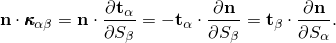### 参考

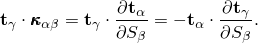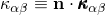"Abaqus Analysis User's Guide"第38.1.1节"Abaqus/Standard中的接触公式"
