# 5.2.2 孔隙压力接触中的压力和流体流动

### 5.2.2 孔隙压力接触中的压力和流体流动

**产品：** Abaqus/Standard

Abaqus/Standard提供了用于建模完全饱和多孔介质的基于表面的能力。基于表面的能力可用于小滑动或有限滑动。仅考虑垂直于表面的流动；无法模拟切向流动。

### 无限界面渗透率的接触界面孔隙流体约束
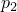
设和是界面两侧的孔隙压力。如果界面渗透率被认为是无限的（即对流体流动没有阻力），则要求界面两侧的孔隙压力始终相等：
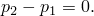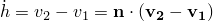
类似地，设和是垂直于界面两侧的体积流率密度，并设是界面法向方向上两侧的相对速度。

假设界面充满流体至分离阈值。因此，连续性要求
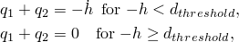
而差值对应于穿过界面的流量的两倍。
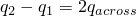
是未定的，在无限渗透率情况下应被视为独立变量。翻转这些方程得
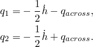
### 有限界面渗透率的接触界面孔隙流体约束

对于有限间隙渗透率，直接穿过界面的体积流率密度为

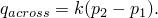假设界面充满流体至分离阈值。因此，连续性要求

垂直于界面两侧的体积流率密度为

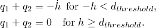其中

和是底层材料渗透率。

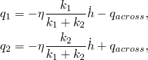### 瞬态方程

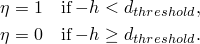界面虚功方程及其线性化形式首先以包括有限滑动的通用形式获得。然后将方程专门化到Abaqus中实现的各种公式。

由于我们希望在界面两侧实现力和体积流率平衡，并在孔隙压力中获得连续性，我们将以下积分添加到虚功方程：

其中是任意拉格朗日乘子，是界面面积。消除和使用对的合适选择，

我们得到
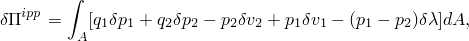
其中
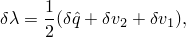
由于Abaqus使用位移（而不是速度）和在上的积分的通量，方程可以乘以得到
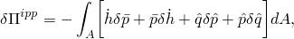
其中是沿界面法向方向增量的变化。线性化得
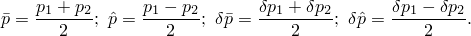
### 闭合接触
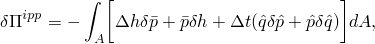
如果两侧局部处于接触状态，和；因此，虚功简化为
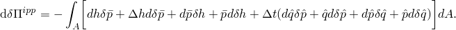
类似地，线性化形式简化为

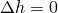### 稳态方程

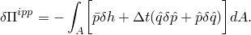对于稳态分析，可以省略瞬态项，而流体流动项以速率形式编写。在这种情况下，我们可以假设界面位移消失，这导致简化的虚功贡献

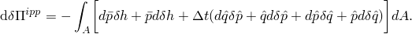及其线性化形式

### 小滑动

当使用小滑动接触公式时，线性化虚功方程中的项、、、将消失。
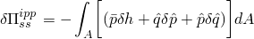
### 参考
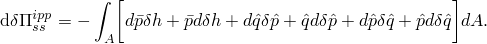
### 参考

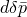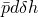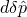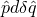"Abaqus Analysis User's Guide"第37.4.1节"孔隙流体接触属性"
