# 5.2.7 基于表面的声学-结构介质相互作用

### 5.2.7 基于表面的声学-结构介质相互作用

**产品：** Abaqus/Standard  Abaqus/Explicit

Abaqus提供了两种模拟声学与结构介质相互作用的选择：基于表面的相互作用或声学界面（ASIn）元素。两者都在Abaqus/Standard中可用，但只有基于表面的能力在Abaqus/Explicit中可用。如果使用专用界面元素（ASIn），则相互作用的结构和声学节点必须由两个网格共享。基于表面的能力可用于结构和声学网格具有不同节点编号且表面网格可能在空间上不一致的情况。基于表面程序的易用性和低计算成本使其优于基于元素的方法。

### 结构与声学介质之间接触界面上的方程

在基于表面的方法中，计算结构和声学介质之间的牵引力和体积加速度通量。不是在两个介质上使用一致的分布牵引力或通量，而是将一侧（识别为"从"）接收基于来自另一侧（"主"）形状函数插值的点牵引力/通量。声学流体或结构固体可以是主或从，基于表面决定哪个是主或从的讨论见Abaqus Analysis User's Guide。

耦合声学-结构问题的瞬态表达式为
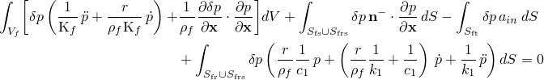
（声学介质）和
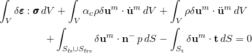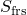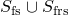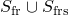
（结构介质），其中是指向流体的法向量。流体-固体表面由直接耦合流体-固体区域的并集和通过"反应"声学表面或阻抗边界耦合的区域组成。这里主要感兴趣的是那些集成在上的项，它们耦合两个变分方程。流体阻抗积分（在 上）仅取决于声压场及其变分，因此不受与固体接触的影响。稳态情况的形式推导与瞬态情况相同，此处不再讨论。有关Abaqus中瞬态和稳态声学差异的详细信息，请参见"耦合声学-结构介质分析"第2.9.1节。

当使用ASIn元素时（见"Abaqus Analysis User's Guide"第32.13.1节"声学界面元素"），公式要求流体和固体元素在几何和节点上共形，以便结构位移和声压的形状函数相同。形状函数使用标准方法积分，生成与元素表面节点数维度相同的元素矩阵。完整的流体-固体耦合矩阵通过元素面求和形成；即，标准元素组装操作。两个最终耦合矩阵具有耦合流体-固体元素面的稀疏模式。
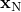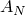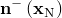
在基于表面的耦合中，相互作用表面由可能不共形的结构和声学网格之间的边界形成。因此，在基于表面的程序中，耦合矩阵不能像ASIn情况那样简单地分解为元素面的和。为了在基于表面的程序中推导耦合矩阵，我们使用与小滑动接触中使用的master-slave过程的变体（见"物体间的小滑动相互作用"第5.1.1节）。在分析开始时，找到从节点到主表面的投影，并计算与从节点关联的面积和法线。投影是主表面上的点；在该投影附近识别主表面的节点。然后从投影附近识别的主表面节点的变量插值从节点的变量。

由于流体和固体网格的物理自由度不同，必须处理两种情况。这两种情况以不同方式处理耦合项的离散化。

### 固体/结构主，流体从

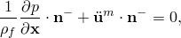如果流体介质表面被指定为从，我们约束每个流体节点的值作为附近主表面节点值的平均值。逐点流体-固体耦合条件

在从节点处强制执行，导致添加到流体从表面的位移自由度。这些从位移由主位移约束并因此被消除；从压力不直接受约束。

因此，流体方程耦合项

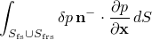等于

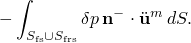该项现在在从节点级别近似，由附近主节点的結構位移插值乘以从节点面积：

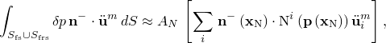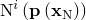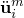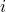其中是在从节点投影处评估的主表面插值器，是主节点处的结构加速度，是指向流体的法向量，在从节点处评估。求和延伸到从节点投影附近的所有主节点。计算对表面上每个从节点重复，并组装形成整个耦合矩阵。

类似地，由于从节点，结构方程中压力耦合项的贡献近似为

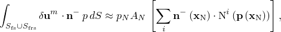其中是从节点的声压，求和再次针对从节点投影附近的主节点进行。

这些耦合项表达式产生互为转置的矩阵。从节点表面的法向量必须定义良好（见"Abaqus Analysis User's Guide"第2.3.1节"表面：概述"）。

### 流体主，固体/结构从

如果指定固体介质为从，则此表面的值被约束为等于从主表面插值的值。逐点流体-固体耦合条件再次在从节点处强制执行，导致声压自由度添加到固体从表面。这些从压力由主表面声压约束并被消除；从位移不直接受约束。因此，对于单个从节点的声学方程耦合项的贡献近似为
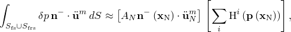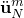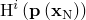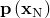
其中是从节点的結構加速度，是 在投影处评估的流体（主）表面上的插值器。求和延伸到从节点投影附近的主节点，并对表面中的所有固体/结构节点重复计算以计算整个耦合矩阵。

从节点对结构方程耦合项的贡献近似为

其中是主节点处的压力，求和再次针对从节点投影附近的主节点进行。

### 参考
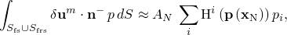
### 参考

"Abaqus Analysis User's Guide"第6.10.1节"声学、冲击和耦合声学-结构分析"
