# 6.1.1 离心、科里奥利和旋转加速度力

### 6.1.1 离心、科里奥利和旋转加速度力

**产品：** Abaqus/Standard

Abaqus中的许多元素允许包含离心、科里奥利和旋转加速度力。本节定义这些载荷类型。

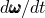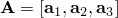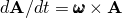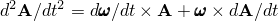假设模型（或应用这些力的部分）以角速度旋转的坐标系描述，并且/或者角（旋转）加速度。设是由形成基底的单位正交向量组成的右手系。那么，和。

如果角速度表示为

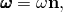其中是的大小，是旋转轴单位向量，则旋转加速度为

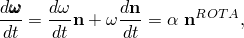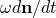其中项表示旋转轴运动（前旋运动）的影响；是旋转加速度的大小；是旋转加速度的轴。如果，则和。在分量形式中

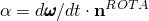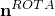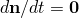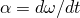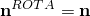和

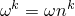设是旋转轴上的一点。材料粒子的位置可以写成

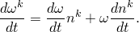其中是点在旋转基系中的坐标。对时间求导得

和

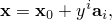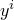我们假设旋转系统的原点固定，因此

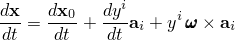由此简化

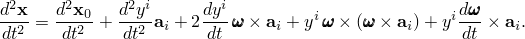和

达朗贝尔力的虚功贡献为

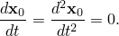其中是身体在参考配置中的质量密度，其体积为，是虚变分场。对于在旋转系统中描述的身体部分，加速度由方程给出，而只有，因为和是规定的且是固定的。因此，

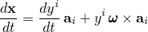简化得，

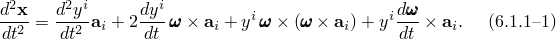中的项可以识别如下。第一项

是相对于旋转系统中材料粒子加速度的通常"相容质量矩阵"项。

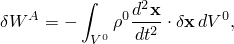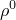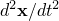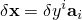将旋转基系的角速度写为其中的分量，给出第二项为

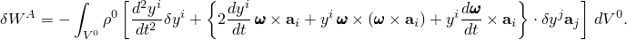其中是交错张量。这是科里奥利力项，只要旋转系统中有速度就会产生，这在动态分析或已引入恒定速度的准静态情况下可能发生。

类似地，第三项重写为

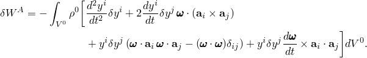这项是离心载荷项。

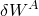同样，第四项重写为

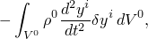这项是旋转加速度载荷项。

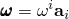在Abaqus/Standard中，离心载荷、科里奥利和旋转加速度项对"载荷刚度矩阵"有贡献。离心载荷项具有对称载荷刚度矩阵，

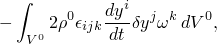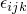科里奥利项具有反对称"载荷阻尼矩阵"，

旋转加速度项具有反对称载荷刚度矩阵，

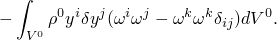### 参考

### 参考

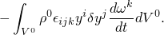"Abaqus Analysis User's Guide"第34.4.3节"分布载荷"
