# 6.2.1 拖曳、惯性和浮力载荷

### 6.2.1 拖曳、惯性和浮力载荷

**产品：** Abaqus/Aqua

对于浸入流体中的梁和桁架结构（例如海上管道和立管问题），Abaqus/Standard提供了通过Morison方程引入拖曳力、惯性载荷和浮力载荷的能力。流体拖曳与稳态流和可能指定的任何波浪引起的 velocity 相关。流体惯性与波浪加速度相关。浮力有两个分量：从平均流体水平测量的静水压力和由波浪存在引起的动压力。对于所有流体载荷类型，自动进行部分浸没。

拖曳力和惯性载荷以两种形式考虑：沿元素长度分布的载荷（分布拖曳载荷进一步分为垂直于元素轴线的分量和沿元素切线的分量），以及梁截面变化处的点拖曳和惯性载荷。

浮力载荷使用"闭端"假设应用；即，假定元素端部可以承受垂直于元素截面的浮力载荷。如果元素的端部实际上是"开端的"——即元素端部无法承受流体压力载荷——则提供点浮力以移除元素端部的浮力载荷。

本节记录这些载荷的形式。假定流体粒子速度和加速度作为当前空间位置的已知函数；它们通过叠加稳态流速度和波浪速度来定义。

### 连续分布的拖曳和惯性载荷

梁、桁架或刚性梁元素上的分布式载荷类型"FDD"、"WDD"、"FDT"和"FI"通过Morison方程提供连续分布的拖曳和惯性。要指定此载荷，使用以下定义：
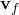
是流体粒子速度（由稳态流输入定义，可能还有波浪定义的其他贡献），

是波浪定义时的流体粒子加速度，
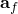
是元素上一点的速度（仅在动态分析步骤期间非零），

是元素上一点的加速度（仅在动态分析步骤期间非零），

是流体的相对速度，

是定义元素中一点处轴向方向的单位向量，
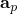
是流体的相对切向（轴向）速度，

是流体的相对横向速度，
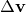
是切向拖曳系数，
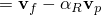
是横向拖曳系数，

是横向惯性系数，

是横向附加质量系数，
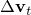
是流体密度，
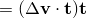
是结构速度因子，
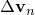
是切向拖曳指数。然后，单元上的横向拖曳力为
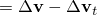
每单位长度

切向拖曳力为

每单位长度

惯性力为

每单位长度

对于风载荷，仅实现横向拖曳。

### 点拖曳和惯性载荷
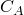
在截面尺寸变化从而暴露端面积于流体的点处，产生了额外的拖曳力和惯性力。

对于这种情况，我们需要额外的定义：

是截面面积的变化，

是暴露面积的外法线，
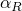
是与不连续性相关的拖曳系数，

与不连续性相关的切向惯性系数，

与不连续性相关的切向附加质量系数，

是切向惯性项的流体和结构加速度形状因子。然后，过渡截面上的拖曳力为
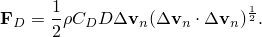
仅当流体的相对速度在向外法线上有负投影时（即当流体流向暴露表面时）此力才为非零。惯性力为
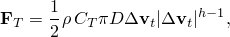
### 分布浮力
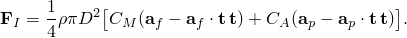
Abaqus在计算梁、管道、刚性梁和肘部的分布浮力载荷（载荷类型PB）时假定闭端条件。开端条件可以通过使用载荷类型TSB来移除元素端部的浮力载荷来模拟。

对于桁架元素，浮力的影响就是阿基米德原理；即，施加等于排开流体重量的垂直力。

对于浮力载荷，假定梁具有指定的等效直径的均匀圆形管道截面。

考虑随变化的压力场，其中是垂直坐标，。然后

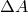对于静水压力，对垂直坐标的依赖是的线性函数，

其中是流体自由表面的垂直位置（管道内部流体的自由表面 elevation 或外部压力的平均水位），是流体密度，是重力加速度。如果定义了波浪，则波浪场产生动压力效应。在这种情况下，压力场相对于位置具有非线性变化。在波幅相对于波长和海洋深度较小的假设下，我们可以假设动压力相对于波方向缓慢变化；因此，忽略平行于静水表面坐标的坐标对压力的导数。然而，动压力场相对于有非线性依赖。

压力场导致节点载荷贡献，可以写成如下。设是弱形式平衡方程中的压力载荷贡献。这个贡献可以用节点载荷向量表示为

其中节点载荷向量为

其中是管道半径（内部或外部），是总压力（包括静水和动压力），是与元素节点关联的形状函数，是元素的当前长度。

### 点浮力

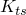点浮力用于在暴露表面上施加离散的浮力。点浮力可用于通过在暴露面积上施加负载荷来移除梁、管道或刚性梁元素上的闭端载荷条件。使用以下定义：

是考虑点的高度，

是管道外流体的质量密度，

是管道内流体的质量密度，

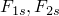是管道外流体的自由表面高度，

是管道内流体的自由表面高度，

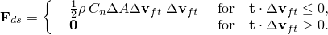是暴露面积的外法线，

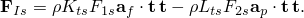是重力加速度。在Abaqus中，假定。

浮力为

其中

和

### 载荷刚度
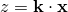
为了确保Abaqus中牛顿方法的二次收敛，需要计算上述力相对于结构运动学解变化的变化。因此，为所有这些载荷类型计算载荷刚度。
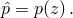
### 参考
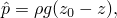
### 参考
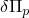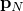
"Abaqus Analysis User's Guide"第6.11.1节"Abaqus/Aqua分析"
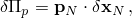