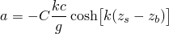# 6.2.2 Airy波理论

### 6.2.2 Airy波理论

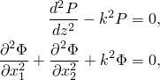**产品：** Abaqus/Aqua

这是一种基于不可压缩无粘性流体的无旋流动的线性化波理论。线性化是通过假设波高相对于波长和静水深度较小来实现的。还假定流体深度均匀（即底部平坦）。

由于是无旋流动，存在流动势，满足

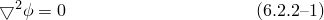并给出流体粒子速度为

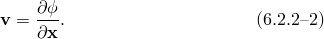现在假设每单位质量有势能（在这种情况下与重力场相关）。然后平衡给出为

其中是流体密度，是压力。将代入，我们得到

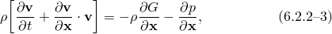该方程可以相对于位置积分给出

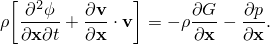因为流体被假定为不可压缩；因此，是常数。这里是任意函数，是空气直接在自由表面上的压力。为方便起见，我们选择

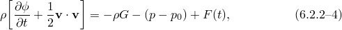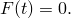相对于其他项可以被忽略（可以从结果解中显示，这与波高相对于波长较小的近似阶数一致）。通过选择的z坐标向上为正，重力势方便地选择为

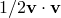其中是未受扰动的表面水平。然后方程变为

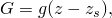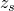从这个方程，瞬时流体表面以下某点的总压力为

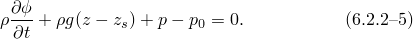因此，总压力是空气压力加上静水压力加上动压力，其中由给出

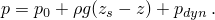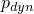设是时间时高于平均（未受扰动）流体表面水平的流体表面升高。由于自由表面的位置是解的一部分，有两个边界条件必须应用于。对于第一个是流体和空气之间界面的动态平衡条件。由于界面假定没有质量，作用于界面的法向力在流体和空气中必须相等。如果忽略界面的表面张力，则水和空气中的压力必须在界面上相等。假设空气运动产生的压力可以忽略不计（这可以被证明是合理的），空气压力可以近似为其未受扰动的值（Whitham, 1974）。动态边界条件然后意味着，其中是自由表面处水中的压力，是未受扰动空气中的压力。由于假定相对于流体深度较小，边界条件可以通过应用于而不是在处进行线性化。

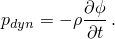利用这些假设，方程提供了边界项

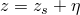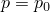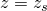自由表面的第二个边界条件来自自由表面的运动学。设自由表面由给出

流体垂直于表面的速度必须等于表面垂直于自身的速度。

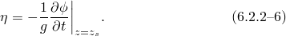对这个表达式求时间导数得

如果我们假设波高相对于波长较小，那么我们可以用速度近似，因此

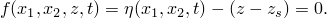在方程和之间消除得

底部处的边界条件为

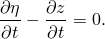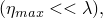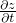现在问题由、和要求解，以及解是水平面中的平面波这一要求定义，即

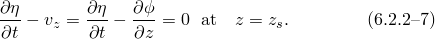其中是波传播方向，是波速。

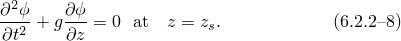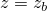我们通过假设来求解这个问题。由于和是独立函数，方程提供两个方程

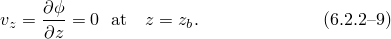其中是常数。

设（使得s测量波传播方向的距离）。这些方程的解是和，因此，

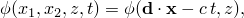其中和是常数，是度的相位角（提供了时间和原点的任意选择，选择为当，和时流体粒子垂直位移最小）。

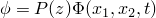在流体底部没有垂直运动，所以由得

代入得

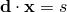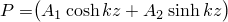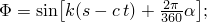其中是常数。色散关系可以通过将代入并在处设定得到

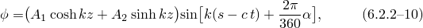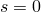波频率与波周期相关为。常数称为波数，与波长相关为，所以。

自由表面高于未受扰动流体表面的升高由方程给出：

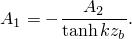写出波幅（波高的一半）为，这定义了

因此，可以重写为

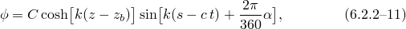此解为该波分量的整个流体提供流体粒子速度、加速度和动压力。方程中省略了项，因为波幅相对于波长较小。这意味着，从，流体粒子加速度被近似为；即，对流加速度部分被忽略。

由于该理论是线性的，任何波浪集合都可以通过其分量的线性叠加来叠加：

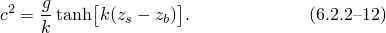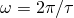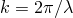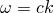其中是的势。由于该理论可以总结如下。

对于：

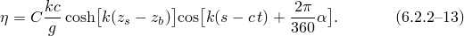速度势：

流体粒子位移：

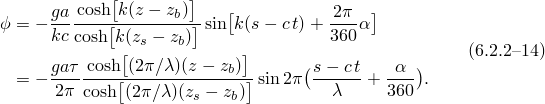水平地，

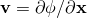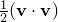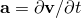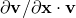和垂直地，

流体粒子速度：

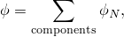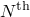水平地，

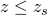和垂直地，

流体粒子加速度：

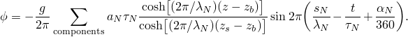水平地，

和垂直地，

自由表面轮廓：

每个模式的色散关系：

动压力：

Airy波理论是一种线性化理论；然而，波幅可能相对于结构尺寸较大。因此，我们必须对波峰下方和平均水位上方的波运动学做出假设。这里使用的假设遵循Hansen（1988）和Faltinsen（1990）描述的修正Airy波理论。自由表面边界条件在方程中被线性化。在平均或未受扰动表面水平以上，速度、加速度和动压力从平均表面水平处的值外推。因此，对于

因此，

当定义重力波时，必须计算结构穿透流体的程度。虽然Airy波理论假定流体位移相对于波长和流体深度较小，但它们不能相对于浸没在流体中的结构尺寸较小。因此，使用瞬时流体表面来确定结构上的点是否看到由于流体存在而产生的载荷。

Airy波场是波场的空间描述。波场为所有时间值在空间位置定义速度、加速度和动压力。因此，通过在适当方程中使用结构在当前时间的当前（对于几何非线性分析）或参考（对于几何线性分析）位置来确定速度、加速度和动压力。波场方程中使用的时间是分析的总时间，累积于分析中的所有步骤（静态、动态等）。

### 参考

### 参考

"Abaqus Analysis User's Guide"第6.11.1节"Abaqus/Aqua分析"
