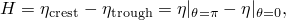# 6.2.3 Stokes波理论

### 6.2.3 Stokes波理论

**产品：** Abaqus/Aqua

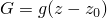假设一列无限系列的平面均匀波在正方向上通过流体传播。z坐标选择为垂直方向为正，因此重力势是，其中是任意基准。

假设流体是无粘性和不可压缩的。流体粒子速度可以从流动势导出

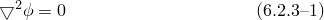平衡为

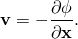其中是流体密度，是压力。将写成流动势的形式，然后给出

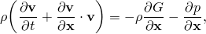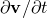相对于积分（注意由于流体不可压缩是常数）给出伯努利方程

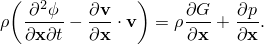其中是任意函数（为方便起见设为零），是大气压力。代入重力势，这是

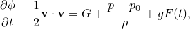其中是未受扰动的表面水平。从这个方程，瞬时流体表面以下某点的总压力为

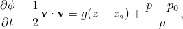因此，总压力是空气压力加上静水压力加上动压力，其中由给出

设是自由表面高于此水平的升高。在自由表面，伯努利方程为

假设表面压力可以忽略。

假设波浪是均匀的，波长和周期为，它们在正方向传播意味着作为和的函数的解必须以相位角的形式出现

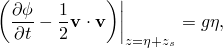其中是波速。这意味着对于解中的任何函数，

因此，在自由表面边界处

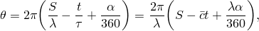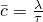自由表面处的伯努利方程为

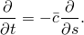或者

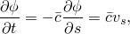自由表面的另一个边界条件是流体粒子速度相对于波速必须与波的斜率相切：

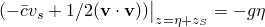在海底处，没有垂直方向的流体运动：

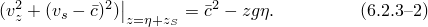现在问题在于寻找满足的势函数，以及表面处的边界条件——和。

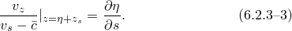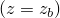Stokes提出了这个问题的幂级数解，Skjelbreia和Hendrickson（1960）获得了五阶解。势函数假定为

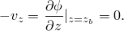其中是常数，取决于水深与波长的比值，是参数。波轮廓假定为

其中对于给定的水深和波长是常数。最后，假定

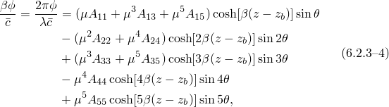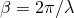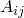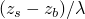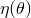和

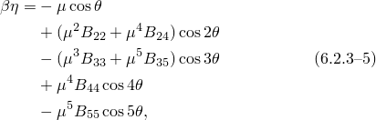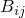Skjelbreia和Hendrickson通过在自由表面边界条件和中匹配相等幂和中的项，获得了18个常数、和。他们将这些常数作为的函数给出：

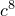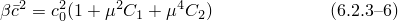Skjelbreia和Hendrickson（1960）在的方程中有一个因子+2592乘以。这被Nishimura等人（1970）纠正为2592。

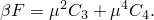然后他们获得了和的方程。波高为

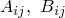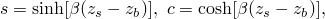所以方程给出

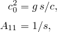此外，波速形式给出的

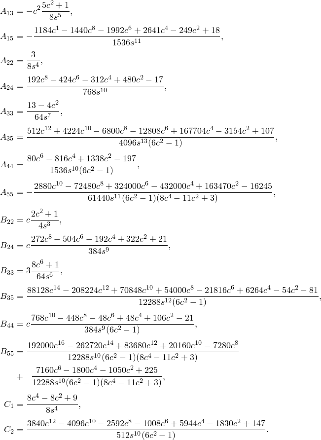给定波周期、波高和水深，方程和必须同时求解波长和参数。这是用牛顿法完成的，使用Airy（线性）波解作为初始猜测。

### Stokes五阶波的流体粒子速度和加速度

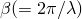流动势已近似为

其中

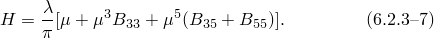流体粒子速度为

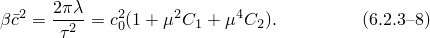流体粒子加速度为

由于解以相位角的形式出现，因此

这允许加速度分量写成
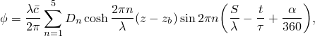
回想动压力的表达式：
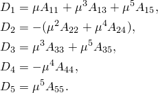
代入的表达式得：
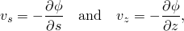
其中
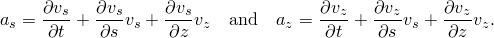
最后，表面位置为
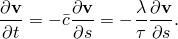
其中
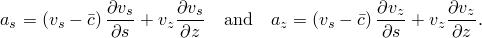
Stokes波场是波场的空间描述。所有波场量都计算到瞬时流体水平。波场为所有时间值在空间位置定义速度、加速度和动压力。因此，通过在适当方程中使用结构在当前时间的当前（对于几何非线性分析）或参考（对于几何线性分析）位置来确定速度、加速度和动压力。波场方程中使用的时间是分析的总时间，累积于分析中的所有步骤（静态、动态等）。
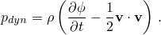
### 参考
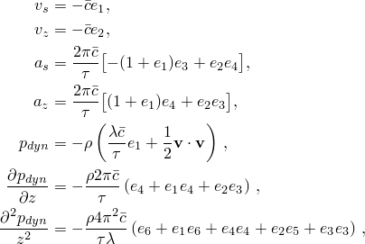
### 参考
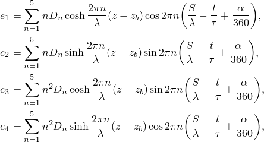
"Abaqus Analysis User's Guide"第6.11.1节"Abaqus/Aqua分析"
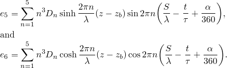