# 6.6.1 滑动约束

### 6.6.1 滑动约束

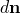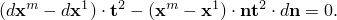**产品：** Abaqus/Standard  Abaqus/Explicit

滑动约束有多种用途。例如，此MPC与其他MPC类型结合使用，用于将壳单元网格约束到实体单元网格。MPC通过强制初始穿过厚度的直线保持直线（尽管有旋转和位移）来保持与标准壳理论的的一致性。当应用于壳-实体界面上的实体单元节点时，此MPC强制执行与壳模型运动学近似的兼容性。

该约束的理论如下：

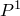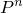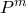设是要定义线的点；设是必须位于此线上的节点。线的方向给定为

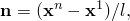其中

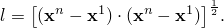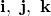设是在全局坐标系中x-、y-、z-方向上的基向量。然后，定义一个垂直于线的单位向量为

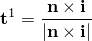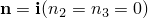除非在这种情况下我们使用

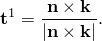现在我们可以定义一个正交法线为

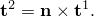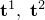、、现在形成一个正交基向量集，和垂直于连接和的线。约束可以通过以下条件施加：连接节点m到节点1的线垂直于和；即，

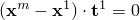和

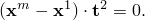我们现在选择一个局部坐标编号系统，使得i是具有最大投影的全局方向：

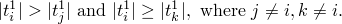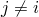类似地，我们选择全局方向j使得且

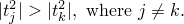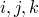使用这个定义，约束条件可以相对于节点m的坐标分量明确写成

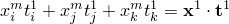和

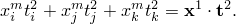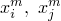这些方程可用于消除（注意的编号避免了在这个消除中除以零）：

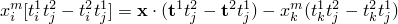和

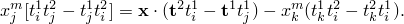上述方程将强制执行所需的约束。我们还需要这些约束的导数。这些是

和

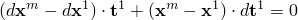其中

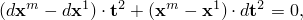和

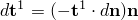这些方程简化为

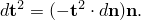和

可以从的定义中获得，因此，

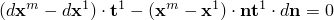因此，

和

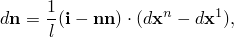增量约束方程变为

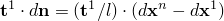和

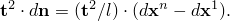设。然后，当使用上述相同的排序写出时，这些方程为

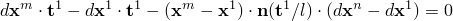和

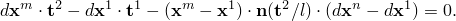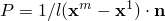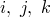求解得

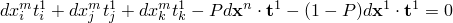和

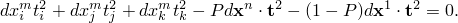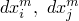在二维情况下，位于x-y或r-z平面中。这意味第二个约束方程自动满足。剩余的约束方程为

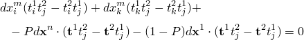及其导数为

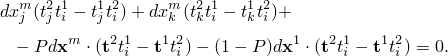### 参考

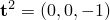### 参考

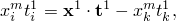"Abaqus Analysis User's Guide"第35.2.2节"一般多点约束"
