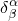

# 1.2.1 Notation

### 1.2.1 Notation

**Products: **Abaqus/Standard  Abaqus/Explicit

Notation is often a serious obstacle that prevents an engineer from using advanced textbooks; for example, general curvilinear tensor analysis and functional analysis are both necessary in some of the theories used in Abaqus, but the unfamiliar notations commonly used in these areas often discourage the user from pursuing their study. The notation used in most of this guide (direct matrix notation) may be unfamiliar to some readers; but it is not difficult or time consuming to gain enough familiarity with the notation for it to be useful, and it is definitely worthwhile. This notation is commonly used in the modern engineering literature---it is a shorthand version of the familiar matrix notation used in many older engineering textbooks. The notation is appealing---once it is understood---because it allows the equations to be developed concisely, and the physical ideas can be perceived without the distraction of the complexities that arise from the choice of the particular basis system that will eventually be used to express the same concepts in component form. Because the notation has become so standard in the literature, the user who wishes or needs to read textbooks and papers that are related to the use of Abaqus will find that familiarity with this notation is desirable.

Both direct matrix notation and component form notation are used in the guide. Both notations are described in this section. Direct matrix notation is used whenever possible. However, vectors, matrices, and the higher-order tensors used in the theories must eventually be written in component form to store them as a set of numbers on the computer. Thus, both ways of writing these quantities will be needed in the guide.
### Basic quantities

The quantities needed to formulate the theory are scalars, vectors, second-order tensors (matrices), and---occasionally---fourth-order tensors (for example, the stress-strain transformation for linear elasticity). In direct matrix notation these are written as:| a scalar value | a |
| --- | --- |
| a vector | or |
| with the transpose | or |
| a second-order tensor or matrix | or |
| with the transpose | or |
| and |
| a fourth-order tensor |  |

Vectors and second-order tensors (matrices) are written in the same way: they are distinguished by the context. In direct matrix notation there is generally no need to indicate that a vector must be transposed. The context determines whether a vector is to be used as a "column" vector  or as a "row" vector . In this case the transpose superscript is only used to improve the readability of an expression. On the other hand, for second-order nonsymmetric tensors the addition of a transpose superscript will change the meaning of an expression.

This representation of vectors and tensors is very general and convenient for developing the theory so that the equations can be understood easily in terms of their physical meaning. However, in actual computations we have to work with individual numbers, so vectors and tensors must be expressed in terms of their components. These components are associated with an axis system that defines a set of base vectors at each point in space. The simplest axis system is rectangular Cartesian, because the base vectors are orthogonal unit vectors in the same direction at all points. Unfortunately, we need more generality than this because we will be dealing with shells and beams, where stress, strain, etc. are most conveniently described in terms of directions on the surface of the shell (or associated with the axis of the beam), and these usually change as we move around on the surface. To retain this necessary generality and express vectors and matrices in component form, we introduce a general set of base vectors, , , which are not necessarily orthogonal or of unit length but are sufficient to define the components of a vector (for this purpose they must not be parallel or have zero length). A vector  can then be written

where the numbers , , and  are the components of  associated with , , and .

In actual cases the  are chosen for convenience (for example, see "Conventions,"  Section 1.2.2 of the Abaqus Analysis User's Guide, for a description of how base vectors are chosen for surface elements in Abaqus), and then the  are obtained.

To save writing, we adopt the usual summation convention that a repeated index is summed---in this case over the range 1 to 3---so that the above equation is written

Likewise, the component form of a matrix will be

or, written out,

 Similarly, a fourth-order tensor can be written in component form as

While we will need such completely general base vectors for describing the stresses and strains on shells and beams, in many cases it is convenient to use rectangular Cartesian components so that the  are orthogonal unit vectors. To distinguish this particular case, we will use Latin indices instead of Greek indices. Thus,  are a set of general base vectors; while  are rectangular Cartesian base vectors; and  is the component of the vector  along a general base vector, while , , is the component of  along the *i*th Cartesian direction.

Vector and tensor concepts and their representation are discussed in many textbooks---see [Flugge (1972)](07s01a01-References.md), for example.
### Basic operations

The usual matrix and vector operators are indicated in this guide as follows:

Dot product of two vectors:

(The dot symbol defines this operation completely, regardless of whether  or  is transposed---i.e., )

Cross product of two vectors:

Matrix multiplication:

(It is implicitly assumed that  and  are dimensioned correctly, as needed for the operation to make sense; in addition, if  is a nonsymmetric tensor, )

Scalar product of two matrices:

This operation means that corresponding conjugate components of the two matrices are multiplied as pairs and the products summed. Thus, for instance, if  is the stress matrix, , and  the conjugate rate of strain matrix, , then  would give the rate of internal work per volume, .

It is also necessary to define the dyadic product of two vectors:

This operation creates a second-order tensor (or dyad) out of two vectors. In component notation this notation is equivalent to .

A matrix of derivatives,

means

Throughout this guide it will be assumed implicitly that, when a derivative is taken with respect to time, we mean the *material* time derivative; that is, the change in a variable with respect to time whilst looking at a particular material particle. When this is not the case for a particular equation, it will be stated explicitly when the equation appears.

Provided that we are careful about interpreting  in the manner illustrated above, standard concepts of elementary calculus clearly hold; for example, if  is a vector-valued function of the vector-valued function , which in turn is a vector-valued function of , that is , then

or, if :

Due to these properties many useful results can be obtained quickly and expressed in a compact, easily understood, form.
### Components of a vector or a matrix in a coordinate system

In the previous section we introduced the idea that a vector  or a matrix  can be written in terms of components associated with some conveniently chosen set of base vectors, . We now show how the components  (or ) are obtained. We can do so using the dot product. For each of the three base vectors, , we define a conjugate base vector , as follows. Choose  as normal to  and , such that the dot product . Similarly, choose  normal to  and , such that ; and  normal to  and , such that . Thus,

We can write this compactly as

where  if , and , otherwise. ( is called the "Kronecker delta.") In matrix notation  is the unit matrix : we can also write the above equation defining , , and  in matrix form as

so that, if one set of base vectors---, say---is known, the others are easily obtained.

With this additional set of base vectors, we can immediately obtain the components of a vector or a matrix as follows.

Consider a vector . Then  (writing  in component form, using the basis vectors ), and since , only if ,

In exactly the same way we could have written

 by expressing  as components associated with the  base vectors, .

Similarly, for a matrix,

and

These component definitions are particularly convenient for calculating the dot product of two vectors, for we can write

which is

Similarly, the scalar product of two matrices is

that is, we simply multiply corresponding entries in the  and  arrays, arranged as matrices, and then sum the products.

Finally, on the computer we need to store only one form of component: ,  or , . We can always go from one to the other using the "metric tensor," , and its inverse, , which are defined as

and

For

 Thus, ; similarly , and, by extension, for matrices,

and

The metric tensor and its inverse are symmetric:

The two sets of base vectors and components of vectors or matrices associated with them are named as follows:|  | are covariant base vectors, |
| --- | --- |
|  | are contravariant base vectors, |
|  | are covariant components of a vector (or matrix), |
|  | are contravariant components of a vector (or matrix). | Thus, the contravariant components are those associated with the covariant base vectors, , and vice versa. The simplest case is when the basis is a set of orthogonal unit vectors (a rectangular Cartesian system) because then---from the definition ---we see that , and so  and we need not distinguish the type of component. Whenever possible a rectangular Cartesian system is chosen, so the type of component need not be distinguished. This system is discussed in more detail in the sections on beam elements and shell elements.
### Components of a derivative

Consider a vector-valued function, , which is expressed in component form on a basis system, . Let the vector-valued function  depend on : . Then

 so that the component of  associated with a change  is

which we write, for convenience, as

meaning

Now suppose  is written on a different basis---, say---so that we store  as the components

Then

Typically we would then write

where

Readers who are familiar with general curvilinear tensor analysis will recognize  as the covariant derivative of  with respect to , often written as . The advantage of the direct matrix notation is clear: because we can imagine  and  as vectors in space, we have a physical understanding of what we mean by ; it is the change in the vector-valued function  as a function of another vector-valued function . For computations we must express  and  in component form. Then

provides the necessary components once we have chosen convenient basis systems:  for  and  for . Typically  and  will both be the simple rectangular Cartesian bases

everywhere. But sometimes we must use more complicated basis systems---examples are when we need quantities associated with the surface of a general shell and when the symmetry of the geometry and, possibly, of the deformation makes it convenient to work in an axisymmetric system. The careful projection of the general results written in direct matrix notation onto the chosen basis system allows us to implement the theory for computation.

As an example, consider the usual expression for strain rate,

which requires the matrix  to be evaluated, where  is the velocity of the material currently flowing through the point  in space. Let us now derive the components of  when the basis system for both  and  is the cylindrical system that we usually choose for axisymmetric problems, with the basis vectors

(in Abaqus for axisymmetric cases we always take the components in this order---radial, axial, circumferential). These basis vectors are orthogonal and of unit length, so that 

We consider position to be defined by the coordinates , with

so that

Thus,

where

so that

We know that

so that

and thus,

The components of the strain rate are thus

and

For the case of purely axisymmetric deformation,  and , so these results simplify to the familiar expressions

In summary, direct matrix notation allows us to obtain all our fundamental results without reference to any particular choice of coordinate system. Careful application of the concept of the covariant derivative then allows these general results to be projected into component form for computation.
### Virtual quantities

The concepts of virtual displacements and virtual work are fundamental to the development. Virtual quantities are infinitesimally small variations of physical measures, such as displacement, strain, velocity, and so on. The virtual variation of a scalar quantity *a* is indicated by ; of a vector or matrix  by .

We extend this notation to such expressions as

which is the symmetric part of the spatial gradient of a virtual vector field . This notation corresponds to the virtual rate of deformation (a measure of strain rate) if  is a virtual velocity field.
### Initial and current positions

Most structural problems concern the description of the way a structure behaves as it is loaded and moves from its reference configuration. Thus, we often compare positions of a point in the current (deformed) configuration and a reference configuration that is usually chosen as the configuration when the structure is unloaded or, in the case of geotechnical problems, when the model is subject only to geostatic stresses. To distinguish these configurations, we use lowercase type () to indicate the current position and uppercase type () to indicate the initial position of the same material point in the same spatial coordinate frame. In Abaqus we almost always store the rectangular Cartesian components of  and . The exception is in axisymmetric structures, where radial (*r*) and axial (*z*) components are stored.
### Nodal variables

So far we have discussed quantities that are considered to be associated with all points in a model. The finite element approximation is based on assuming interpolations, by which displacement, position, and---often---other variables at any material point are defined by a finite number of nodal variables. In this guide we use uppercase superscripts to refer to individual nodal variables or nodal vectors and adopt the summation convention for these indices.

Hence, the interpolation can be written quite generally as

where  is some vector-valued function at any point in the structure; ,  up to the total number of variables in the problem, is a set of *N* vector interpolation functions (these are functions of the material coordinates, ); and ,  is a set of nodal variables.

In some sections in this guide we need to describe operations on nodal variables for the complete system of finite element equations. In these sections we use the classical matrix-vector notation. In this notation  represents a column vector containing nodal variables,  represents a row vector, and a matrix is written as . Common operations are the scalar product between two vectors,

(which is equivalent to  in index notation) and the matrix-vector product

(which is equivalent to  in index notation).