# 1.3.1 Rotation variables

### 1.3.1 Rotation variables

**Products: **Abaqus/Standard  Abaqus/Explicit

Since Abaqus contains such capabilities as structural elements (beams and shells) for which it is necessary to define arbitrarily large magnitudes of rotation, a convenient method for storing the rotation at a node is required. The components of a rotation vector  are stored as the degrees of freedom 4, 5, and 6 at any node where a rotation is required.

The finite rotation vector, , consists of a rotation magnitude, 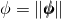, and a rotation axis or direction in space, 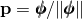. Physically, the rotation  is interpreted as a rotation by  radians around the axis . To characterize this finite rotation mathematically, the rotation vector  is used to define an orthogonal transformation or rotation matrix. To do so, first define the skew-symmetric matrix 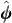 associated with  by the relationships

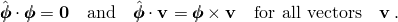 is called the axial vector of the skew-symmetric matrix . In matrix components relative to the standard Euclidean basis, if 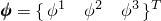, then

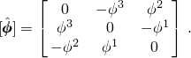In what follows, 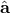 will be used to denote the skew-symmetric matrix with axial vector .

A well-known result from linear algebra is that the exponential of a skew-symmetric matrix  is an orthogonal (rotation) matrix that produces the finite rotation . Let the rotation matrix be , such that 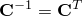. Then by definition,

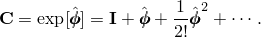However, the above infinite series has the following closed-form expression:

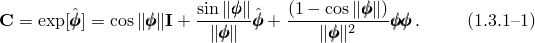

In components,

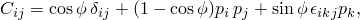where 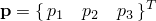 and  is the alternator tensor, defined by

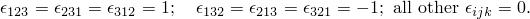It is this closed-form expression that allows the exact and numerically efficient geometric representation of finite rotations.
### Quaternion parametrization

Even though Abaqus stores and outputs the rotation vector, quaternion parameters prove to be an efficient and convenient way to treat finite rotations computationally. Let 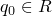 be a scalar, and let 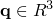 be a vector field. The quaternion  is simply the pairing

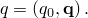To associate  with the finite rotation vector , define the following:

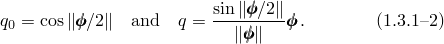

By trigonometric identities it follows that the orthogonal matrix  in [Equation 1.3.1&#8211;1](01s03a03-Rotation-variables.md) is given in terms of  as

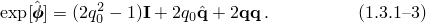By the convention introduced above, 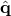 is the skew-symmetric matrix with axial vector .

For a more detailed discussion of quaternion algebra and its relation to other representations of finite rotations, see the discussion by [Spring (1986)](07s01a01-References.md).
### Compound rotations

A compound rotation is the successive application of two or more rotation fields. In geometrically linear problems compound rotations are obtained simply as the linear superposition of the individual (linearized) rotation vectors. This fact follows directly from the series expansion for 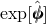. Let  and  be infinitesimal rotations. Thus, 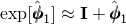, 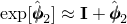, and

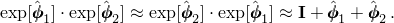In geometrically nonlinear analysis compound rotations are no longer additive. Furthermore, they are not commutative; that is, the order of application is important. A significant exception occurs when the multiple rotations share the same rotation axis. This special case is investigated further below. A detailed example of a finite compound rotation is given in "Conventions,"  Section 1.2.2 of the Abaqus Analysis User's Guide.

Let 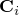 be the orthogonal transformation representing the compound rotation defined as the product of a set of individual or incremental rotations 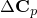, for 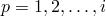. (For the case of specified boundary conditions  is the final product after *i* steps of all the specified rotations ; for the iterative numerical solution procedure  is the total rotation after *i* increments, where , for 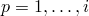, is the converged rotation field solution at each increment.) By definition, the compound rotation is the product

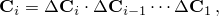or equivalently by the recursion relation,

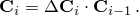It is important to note that , which is interpreted as the finite rotation  superposed on the finite rotation , is different from , which is interpreted as the finite rotation  superposed on the finite rotation .

Although compound rotations are defined in terms of orthogonal matrices, in a numerical context the rotation vectors (or equivalently the quaternion parameters) associated with the rotation matrices are the degrees of freedom. Compound rotations are performed as follows: Given a quaternion parametrization 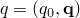 and an incremental (finite) rotation 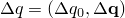, where  is defined in terms of an incremental rotation vector  by [Equation 1.3.1&#8211;2](01s03a03-Rotation-variables.md), the total or compound rotation is given by the quaternion , which is calculated as

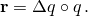Here  denotes the quaternion product and is defined as

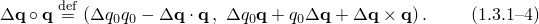

[Equation 1.3.1&#8211;4](01s03a03-Rotation-variables.md) allows for the update of rotation fields without ever calculating the orthogonal matrix from the quaternion and without performing a matrix multiplication. Furthermore, all operations are singularity free regardless of the magnitude of the incremental rotation field . The final (total) rotation vector can be calculated from the quaternion 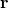 by inverting [Equation 1.3.1&#8211;2](01s03a03-Rotation-variables.md).

For the special case when compound rotations share the same rotation axis, the compound rotation reduces to an additive form. Let  and  have the same rotation axis . Then 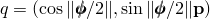, 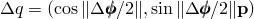, and

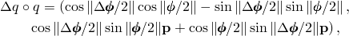which reduces to

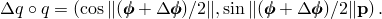
### Rotation vector extraction

For output purposes it is necessary to extract the rotation vector corresponding to a given quaternion. The extraction procedure is as follows: Let 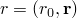 be the quaternion, and let  be the rotation vector. Thus,

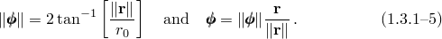

It is important to note that the extraction of the rotation vector from the quaternion is not unique. The magnitude 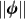 is determined only up to the addition of 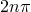, 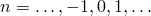 Abaqus will always choose that rotation vector such that 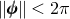.
### Director and rotation field updates

As an example of the utility of the quaternion parameters, consider the incremental update of a director field for either a beam or shell analysis. At some stage of the solution the director field 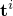, the quaternion parametrization of the rotation field 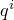, and the incremental rotation field 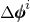 are known at increment *i*. To update the director field by the incremental rotation to increment 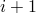, proceed as follows: First calculate the quaternion parametrization of the incremental rotation:

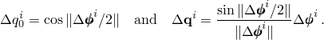The director field at  is then defined as 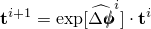, where  is calculated with [Equation 1.3.1&#8211;3](01s03a03-Rotation-variables.md). Thus, the director is calculated directly from the quaternion as

Furthermore, the update of the rotation field is obtained by quaternion multiplication  and is defined by

### Variations of the rotation field

In the development of the balance equations, it is necessary to calculate the variation of the rotation field. Consider the vector field , which is obtained by rotation of the reference vector field :

Variations  in this field are obtained as

where  is the linearized rotation matrix; that is, the variation of the orthogonal tensor . On the other hand, the variation can be defined in terms of the linearized rotation field :

Consequently, it follows that

It is important to note that the linearized rotation , which is analogous to the angular velocity in dynamics, is *not* the variation of the rotation vector . By a straightforward (but involved) calculation, it can be shown that the variation of the rotation vector () is related to the linearized rotation  by

where

The inverse of  is

Let  represent an infinitesimal change in the rotation field. A direct calculation of the variation of , which is equivalent to calculation of the second variation of either  or , leads to an expression that is not symmetric in the variations  and the changes . However, it is shown in [Simo (1992)](07s01a01-References.md) that the correct definition of the Hessian operator---that is, the "covariant" derivative of the weak form of the balance equations---requires only the symmetric part (with respect to the variations) of the second variation. Thus, without loss of generality, we can write

Similarly, the second variation of the vector field rotated by  can be written as

### Velocity and acceleration

Taking the time derivative of the rotation matrix, we find with the same arguments as used in the calculation of the variations that

where  is the angular velocity matrix. Equivalently, the first and second time derivative of  are written as

The instantaneous angular velocity vector  is related to the time rate of change of the rotation vector by the relation

where  is given by [Equation 1.3.1&#8211;6](01s03a03-Rotation-variables.md).

In the linearization of the dynamic balance equations, it is necessary to calculate the variation of the angular velocity, . This quantity, however, can be calculated only by linearizing the specific algorithm used for the time integration of the dynamic equations.
### Coupling of rotations: constant velocity joint

Next, a more rigorous treatment of the two-dimensional constant velocity joint described in "MPC,"  Section 1.1.14 of the Abaqus User Subroutines Reference Guide, is presented. This derivation exemplifies some of the issues associated with the treatment of finite rotations. "Uniform collapse of straight and curved pipe segments,"  Section 1.1.5 of the Abaqus Benchmarks Guide, deals with a different finite rotation constraint and tackles additional complications.

Let *a*, *b*, *c* (see [Figure 1.3.1&#8211;1](01s03a03-Rotation-variables.md)) be the nodes making up the joint, with *a* the dependent node.

Figure 1.3.1&#8211;1 Nonlinear MPC example---constant velocity joint.

The joint is operated by prescribing an axial rotation  at *c* and an out-of-plane rotation  at *b*. The compounding of these two prescribed rotation fields will determine the total rotation at *a*. We can formally write this constraint as follows:

The constraint can be written in terms of the rotation matrices as

With the previously defined variational expressions, the constraint can be linearized as

This expression can be simplified by right-multiplying the expression by  and by making use of the constraint [Equation 1.3.1&#8211;7](01s03a03-Rotation-variables.md), which yields

which can be written in vector form as

Since

the linearized constraint is indeed identical to the one derived based on simple linear considerations in the Abaqus Analysis User's Guide.

The linearized constraint is used for the calculation of equilibrium. It can also be used for the recovery of the dependent rotation, , as is done in the Abaqus Analysis User's Guide. The resulting rotation will satisfy the constraint approximately (unless one of the angles  or  is constant, in which case the constraint is linear and the recovery is exact).

For an exact enforcement of the constraint, user subroutine MPC must define the components of the total rotation vector  exactly. To do so,  must be updated based on the current values of  and . This is most easily accomplished with the aid of the quaternion parameters. Let  and  be the quaternion parameterizations associated with the finite rotation vectors  and , respectively. The total compound rotation  is given by the quaternion , where

according to the quaternion compound formula [Equation 1.3.1&#8211;4](01s03a03-Rotation-variables.md). The rotation vector  is extracted from the quaternion  as follows:

where  is the norm of the vector .

"MPC,"  Section 1.1.14 of the Abaqus User Subroutines Reference Guide, shows the implementation of the linearized form of the constraint in user subroutine MPC. The implementation of the exact nonlinear constraint is shown below:

SUBROUTINE MPC(UE,A,JDOF,MDOF,N,JTYPE,X,U,UINIT,MAXDOF,LMPC,
* KSTEP,KINC,TIME,NT,NF,TEMP,FIELD)
C
INCLUDE 'ABA_PARAM.INC'
C
DIMENSION UE(MDOF), A(MDOF,MDOF,N), JDOF(MDOF,N), X(6,N),
* U(MAXDOF,N), UINIT(MAXDOF,N), TIME(2), TEMP(NT,N),
* FIELD(NF,NT,N)
PARAMETER( SMALL = 1.E-14 )
C
IF ( JTYPE .EQ. 1 ) THEN
A(1,1,1) =  1.
A(2,2,1) =  1.
A(3,3,1) =  1.
A(3,1,2) = -1.
A(1,1,3) = -COS(U(6,2))
A(2,1,3) = -SIN(U(6,2))
C
JDOF(1,1) = 4
JDOF(2,1) = 5
JDOF(3,1) = 6
JDOF(1,2) = 6
JDOF(1,3) = 4
C
CPHIB = COS(0.5*U(6,2))
SPHIB = SIN(0.5*U(6,2))
CPHIC = COS(0.5*U(4,3))
SPHIC = SIN(0.5*U(4,3))
C
QA0 = CPHIB*CPHIC
QAX = CPHIB*SPHIC
QAY = SPHIB*SPHIC
QAZ = CPHIB*SPHIC
C
QAMAG = SQRT( QAX*QAX + QAY*QAY + QAZ*QAZ )
IF ( QAMAG .GT. SMALL ) THEN
PHIA  = 2.*ATAN2( QAMAG , QA0 )
UE(1) = PHIA*QAX/QAMAG
UE(2) = PHIA*QAY/QAMAG
UE(3) = PHIA*QAZ/QAMAG
ELSE
UE(1) = 0.
UE(2) = 0.
UE(3) = 0.
END IF
END IF
C
RETURN
END
### Reference

### Reference

"Conventions,"  Section 1.2.2 of the Abaqus Analysis User's Guide