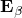

# 1.4.1 Deformation

### 1.4.1 Deformation

**Products: **Abaqus/Standard  Abaqus/Explicit

In any structural problem the analyst describes the initial configuration of the structure and is interested in its deformation throughout the history of loading. The material particle initially located at some position  in space will move to a new position : since we assume material cannot appear or disappear, there will be a one-to-one correspondence between  and , so we can always write the history of the location of a particle as

and this relationship can be inverted---we know  when we know  and *t*. Now consider two neighboring particles, located at  and at  in the initial configuration. In the current configuration we must have

using the "mapping" [Equation 1.4.1&#8211;1](01s04a04-Deformation.md).

The matrix

is called the deformation gradient matrix, and [Equation 1.4.1&#8211;2](01s04a04-Deformation.md) is written

As the material behavior depends on the straining of the material and not on its rigid body motion, those parts of the motion in the vicinity of a material point must be distinguished. Looking at an infinitesimal gauge length  emanating from the particle initially at , we can measure its initial and current lengths as

so the "stretch ratio" of this gauge length is

If , there is no strain of this infinitesimal gauge length---it has undergone rigid body motion only. Now using [Equation 1.4.1&#8211;4](01s04a04-Deformation.md),

so that, from [Equation 1.4.1&#8211;5](01s04a04-Deformation.md),

where  is a unit vector in the direction of the gauge length .

[Equation 1.4.1&#8211;6](01s04a04-Deformation.md) shows how to measure the stretch ratio associated with any direction, , at any material point defined by  (or by ). Useful results are obtained when we vary the direction defined by  at a particular material point and look for stationary values of the stretch ratio, . Since  must always be a unit vector, stationary values of  are obtained by solving the constrained variational equation

where  is a Lagrange multiplier, introduced to retain the constraint

Taking the variation gives back the constraint (conjugate to ) and, conjugate to , gives

Taking the dot product of the left-hand side of this equation with  and comparing with [Equation 1.4.1&#8211;6](01s04a04-Deformation.md) identifies , so [Equation 1.4.1&#8211;7](01s04a04-Deformation.md) is

This problem is an eigenvalue one that can be solved for the three extreme values of . Since  is always real and positive (and nonzero), , and hence  must be positive definite. [Equation 1.4.1&#8211;8](01s04a04-Deformation.md) thus gives three real, positive eigenvalues, , , , the "principal stretches," with three corresponding eigenvectors, , , , which will be orthogonal, by [Equation 1.4.1&#8211;8](01s04a04-Deformation.md), if the corresponding eigenvalues are different, and can be orthogonalized otherwise. The  are the principal directions of strain.

Now let , ,  be unit vectors corresponding to , , , but in the current configuration, so that, using [Equation 1.4.1&#8211;4](01s04a04-Deformation.md),

Then

by the orthogonality results just mentioned. Thus, , , and  will also be an orthogonal set. Since each is a unit vector,

where  is the same pure rigid body rotation matrix in each of these equations. A pure rigid body motion matrix has the property that its inverse is its transpose: . Comparing the principal stretch directions in the current and original configurations, therefore, isolates the rigid body rotation and the stretch. Finding the principal stretch ratios and their directions thus provides one solution to the problem of isolating straining motion and rigid body motion in the vicinity of a material point.

Now consider a gauge length in the reference configuration, d, directed along . The same infinitesimal material line in the current configuration will be along  and will be stretched by , so that

Similarly, along the other principal directions,

and

Since (, , ) is an orthonormal set of base vectors in the reference configuration, any infinitesimal material line (gauge length)  at  can be written in terms of its components in this basis:

where

Each of the vectors  moves and stretches to the corresponding , as defined above. Thus, the current gauge length, , is

which we write as

where

is the "left stretch" matrix, which is the sum of three dyadic products.

Comparison with the definition of the deformation gradient, [Equation 1.4.1&#8211;4](01s04a04-Deformation.md), shows that

which is the polar decomposition theorem---that any motion can be represented as a pure rigid body rotation, followed by a pure stretch of three orthogonal directions. The polar decomposition theorem is important because it allows us to distinguish the straining part of the motion from the rigid body rotation. Specifically,  completely defines the relative motions of material particles in the infinitesimal neighborhood of the material particle that was at  in the reference configuration; and the left stretch matrix, , completely defines the deformation of the material particles at . The rotation matrix  defines the rigid body rotation of the principal directions of strain ( in the reference configuration;  in the current configuration).  represents only the rigid body rotation of the material at the point under consideration in some average sense: in a general motion, each infinitesimal gauge length emanating from a material particle has a different amount of rotation. This distinction between the rotation of the principal directions of strain, , and the rotations of individual directions in the material becomes significant when we must discuss large deformations of nonisotropic materials. Nevertheless, we have established an important result: if  only, we know there is no deformation of the material in the immediate neighborhood of the point originally at  and currently at , since in this case  and so .  must be nonzero for there to be any deformation of the material at the point in question: in this sense  (and, hence,  itself) is sufficient to define the deforming part of the motion (it contains complete information about all except pure rigid body rotation of the point). For this reason---so that, later in the development, we will be able to link the kinematics to the stressing of the material---we will need to be able to isolate  from . It is easy to obtain , for

since  and  is symmetric.

Since we originally defined  from the principal stretches and their principal directions in the current configuration as

then

We see that the eigenvalues of , are , , and , and the corresponding eigenvectors are , , and . We can then construct . The deformation at the point is, thus, readily obtained by multiplying a  matrix with its transpose () and solving the real eigenproblem for the resulting (symmetric) matrix. We can then obtain the rotation  as

Since  has been constructed from its eigenvalues and eigenvectors, its inverse is immediately available:

So far we have written the results quite generally, without reference to any particular coordinate system. To perform computations we must choose a basis system to express these results as arrays of individual numbers. We now do so with some generality with respect to the choice of basis system. The justification for retaining generality at this stage is twofold: as an exercise, to provide a little more familiarity in the notation system we have chosen to use in this guide, and because we do need some---but, as it turns out, not all---of the generality when we have to deal with shell elements, where it is undesirable to use the rectangular Cartesian base vectors of the global, spatial system because the natural orientation of the shell reference surface causes us to prefer to choose two of the base vectors to be tangent to the shell's reference surface and the other to be normal to this surface. This preference causes us to need two basis systems: one associated with the body in its current configuration, when the point in question is at , and one associated with the body in its reference configuration, when the same point was at , because the orientation of the shell's reference surface---which determines our choice of basis vectors---will be quite different in these two configurations. We will write , , as the basis vectors chosen to write components associated with the current configuration (so that any vector  associated with the current configuration is written as ) and , , as the basis at the same material point but in the reference configuration. (Since we assume that both of these basis systems are adequate to express any vector-valued function by its components in the basis system---that is, the basis vectors are not linearly dependent---either would, in principal, serve for both configurations. We introduce two distinct systems by preference, because each is chosen as particularly suitable for a particular configuration.) Since we do not yet impose any particular restrictions on the  or the  (except for the requirement that the vectors must not be linearly dependent), we cannot assume that they will be orthogonal or of unit length: we will, therefore, need to use the corresponding contravariant vectors defined by

and the contravariant metric tensors

We can express the deformation gradient, , numerically by projecting it onto the bases:

Recall the definition of :

Since the components of  along  are  and we can write ,

Thus, writing  defines

 We must continue to bear in mind that the first index of  is associated with a component of  along a base vector in the current configuration ( in this case), while its second index is associated with a component of  along a base vector in the reference configuration ().

From [Equation 1.4.1&#8211;13](01s04a04-Deformation.md) we can write

where  is the contravariant metric of the basis system that we have chosen in the reference configuration.

The eigenproblem for the squared principal stretch ratios and their directions is solved by finding the eigenvalues of the matrix of numbers . The eigenvectors will appear as the components  along the  base vectors in the current configuration. Since we have defined the left stretch on the current configuration as

we will write its components on the basis in the current configuration as

and, since

The polar decomposition gives

so

where  is the contravariant metric tensor of the basis system we have chosen to use in the current configuration and---as with ---we see that the first index of  is associated with the contravariant base vector  in the current configuration, while the second index is associated with the contravariant base vector  in the reference configuration.

We should take care to understand the distinction between the direct matrix expression of the rigid body rotation of the principal directions of strain of the material, , and the components of  expressed on a particular basis. Suppose, for example, that the rigid body rotation at a point is zero (that is, ) but we, nevertheless, have chosen different basis systems  and . In this case . This implies that, even though  is a unit matrix (in the sense that operating on any vector with this matrix makes no change in that vector), the numerical values we have chosen to store the matrix---the ---do not form a unit matrix of numbers unless the  and the  are coincident and orthonormal. Thus, our choice of quite general basis systems that are not the same in the current and reference configurations (introduced as being "natural" for writing results for shells) somewhat complicates the interpretation of the numbers we store.

In the previous few paragraphs we have chosen to explore the expression of the basic results we have derived so far for the kinematics of the total motion in terms of quite general basis systems,  and . In Abaqus we wish to express results as simply and directly as possible, and we can do so by choosing particular sets of basis vectors that offer the most convenience for our purposes. First, we take the  (and, by extension, the , since these are just the  at the beginning of the motion) to be a local, orthonormal system at each point. Although it is not possible to construct a Cartesian system with orthonormal base vectors over a general shell surface, we can always project the general results onto such a system when that system is chosen specifically at each point where we need to make the projection---typically at the integration points of the elements. The choice of which system is used as this local orthonormal basis is made in Abaqus at two levels: we distinguish continuum ("solid") elements from structural (shell and beam) elements, and we distinguish the default choice of directions from the particular choice of directions (orientation) specified by the user. For continuum elements the default  are unit vectors along the axes of the global Cartesian system chosen for the problem. At points where the orientation is defined by the user, the specified  are used. For shells (and membranes) we take  and  tangent to the shell's reference surface and  normal to that surface at the point under consideration. By default,  is the projection of the global *x*-axis onto the reference surface or, if the global *x*-axis is almost normal to that surface at the point,  is the projection of the global *z*-axis onto the surface. If the orientation is defined by the user,  and  are the projections of the two specified axes onto the reference surface at the point. In all cases  is normal to the shell's reference surface. For beams  is along the beam axis, with  and  defined from the beam section definition option and beam normals given as part of the nodal coordinate definition. For continuum elements the same schemes are applied by default to define the basis system in the current configuration. For continuum elements with the orientation specified by the user and in all cases for shells, beams, and membranes, the  are defined by

These schemes all have the same property: at any point in time the  are orthonormal vectors: , so  and, thus, , and---in particular--- and, thus, . This simplifies the understanding of all the quantities we write, since the components of any tensor  are always the physical projections of that tensor-valued quantity on the local orthogonal basis system  and we need not distinguish covariant and contravariant components as we did in the general development above. In practical terms the only price we must pay for this simplicity is in shells when we have to use a separate basis system at each point under study, since we cannot construct a single system with the orthonormal property on a general curved surface. (In an axisymmetric system we also have to use  to ensure that the  base vector is a unit vector, but this is a minor point.) The simplifications are valuable and, from our perspective of studying finite element formulations, they are bought at modest cost, since we generally only consider a single integration point at a time. Throughout the rest of this guide, whenever we need to write down particular components of a tensor, we shall assume that the basis on which they are written has the orthonormal property .

The material also undergoes rigid body translation, but this is not important in the development since we need consider only relative motion of neighboring points because we are interested in the deformation of the material to link the kinematics of the motion to the material's constitutive behavior. Numerically, rigid body translation is significant only for two reasons. One is that the spatial discretization must allow rigid body translation without giving strain, which is important in choosing interpolation functions for the finite elements. The other is that care must be exercised to ensure that the strain and rotation are calculated accurately when the rigid body motion is large, since then the strain and rotation depend on the difference between two very large motions.
### Reference

### Reference

"Conventions,"  Section 1.2.2 of the Abaqus Analysis User's Guide