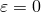

# 1.4.2 Strain measures

### 1.4.2 Strain measures

**Products: **Abaqus/Standard  Abaqus/Explicit

Strain measures used in general motions are most simply understood by first considering the concept of strain in one dimension and then generalizing this to arbitrary motions by using the polar decomposition theorem just derived.
### Strain in one dimension

We already have a measure of deformation---the stretch ratio . In fact,  is itself an adequate measure of "strain" for a number of problems. To see where it is useful and where not, first notice that the unstrained value of  is 1.0. A typical soft rubber component (such as a rubber band) can change length by a large factor when it is loaded, so the stretch ratio  would often have values of 2 or more. In contrast, a typical structural steel component will be designed to respond elastically to its working loads. Such a material has an elastic modulus of about 200  103 MPa (30  106 lb/in2) at room temperature and a yield stress of about 200 MPa (30  103 lb/in2), so the stretch at yield will be about 1.001 in tension, 0.999 in compression. The stretch ratio is an unsatisfactory way of measuring deformation for this case because the numbers of interest begin in the fourth significant digit. To avoid this inconvenience, the concept of strain is introduced, the basic idea being that the strain is zero at , when the material is "unstrained." In one dimension, along some "gauge length" , we define strain as a function of the stretch ratio, , of that gauge length:

The objective of introducing the concept of strain is that the function *f* is chosen for convenience. To see what this implies, suppose  is expanded in a Taylor series about the unstrained state:

We must have , so  at  (this was the main reason for introducing this idea of "strain" instead of just using the stretch ratio). In addition, we choose  at  so that for small strains we have the usual definition of strain as the "change in length per unit length." This ensures that, in one dimension, all strain measures defined in this way will give the same numerical value to the order of the approximation when strains are small (because then the higher-order terms in the Taylor series are all negligible)---regardless of the magnitude of any rigid body rotation. Finally, we require that  for all physically reasonable values of  (that, is for all ) so that strain increases monotonically with stretch; hence, to each value of stretch there corresponds a unique value of strain. (The choice of  is arbitrary: we could equally well choose , implying that the strain is positive in compression when . This alternative choice is often made in geomechanics textbooks because geotechnical problems usually involve compressive stress and strain. The choice is a matter of convenience. In Abaqus we always use the convention that positive direct strains represent tension when . This choice is retained consistently in Abaqus, including in the geotechnical options.)

With these reasonable restrictions ( and  at , and  for all ), many strain measures are possible, and several are commonly used. Some examples are

In a uniformly strained uniaxial specimen, where *l* is the current and *L* the original gauge length, this strain is measured as . This definition is the most familiar one to engineers who perform uniaxial testing of stiff specimens.

This strain measure is commonly used in metal plasticity. One motivation for this choice in this case is that, when "true" stress (force per current area) is plotted against log strain, tension, compression and torsion test results coincide closely. Later we will see that this strain measure is mathematically appropriate for such materials because, for these materials, the elastic part of the strain can be assumed to be small.

This strain measure is convenient computationally for problems involving large motions but only small strains, because, as we will show later, its generalization to a strain tensor in any three-dimensional motion can be computed directly from the deformation gradient without requiring solution for the principal stretch ratios and their directions.

All of these strains satisfy the basic restrictions. Obviously many strain functions are possible: the choice is strictly a matter of convenience. Since strain is usually the link between the kinematic and the constitutive theories, the convenience of this choice in the context of finite elements is based on two considerations: the ease with which the strain can be computed from the displacements, since the latter are usually the basic variables in the finite element model, and the appropriateness of the strain measure with respect to the particular constitutive model. For example, as mentioned above, it appears that log strain is particularly appropriate to plasticity, while large-strain elasticity analysis (for rubbers and similar materials) can be done quite satisfactorily without ever using any "strain" measure except the stretch ratio .
### Strain in general three-dimensional motions

Having defined the basic concept of "strain" in one dimension, we now generalize the idea to three dimensions. In "Deformation,"  Section 1.4.1, we established that the deforming part of the motion in the immediate neighborhood of a material point is completely characterized by six variables: the three principal stretch ratios , , and  and the orientation of the three principal stretch directions in the current (or in the reference) configuration. This immediately gives the generalization of the one-dimensional strain function introduced above. We first choose the function *f* that will be used as the strain measure.  will be the strain along the first principal direction, ;  will be the strain along ; and  will be the strain along .

The matrix

completely characterizes the state of strain at the material point. Notice the resemblance to the definition of the stretch matrix, [Equation 1.4.1&#8211;10](01s04a04-Deformation.md): we might consider  to be defined by the matrix function

where we understand a matrix function to mean that the two matrices have the same principal directions with their principal values related by the definition of *f*, which is a convenient shorthand way of indicating a relationship between two matrices.

In [Equation 1.4.2&#8211;2](01s04a05-Strain-measures.md) we have written the matrix  by using the principal strain directions in the current configuration. We could equally have begun with the polar decomposition into a stretch followed by rotation of the principal directions of stretch:  would be defined in a similar way and would then be associated with its principal directions in the reference configuration. Abaqus generally reports strains referred to directions in the current configuration. There is no obvious reason for this choice: either approach would suffice so long as the user knows which is being used. The strain measures reported by Abaqus are enumerated in "Conventions,"  Section 1.2.2 of the Abaqus Analysis User's Guide.

In a finite element code the deformation gradient  is usually computed at each material calculation point from the displacement solution at the nodes of each element and the interpolation function chosen for the element. We now need an algorithm to obtain , given a choice of strain measure. This algorithm is available immediately from [Equation 1.4.1&#8211;12](01s04a04-Deformation.md): the eigenvalues and eigenvectors of the  matrix  are ;  and ; and ,  and . We can then calculate ,  etc. for the function *f* chosen as the strain measure and, thus, construct

This algorithm also gives principal strain and stretch values---often a useful output because they give a concise description of the state of deformation at a point. However, the algorithm requires computation of the eigenvalues and eigenvectors of a  matrix at each of many points in the model at each of many iterations, which involves some computational cost. Thus, it would be useful if  could be computed less expensively from , which is possible only for certain choices of the strain measure, . We now consider one such possibility.

The unit matrix  can be written as

Using [Equation 1.4.1&#8211;12](01s04a04-Deformation.md),

Green's strain was defined in one dimension as

Comparing this one-dimensional definition with [Equation 1.4.2&#8211;2](01s04a05-Strain-measures.md) and [Equation 1.4.2&#8211;3](01s04a05-Strain-measures.md), we see that

is then a generalization of Green's strain in one dimension. (The more standard definition of Green's strain matrix is obtained by using  instead of , so the strain matrix is taken on the reference configuration instead of the current configuration as a basis:

The definition we have adopted is consistent with taking the strain matrix on the current configuration. The only difference between the two definitions is the configuration in which the matrix is defined---whether we think of the motion as rigid body rotation of the principal axes of stretch, , followed by stretch along those axes, , or stretch along the principal axes, , followed by rigid body rotation of those axes, . The choice is arbitrary.)

Green's strain matrix is, thus, available directly from the deformation gradient without first having to solve for the principal directions. This advantage makes Green's strain computationally attractive. Recall that strain is the link between the kinematics and the constitutive theory, so the strain choice should be optimal based on the two considerations of convenience and appropriateness. We have already suggested that logarithmic strain is the most appropriate for elastic-plastic or elastic-viscoplastic materials in which the elastic strains are always small (because the yield stress is small compared to the elastic modulus), so it appears that the computational convenience of Green's strain cannot be used to advantage. However, the choice of a strain function, , was restricted so that, for small strains but arbitrary rotations, all strain measures are the same to the order of the approximation. Thus, for such cases Green's strain is a very convenient choice for computing the strain. The small-strain, large-rotation approximation is often useful---especially in structural problems (shells and beams) because there the thinness or slenderness of the members often allows large rotations to occur with quite small-strains---and Green's strain is commonly used in large-rotation, small-strain formulations for such problems as shell buckling.

Finally, it is worth remarking that the familiar "small-strain" measure used in most elementary elasticity textbooks,

is useful only for small displacement gradients---that is, both the strains and the rotations must be small for this strain measure to be appropriate. This can be demonstrated by considering pure rotation of a specimen: even though the material is not stretched, the components of this measure of strain become nonzero as the rotation increases.
### Reference

### Reference

"Conventions,"  Section 1.2.2 of the Abaqus Analysis User's Guide