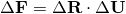
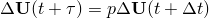

# 1.4.3 Rate of deformation and strain increment

### 1.4.3 Rate of deformation and strain increment

**Products: **Abaqus/Standard  Abaqus/Explicit

Many of the materials we need to model are path dependent, so usually the constitutive relationships are defined in rate form, which requires a definition of strain rate. The velocity of a material particle is

where the partial differentiation with respect to time (*t*) means the rate of change of the spatial position, , of a fixed material particle. Here, again, we take the Lagrangian viewpoint: we observe a material particle and follow it through the motion, rather than looking at a fixed point in space and watching the material flowing through this point. The Lagrangian point of view is used for the mechanical modeling capabilities in Abaqus because we are usually dealing with history-dependent materials and the Lagrangian perspective makes it easy to record and update the state of a material point since the mesh is glued to the material.

The velocity difference between two neighboring particles in the current configuration is

where

is the velocity gradient in the current configuration.

In "Deformation,"  Section 1.4.1, we introduced the definition of the deformation gradient matrix, :

so

We could also obtain the velocity difference directly by

where

because  is defined as the velocity difference between two neighboring material particles and, having chosen these particles, the gauge length between them in the reference configuration, , is the same throughout the motion and, so, has no time derivative.

Comparing the two expressions for  in terms of the reference configuration gauge length , we see that

or

Now  will be composed of a rate of deformation and a rate of rotation or spin. Since these are rate quantities, the spin can be treated as a vector; thus, we can decompose  into a symmetric strain rate matrix and an antisymmetric rotation rate matrix, just as in small motion theory we decompose the infinitesimal displacement gradient into an infinitesimal strain and an infinitesimal rotation. The symmetric part of the decomposition is the strain rate (it is called the rate of deformation tensor in many textbooks and is also commonly denoted as ) and is

The antisymmetric part of the decomposition is the spin matrix,

These are particularly simple and familiar forms; for example,  is identical to the elementary definition of "small strain" if we replace the particle velocity, , with the displacement, . In one dimension  is

which identifies  as the rate of logarithmic strain,

This interpretation would also be correct if the principal directions of strain rotate along with the rigid body motion (because the identification can be applied to each principal value of the logarithmic strain matrix). In the general case, when the principal strain directions rotate independent of the material,  is not integrable into a total strain measure. Nevertheless, the identification of  with the rate of logarithmic strain in the particular case of nonrotating principal directions provides a useful interpretation of the logarithmic measure of strain as a "natural" strain if we think of , as it is defined above as the symmetric part of the velocity gradient with respect to current spatial position, as a "natural" measure of strain rate.

The typical inelastic constitutive model requires as input a small but finite strain increment , as well as vector and tensor valued state variables (such as the stress) that are written on the current configuration. In Abaqus/Explicit and for shell and membrane elements in Abaqus/Standard, a slightly different algorithm is used to calculate . For most element types in Abaqus/Standard we approach this problem by first using the polar decomposition in the increment to define the change in the average material rotation over the increment, , from the total deformation in the increment, :

All vectors and tensors associated with the material (whose values are available at the beginning of the increment from previous calculations) can now be rotated to the configuration at the end of the increment, solely to account for the rigid body rotation in the increment:

for a vector, and

for a tensor.

These rotated variables are now passed to the constitutive routines, which may provide further updates to them because of constitutive effects. These constitutive effects will be associated with deformation, which must be supplied in the form of the strain increment . For this we proceed as follows.

Since we assume  rotates the deformation basis---in the sense that it rotates the principal axes of deformation and, thus, provides a measure of average material rotation---we can define the velocity gradient  at any time during the increment, referred to the fixed basis at , as

Then our integration of  is the matrix , on the basis at the end of the increment, and defined by

Using [Equation 1.4.3&#8211;2](01s04a06-Rate-of-deformation-and-strain-increment.md), this is

Since

we can make use of the polar decomposition of the increment of deformation into a stretch on the axes at the start of the increment followed by rotation () to write

 so that the integrand in the definition of the increment of strain is

We now assume that the incremental stretch at any time in the increment written on the basis at the beginning of the increment, , always has the same principal directions , , , so that

and, hence,

and

We can, thus, write

and, hence,

so that, finally, from [Equation 1.4.3&#8211;3](01s04a06-Rate-of-deformation-and-strain-increment.md),

Thus, as long as we assume that the stretch at any time during the increment has the same principal directions as the total increment of stretch (on the fixed basis at the start of the increment), the logarithmic definition of incremental strain provides the required integral of the strain rate expressed as the rate of deformation. This assumption amounts to requiring that the components of stretch grow proportionally during the increment: that , where *p* is any scalar that we take to grow monotonically from 0 to 1 during . This assumption might be questionable if the increments are very large, but it is consistent with the levels of approximation used in the integration of the inelastic constitutive models. We, therefore, have a simple method for calculating the strain increment for use in this type of constitutive model without any additional loss of accuracy compared to what we already accept in the constitutive integration itself.
### Reference

### Reference

"Conventions,"  Section 1.2.2 of the Abaqus Analysis User's Guide