# 1.4.4 The additive strain rate decomposition

### 1.4.4 The additive strain rate decomposition

**Products: **Abaqus/Standard  Abaqus/Explicit

Many useful materials, such as conventional structural metals, can carry only very small amounts of elastic strain (the elastic modulus is typically two or three orders of magnitude larger than the yield stress). We can take advantage of this behavior to simplify the description of the deformation of such a material. Since the behavior is so common, the assumption that the elastic strains are always small forms the basis of almost all of the inelastic material models provided in Abaqus. This section discusses the description of the deformation for this case.

We begin by assuming that the material has a natural elastic reference state in the sense that, at any time in the deformation, we can imagine isolating the immediate neighborhood of a single point in the material, preventing any further inelastic deformation, removing all external forces from the isolated piece, and allowing the material to unload: the deformation associated with this unloading will then be 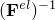, the reverse of the elastic deformation. The deformation between the original reference state and this elastically unloaded state is then the inelastic deformation, 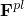:

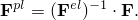The total deformation can, thus, be decomposed as

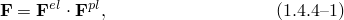from which we can obtain the velocity gradient with respect to position in the current configuration, 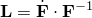, as

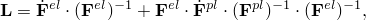which we write as

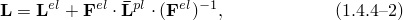by defining the elastic and plastic velocity gradients, 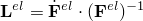 and 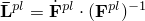, by analogy with the definition of the total velocity gradient.

For the materials of concern here, we now assume that the elastic strains, , are very small compared to unity. Using this together with the left polar decomposition of the elastic deformation, we can write

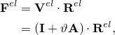where 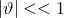, 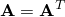, and 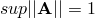. We now use this decomposition of 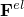 in [Equation 1.4.4&#8211;2](01s04a07.md) to obtain

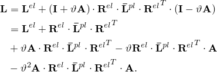We now define

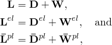where  and  denote the symmetric and antisymmetric parts of each velocity gradient, respectively. Using these definitions and neglecting the higher-order term, the velocity gradient can now be expressed as

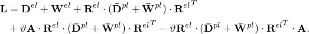Taking the symmetric part of this expression gives

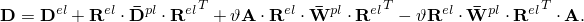

We now make the assumption that 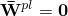, which holds for isotropy; and the last expression reduces to

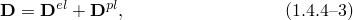where we introduce the notation 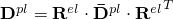. [Equation 1.4.4&#8211;3](01s04a07.md) is the classical "additive rate of deformation decomposition" of plasticity theory---see [Aravas (1991)](07s01a01-References.md) for an example. We see that it derives from the general decomposition ([Equation 1.4.4&#8211;1](01s04a07.md)) when we use the symmetric part of the velocity gradient with respect to current position and when the total elastic strain is always small compared to one. The rate of deformation decomposition is used in this form in almost all the inelastic constitutive models in Abaqus, and it is denoted as 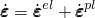.
### Reference

### Reference

"Inelastic behavior,"  Section 23.1.1 of the Abaqus Analysis User's Guide