# 1.5.1 Equilibrium and virtual work

### 1.5.1 Equilibrium and virtual work

**Products: **Abaqus/Standard  Abaqus/Explicit

Many of the problems to which Abaqus is applied involve finding an approximate (finite element) solution for the displacements, deformations, stresses, forces, and---possibly---other state variables such as temperature in a solid body that is subjected to some history of "loading," where "loading" implies some series of events to which the body's response is sought. The exact solution of such a problem requires that both force and moment equilibrium be maintained at all times over any arbitrary volume of the body. The displacement finite element method is based on approximating this equilibrium requirement by replacing it with a weaker requirement, that equilibrium must be maintained in an average sense over a finite number of divisions of the volume of the body. In this section we develop the exact equilibrium statement and write it in the form of the virtual work statement for later reduction to the approximate form of equilibrium used in a finite element model.

Let *V* denote a volume occupied by a part of the body in the current configuration, and let *S* be the surface bounding this volume. (Again, we should emphasize that we are adopting a Lagrangian viewpoint: the volume being considered is a volume of material in the body---specifically, *V* is the volume of space occupied by this material at the "current" point in time, which is distinct from the Eulerian approach, where we are examining a volume in space and watch material flowing through that volume.) Let the surface traction at any point on *S* be the force  per unit of current area, and let the body force at any point within the volume of material under consideration be  per unit of current volume. Force equilibrium for the volume is then

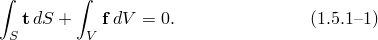

The "true" or Cauchy stress matrix  at a point of *S* is defined by

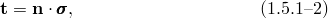where  is the unit outward normal to *S* at the point. Using this definition, [Equation 1.5.1&#8211;2](01s05a08.md) is

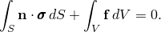

Gauss's theorem allows us to rewrite a surface integral as a volume integral according to

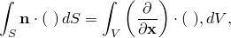where  is any continuous function---scalar, vector, or tensor.

Applying the Gauss theorem to the surface integral in the equilibrium equation gives

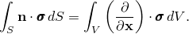

Since the volume is arbitrary, this equation must apply pointwise in the body, thus providing the differential equation of translational equilibrium:

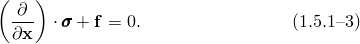These are the three familiar differential equations of force equilibrium. In deriving them we have made no approximation with respect to the magnitude of the deformation or rotation---the equations are an exact statement of equilibrium so long as we are precise about our definitions of surface tractions, body forces, stress (Cauchy stress, defined by [Equation 1.5.1&#8211;2](01s05a08.md)), volume, and area.

Moment equilibrium is most simply written in the general case by taking moments about the origin:

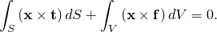Use of the Gauss theorem with this equation then leads to the result that the ``true'' (Cauchy) stress matrix must be symmetric:

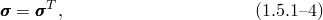so that at each point there are only six independent components of stress. Conversely, by taking the stress matrix to be symmetric, we automatically satisfy moment equilibrium and, therefore, need only consider translational equilibrium when explicitly writing the equilibrium equations. (The moment equilibrium equation written above assumes that there are no point couples acting on the volume. If there are, the stress matrix does not have the symmetry property of [Equation 1.5.1&#8211;4](01s05a08.md). Continuum mechanics models that allow for such point couples have been developed, but they are not relevant to any of the models provided in Abaqus.)

The basis for the development of a displacement-interpolation finite element model is the introduction of some locally based spatial approximation to parts of the solution. To develop such an approximation, we begin by replacing the three equilibrium equations represented by [Equation 1.5.1&#8211;3](01s05a08.md) by an equivalent "weak form"---a single scalar equation over the entire body, which is obtained by multiplying the pointwise differential equations by an arbitrary, vector-valued "test function," defined, with suitable continuity, over the entire volume, and integrating. As the test function is quite arbitrary, the differential equilibrium statement in any particular direction at any particular point can always be recovered by choosing the test function to be nonzero only in that direction at that point. For this case of equilibrium with a general stress matrix, this equivalent "weak form" is the virtual work principle. The test function can be imagined to be a "virtual" velocity field, , which is completely arbitrary except that it must obey any prescribed kinematic constraints and have sufficient continuity: the dot product of this test function with the equilibrium force field then represents the "virtual" work rate.

Taking the dot product of [Equation 1.5.1&#8211;3](01s05a08.md) with  results in a single scalar equation at each material point that is then integrated over the entire body to give

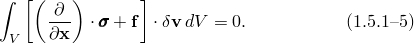

The chain rule allows us to write

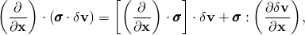so that

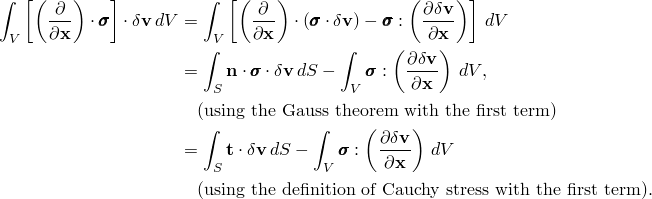Thus, the virtual work statement, [Equation 1.5.1&#8211;5](01s05a08.md), can be written

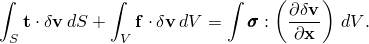From the previous section we recognize

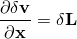as the virtual velocity gradient in the current configuration. We can decompose the gradient into a symmetric and an antisymmetric part:

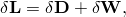where

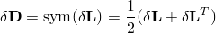is the virtual strain rate (the virtual rate of deformation) and

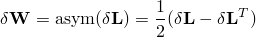is the virtual rate of spin. With these definitions

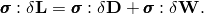Since  is symmetric,

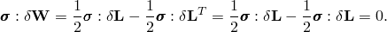 Finally, we obtain the virtual work equation in the classical form

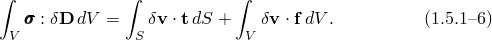

Recall that , , and  are an equilibrium set,

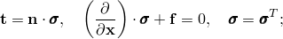  and  are compatible,

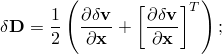and  is compatible with all kinematic constraints. We can show that any two of these three statements (virtual work, equilibrium, and compatibility of the test function ) imply the other: we can thus use the virtual work principle, with a suitable test function, as a statement of equilibrium.

The virtual work statement has a simple physical interpretation: the rate of work done by the external forces subjected to any virtual velocity field is equal to the rate of work done by the equilibrating stresses on the rate of deformation of the same virtual velocity field. The principle of virtual work is the "weak form" of the equilibrium equations and is used as the basic equilibrium statement for the finite element formulation that will be introduced in "Procedures: overview and basic equations,"  Section 2.1.1. Its advantage in this regard is that it is a statement of equilibrium cast in the form of an integral over the volume of the body: we can introduce approximations by choosing test functions for the virtual velocity field that are not entirely arbitrary, but whose variation is restricted to a finite number of nodal values. This approach provides a stronger mathematical basis for studying the approximation than the alternative of direct discretization of the derivative in the differential equation of equilibrium at a point, which is the typical starting point for a finite difference approach to the same problem.
### Reference

### Reference

"Conventions,"  Section 1.2.2 of the Abaqus Analysis User's Guide