# 1.5.2 Stress measures

### 1.5.2 Stress measures

**Products: **Abaqus/Standard  Abaqus/Explicit

The virtual work statement ([Equation 1.5.1&#8211;6](01s05a08-Equilibrium-and-virtual-work.md)) expresses equilibrium in terms of Cauchy ("true") stress and the conjugate virtual strain rate, the rate of deformation. (Here "conjugate" means work conjugate, in the sense that the product of the stress and the strain rate defines work per current volume.) It is natural to think of stress and strain as conjugate quantities, but so far we only have "true" stress and a wide range of possible strain measures. By defining the concept of conjugacy more precisely, we can define a stress matrix conjugate to any strain matrix that we might choose to use. This exercise has some value, although---as we develop the argument---it is worth remembering that the Cauchy ("true") stress is---from the engineer's viewpoint---probably the only measure of stress of practical interest as an output value from a computer code like Abaqus, because it is a direct measure of the traction being carried per unit area by any internal surface in the body under study. For this reason Abaqus always reports the stress as the Cauchy stress. One of the alternative stress definitions developed in this section (Kirchhoff stress) is relevant to the constitutive development in Chapter 4, "Mechanical Constitutive Theories." The other (second Piola-Kirchhoff stress) is discussed because it is frequently mentioned in standard texts.

It is convenient to think of a solid material as having a natural, elastic, reference state to which it will return upon unloading. For a fully elastic material like rubber, this state will always be the original, unstressed, state. For a material that yields, such as a metal, this reference state will be modified by the inelastic deformation to which the material is subjected. Further, we expect the elasticity of the material to be derivable from a thermodynamic potential written about this reference state so that, for isothermal deformations, there will be a potential function for the elastic strain energy per unit of the natural reference volume. On this basis we formalize the concept of conjugacy by writing the work rate per unit of volume in this elastic reference state as

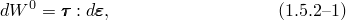where  is a particular choice of strain matrix, derived on the basis of the discussion in "Strain measures,"  Section 1.4.2, and  is now the stress matrix that is work conjugate to . [Equation 1.5.2&#8211;1](01s05a09-Stress-measures.md) defines a conjugate stress measure for any chosen strain measure.

The internal virtual work rate was expressed in [Equation 1.5.1&#8211;6](01s05a08-Equilibrium-and-virtual-work.md) directly in terms of Cauchy stress, and the virtual velocity gradient. This internal virtual work rate may be rewritten as an integral over the natural reference volume:

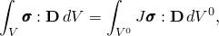where 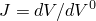 is the Jacobian of the elastic deformation between the natural reference and the current volume---the ratio of the material's volume in the current and natural configurations. According to the work conjugacy concept just defined, the stress measure defined by

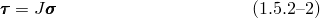is work conjugate to the strain measure whose rate is the rate of deformation

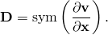This measure of stress is called Kirchhoff stress. It is useful in the development of constitutive models at large strain because it is the most directly available stress measure when we wish to think of the strain rate measured by the rate of deformation and are considering a material with an elastic reference state.

The discussion of strain suggested that Green's strain is convenient for the description of problems involving small strains but rotations that are not small, because Green's strain matrix, , can be computed directly from the deformation gradient . We now develop the stress measure work conjugate to Green's strain. From "Strain measures,"  Section 1.4.2, the standard Green's strain matrix was defined with respect to the reference configuration as

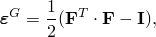so the rate of Green's strain is

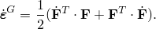 From the discussion of the rate of deformation ("Rate of deformation and strain increment,"  Section 1.4.3) we have 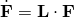 so that

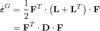and, thus,

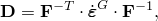where 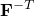 means the inverse of the transpose of .

Since the work rate per unit reference volume is

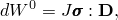 it follows that

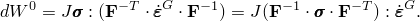(This last manipulation is most readily seen by looking at the equation in component form.) Thus,

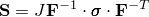is the stress that is work conjugate to 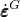. This stress measure, , is known as the second Piola-Kirchhoff stress tensor.

For general motions including large strains  is not readily interpreted physically. But for the important case of large rotations and small strains, the second Piola-Kirchhoff stress is readily interpreted. We can perform the polar decomposition as 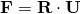, where  is the rotation of the principal axes of deformation and  is the right stretch matrix (the stretch written on the reference configuration). If we write the principal stretches in terms of nominal principal strains,

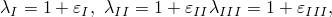the right stretch tensor can be written as

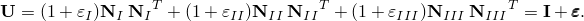The deformation gradient can be written as

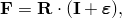and the inverse deformation gradient can be approximated by

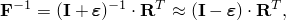since---for the small-strain case---all entries in  are very much smaller than one. In addition,

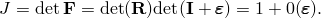Therefore,

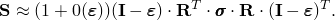 Neglecting terms of order strain compared to unity (since this is the small-strain approximation), we obtain

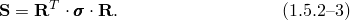

This result gives a very simple physical interpretation of the second Piola-Kirchhoff stress for small strains but arbitrarily large rotations: the components of  are the rotated axis components of . That is, the components of  are the stress components, associated with directions in the reference configuration. Thus, if we use a rectangular Cartesian basis system, the 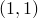 component of , 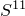, is the normal component of force per unit area acting on a surface that was normal to the *X*-axis in the reference configuration, regardless of the current orientation of that surface.

For example, consider a beam whose axis was initially parallel to the *X*-axis. Then, throughout the deformation,  will always be the axial stress in the beam, no matter how much the beam is rotated or bent (provided the strains remain small compared to unity). Thus, for this case we can think of  as a "material" or "corotational" stress: the material stress and strain are unique, to the order of the approximation, provided strains remain small.

When the small-strain approximation is no longer valid, it is essential to use appropriate measures of stress and strain. From a constitutive viewpoint we have already introduced the basic idea of the approach we will follow: we identify the natural reference for the material's elastic response and use stress and strain measures that provide a conjugate pairing so that the elastic potential can be readily expressed. Since we are often interested in the rate behavior of a material, and also because we prefer to use Cauchy stress as the most natural expression of the stress at a point, it is attractive to consider the usage of the strain measure whose rate is the rate of deformation. (We have identified this in one dimension as the logarithmic strain.) We then use the Kirchhoff stress, , with respect to the reference state for the material's elasticity, as the stress measure for our constitutive definitions; it is this stress measure that is used in forming constitutive models in Abaqus at large strains, as will be seen in Chapter 4, "Mechanical Constitutive Theories."

The work conjugacy principle implies that, for "small strains," all stress measures are indistinguishable, because in this case the strain measures are the same. One interpretation of this is that, if the stress-strain curve for a material is plotted using different stress and strain measures (for example, "true" stress versus log strain, and as nominal stress versus engineering strain) the small-strain approximation is no longer appropriate at strain levels where these two plots differ to any degree considered important to the analysis.
### Reference

### Reference

"Conventions,"  Section 1.2.2 of the Abaqus Analysis User's Guide