# 1.5.5 Energy balance

### 1.5.5 Energy balance

**Products: **Abaqus/Standard  Abaqus/Explicit

The conservation of energy implied by the first law of thermodynamics states that the time rate of change of kinetic energy and internal energy for a fixed body of material is equal to the sum of the rate of work done by the surface and body forces. This can be expressed as

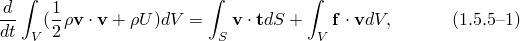where

is the current mass density,

is the velocity field vector,

*U*

is the internal energy per unit mass,

is the surface traction vector,

is the body force vector, and

is the normal direction vector on boundary *S*.

Using Gauss' theorem and the identity that 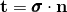 on the boundary *S*, the first term of the right-hand side of [Equation 1.5.5&#8211;1](01s05a12-Energy-balance.md) can be rewritten as

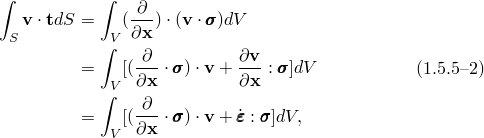 where we have used the fact that  is symmetric, and we also know (see "Equilibrium and virtual work,"  Section 1.5.1) that

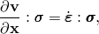where   is the strain rate tensor (see "Rate of deformation and strain increment,"  Section 1.4.3).  Substituting [Equation 1.5.5&#8211;2](01s05a12-Energy-balance.md) into [Equation 1.5.5&#8211;1](01s05a12-Energy-balance.md) yields

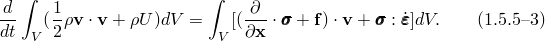

From Cauchy's equation of motion we have

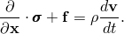 Substituting this into [Equation 1.5.5&#8211;3](01s05a12-Energy-balance.md) gives

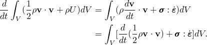From this we get the energy equation

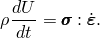Integrating this equation we find

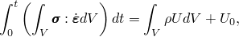where 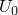 is the energy at time . To make the energy balance ([Equation 1.5.5&#8211;1](01s05a12-Energy-balance.md)) more convenient to use, we integrate it in time:

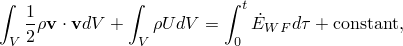or

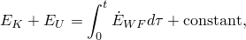where

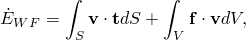 defined as the rate of work done to the body by external forces and contact friction forces between the contact surfaces. 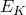, the kinetic energy, is given by

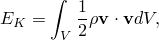and 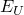 is defined as

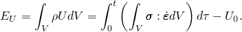To track physically distinguishable engineering phenomena more narrowly, we introduce decompositions of the stress, strain, and tractions.

We can split the traction, , into the surface distributed load, 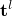, the solid infinite element radiation traction, 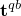, and the frictional traction, 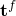. Then 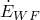 can be written as

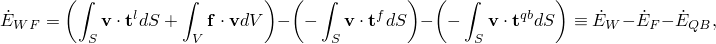where 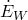 is the rate of work done to the body by external forces, 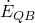 is the rate of energy dissipated by the damping effect of solid medium infinite elements, and 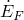 is the rate of energy dissipated by contact friction forces between the contact surfaces. An energy balance for the entire model can then be written as

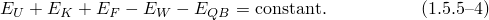For convenience, the dissipated portions of the internal energy are split off:

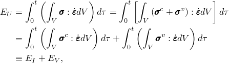 where 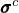  is the stress derived from the user-specified constitutive equation, without viscous dissipation effects included;   is the elastic stress;  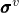 is the viscous stress (defined for bulk viscosity, material damping,  and dashpots);  is the energy dissipated by viscous effects;  and   is the remaining energy, which we continue to call the internal energy.  If we introduce the strain decomposition, 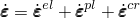  (where 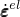,  , and  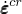 are elastic, plastic, and creep strain rates, respectively),  the internal energy, , can be expressed as

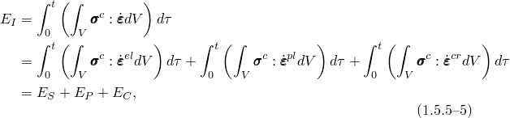where 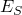  is the applied elastic strain energy,  is the energy dissipated by plasticity, and  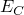 is the energy dissipated by time-dependent deformation  (creep, swelling, and viscoelasticity).

If damage occurs in the material, not all of the applied elastic strain energy is recoverable. At any given time, the stress, , can be expressed in terms of the "undamaged" stress, 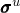, and the continuum damage parameter, *d*:

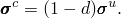The damage parameter, *d*, starts at zero (undamaged material) and increases to a maximum value of no more than one (fully damaged material). Hence, we can write

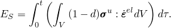We assume that, upon unloading, the damage parameter remains fixed at the value attained at time *t*. Therefore, the recoverable strain energy is equal to

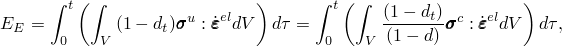and the energy dissipated through damage is equal to

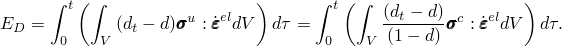If we define

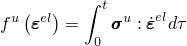as the undamaged elastic energy function, we can write

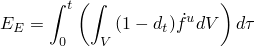and

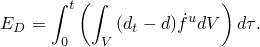Interchanging the integrals yields

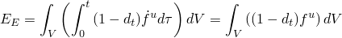and

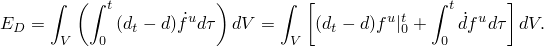The first term in the last expression vanishes, since at time *t*, 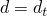 and at time zero, 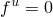. If we now define the damage strain energy function

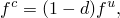then

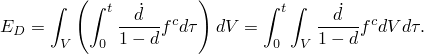For a linear elastic energy function

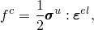and, hence,

### References

### References

"Abaqus/Standard output variable identifiers,"  Section 4.2.1 of the Abaqus Analysis User's Guide

"Abaqus/Explicit output variable identifiers,"  Section 4.2.2 of the Abaqus Analysis User's Guide