# 2.2.1 Nonlinear solution methods in Abaqus/Standard

### 2.2.1 Nonlinear solution methods in Abaqus/Standard

**Product: **Abaqus/Standard

The finite element models generated in Abaqus are usually nonlinear and can involve from a few to thousands of variables. In terms of these variables the equilibrium equations obtained by discretizing the virtual work equation can be written symbolically as

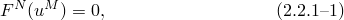where  is the force component conjugate to the  variable in the problem and 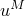 is the value of the 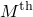 variable. The basic problem is to solve [Equation 2.2.1&#8211;1](02s02a14-Nonlinear-solution-methods-in-AbaqusStan.md) for the  throughout the history of interest.

Many of the problems to which Abaqus will be applied are history-dependent, so the solution must be developed by a series of "small" increments. Two issues arise: how the discrete equilibrium statement [Equation 2.2.1&#8211;1](02s02a14-Nonlinear-solution-methods-in-AbaqusStan.md) is to be solved at each increment, and how the increment size is chosen.

Abaqus/Standard generally uses Newton's method as a numerical technique for solving the nonlinear equilibrium equations. The motivation for this choice is primarily the convergence rate obtained by using Newton's method compared to the convergence rates exhibited by alternate methods (usually modified Newton or quasi-Newton methods) for the types of nonlinear problems most often studied with Abaqus. The basic formalism of Newton's method is as follows. Assume that, after an iteration *i*, an approximation 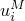, to the solution has been obtained. Let 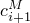 be the difference between this solution and the exact solution to the discrete equilibrium equation [Equation 2.2.1&#8211;1](02s02a14-Nonlinear-solution-methods-in-AbaqusStan.md). This means that

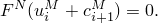Expanding the left-hand side of this equation in a Taylor series about the approximate solution  then gives

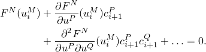If  is a close approximation to the solution, the magnitude of each  will be small, and so all but the first two terms above can be neglected giving a linear system of equations:

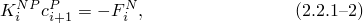where

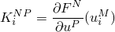is the Jacobian matrix and

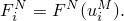The next approximation to the solution is then

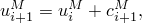and the iteration continues.

Convergence of Newton's method is best measured by ensuring that all entries in 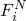 and all entries in 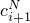 are sufficiently small. Both these criteria are checked by default in an Abaqus/Standard solution. Abaqus/Standard also prints peak values in the force residuals, incremental displacements, and corrections to the incremental displacements at each iteration so that the user can check for these contingencies himself.

Newton's method is usually avoided in large finite element codes, apparently for two reasons. First, the complete Jacobian matrix is sometimes difficult to formulate; and for some problems it can be impossible to obtain this matrix in closed form, so it must be calculated numerically---an expensive (and not always reliable) process. Secondly, the method is expensive per iteration, because the Jacobian must be formed and solved at each iteration. The most commonly used alternative to Newton is the modified Newton method, in which the Jacobian in [Equation 2.2.1&#8211;2](02s02a14-Nonlinear-solution-methods-in-AbaqusStan.md) is recalculated only occasionally (or not at all, as in the initial strain method of simple contained plasticity problems). This method is attractive for mildly nonlinear problems involving softening behavior (such as contained plasticity with monotonic straining) but is not suitable for severely nonlinear cases. (In some cases Abaqus/Standard uses an approximate Newton method if it is either not able to compute the exact Jacobian matrix or if an approximation would result in a quicker total solution time. For example, several of the models in Abaqus/Standard result in a nonsymmetric Jacobian matrix, but the user is allowed to choose a symmetric approximation to the Jacobian on the grounds that the resulting modified Newton method converges quite well and that the extra cost of solving the full nonsymmetric system does not justify the savings in iteration achieved by the quadratic convergence of the full Newton method. In other cases the user is allowed to drop interfield coupling terms in coupled procedures for similar reasons.)

Another alternative is the quasi-Newton method, in which [Equation 2.2.1&#8211;2](02s02a14-Nonlinear-solution-methods-in-AbaqusStan.md) is symbolically rewritten

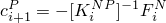and the inverse Jacobian is obtained by an iteration process.

There are a wide range of quasi-Newton methods. The more appropriate methods for structural applications appear to be reasonably well behaved in all but the most extremely nonlinear cases---the trade-off is that more iterations are required to converge, compared to Newton. While the savings in forming and solving the Jacobian might seem large, the savings might be offset by the additional arithmetic involved in the residual evaluations (that is, in calculating the ), and in the cascading vector transformations associated with the quasi-Newton iterations. Thus, for some practical cases quasi-Newton methods are more economic than full Newton, but in other cases they are more expensive. Abaqus/Standard offers the "BFGS" quasi-Newton method: it is described in "Quasi-Newton solution technique,"  Section 2.2.2.

When any iterative algorithm is applied to a history-dependent problem, the intermediate, nonconverged solutions obtained during the iteration process are usually not on the actual solution path; thus, the integration of history-dependent variables must be performed completely over the increment at each iteration and not obtained as the sum of integrations associated with each Newton iteration, 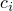. In Abaqus/Standard this is done by assuming that the basic nodal variables, , vary linearly over the increment, so that

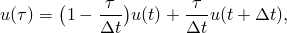where 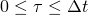 represents "time" during the increment. Then, for any history-dependent variable, , we compute

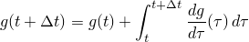at each iteration.

The issue of choosing suitable time steps is a difficult problem to resolve. First of all, the considerations are quite different in static, dynamic, or diffusion cases. It is always necessary to model the response as a function of time to some acceptable level of accuracy. In the case of dynamic or diffusion problems time is a physical dimension for the problem and the time stepping scheme must provide suitable steps to allow accurate modeling in this dimension. Even if the problem is linear, this accuracy requirement imposes restrictions on the choice of time step. In contrast, most static problems have no imposed time scale, and the only criterion involved in time step choice is accuracy in modeling nonlinear effects. In dynamic and diffusion problems it is exceptional to encounter discontinuities in the time history, because inertia or viscous effects provide smoothing in the solution. (One of the exceptions is impact. The technique used in Abaqus/Standard for this is discussed in "Intermittent contact/impact,"  Section 2.4.2.) However, in static cases sharp discontinuities (such as bifurcations caused by buckling) are common. Softening systems, or unconstrained systems, require special consideration in static cases but are handled naturally in dynamic or diffusion cases. Thus, the considerations upon which time step choice is made are quite different for the three different problem classes.

Abaqus provides both "automatic" time step choice and direct user control for all classes of problems. Direct user control can be useful in cases where the problem behavior is well understood (as might occur when the user is carrying out a series of parameter studies) or in cases where the automatic algorithms do not handle the problem well. However, the automatic schemes in Abaqus are based on extensive experience with a wide range of problems and, therefore, generally provide a reliable approach.

For static problems a number of schemes have been suggested for automatic step control (see, for example, [Bergan et al., 1978](07s01a01-References.md)). Abaqus/Standard uses a scheme based predominantly on the maximum force residuals following each iteration. By comparing consecutive values of these quantities, Abaqus/Standard determines whether convergence is likely in a reasonable number of iterations. If convergence is deemed unlikely, Abaqus/Standard adjusts the load increment; if convergence is deemed likely, Abaqus/Standard continues with the iteration process. In this way excessive iteration is eliminated in cases where convergence is unlikely, and an increment that appears to be converging is not aborted because it needed a few more iterations. One other ingredient in this algorithm is that a minimum increment size is specified, which prevents excessive computation in cases where buckling, limit load, or some modeling error causes the solution to stall. This control is handled internally, with user override if needed. Several other controls are built into the algorithm; for example, it will cut back the increment size if an element inverts due to excessively large geometry changes. These detailed controls are based on empirical testing.

In dynamic analysis when implicit integration is used, the automatic time stepping is based on the concept of half-increment residuals [(Hibbitt and Karlsson, 1979)](07s01a01-References.md). The basic idea is that the time stepping operator defines the velocities and accelerations at the end of the step 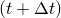 in terms of displacement at the end of the step and conditions at the beginning of the step. Equilibrium is then established at 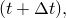 which ensures an equilibrium solution at the end of each time step and, thus, at the beginning and end of any individual time step. However, these equilibrium solutions do not guarantee equilibrium throughout the step. The time step control is based on measuring the equilibrium error (the force residuals) at some point during the time step, by using the integration operator, together with the solution obtained at , to interpolate within the time step. The evaluation is performed at the half step . If the maximum entry in this residual vector---the maximum "half-increment residual"---is greater than a user-specified tolerance, the time step is considered to be too big and is reduced by an appropriate factor. If the maximum half-increment residual is sufficiently below the user-specified tolerance, the time step can be increased by an appropriate factor for the next increment. Otherwise, the time step is deemed adequate. The algorithm is somewhat more complicated at traumatic events such as impact. Here, the time step can also be adjusted based on the magnitude of residuals in the first or second iteration following such events. Clearly, if these residuals are several orders of magnitude greater than those permitted, convergence is unlikely and the time step is altered immediately to avoid unproductive iteration. These algorithms are discussed in more detail in "Intermittent contact/impact,"  Section 2.4.2, as well as in the Abaqus Analysis User's Guide. They are products of experience and many numerical experiments and have been shown to be effective in several problem areas of interest.
### References

### References

"Convergence criteria for nonlinear problems,"  Section 7.2.3 of the Abaqus Analysis User's Guide

"Time integration accuracy in transient problems,"  Section 7.2.4 of the Abaqus Analysis User's Guide