# 2.2.3 Direct cyclic algorithm

### 2.2.3 Direct cyclic algorithm

**Product: **Abaqus/Standard

The classical approach  in Abaqus/Standard to obtain the stabilized response of an elastic-plastic structure subjected to cyclic loading is to apply the periodic loading cycles repetitively to the unstressed structure until a stabilized state is obtained. At each instant in time it typically involves using Newton's method to solve the nonlinear equilibrium equations

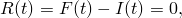where 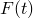 is the discretized form of a cyclic load that has the characteristic 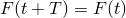 at all times *t* during a load cycle with period *T*, 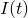 represents the internal force vector generated by the stress, and 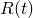 is the residual vector. As the problem size increases, the solution of these nonlinear equations can dominate the entire computational effort. This approach, therefore, can be quite expensive, since the application of many loading cycles may be required before the stabilized response is obtained. To avoid the considerable numerical expense associated with such a transient analysis, a direct cyclic algorithm is implemented in Abaqus/Standard and is described in this section.

The direct cyclic algorithm uses a modified Newton method in conjunction with a Fourier representation of the solution and the residual vector to obtain the stabilized cyclic response directly. The basic formalism of this method is as follows. We are looking for a displacement function that describes the response of the structure at all times *t* during a load cycle with period *T* and has the characteristic 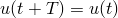. We use a truncated Fourier series for this purpose:

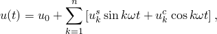where *n* stands for the number of terms in the Fourier series; 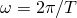 is the angular frequency; and 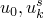, and  are unknown displacement coefficients. Consider  the corrections to the coefficients of the displacement solution. The equilibrium equations can then be written as the following linear system of equations:

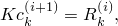where *K* is the elastic stiffness matrix and *i* stands for the iteration number. Because the elastic stiffness serves as the Jacobian matrix throughout the analysis, the equation system is solved only once.  Therefore, the direct cyclic algorithm is likely to be less expensive to use than the full Newton approach to the solution of the nonlinear equations, especially when the problem is large.

We also expand the residual vector in a truncated Fourier series in the same form as the displacement solution:

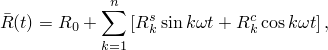where each residual vector coefficient 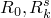, and   in the Fourier series corresponds to a displacement coefficient. The conversion of  into Fourier terms is done incrementally on an element-by-element basis:

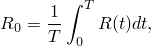

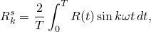

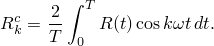

At the end of each loading cycle, we solve for the corrections to the displacement Fourier coefficients---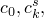 and 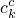. The next displacement coefficients are then

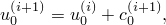

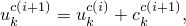

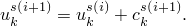The updated displacement coefficients are used in the next iteration to obtain displacements at each instant in time. This process is repeated until convergence is obtained. Each pass through the complete load cycle can therefore be thought of as a single iteration of the solution to the nonlinear problem.

Convergence of the direct cyclic method is best measured by ensuring that all the entries in  and  are sufficiently small. By default, both these criteria are checked in an Abaqus/Standard solution.

There are two accuracy aspects to this algorithm: the number of Fourier terms and the number of iterations to obtain convergence. The number of Fourier terms needed to obtain a solution depends on the time variation of the cyclic load as well as the variation of the structure response. In determining the number of terms, keep in mind that the objective of this kind of analysis is to make low-cycle fatigue life predictions. Hence, the goal is to obtain a good approximation of the plastic strain cycle at each point; local inaccuracies in the stress are less important. More Fourier terms usually provide a more accurate solution but at the expense of additional data storage and computational time. Abaqus/Standard uses an adaptive algorithm to determine the number of Fourier terms during the analysis. Both "automatic" time incrementation and direct user control of the time incrementation can be used in the direct cyclic method.

Since the direct cyclic algorithm uses the modified Newton method, in which a constant elastic stiffness matrix serves as the Jacobian throughout the analysis, interface nonlinearities such as contact and friction are not taken into account. These nonlinearities are severe and would probably lead to convergence difficulties if they were included in the direct cyclic algorithm.

By default, the periodicity condition, in which the solution of an iteration starts with the solution at the end of the previous iteration, is always imposed from the beginning of an analysis. However, in cases where the periodic solution is not easily found (for example, when the loading is close to causing ratchetting), the state around which the periodic solution is obtained may show considerably more "drift" than would be obtained in a transient analysis. In such cases the user may wish to delay the application of the periodicity condition as an artificial method to reduce this drift. Abaqus/Standard allows the user to choose when to impose the periodicity condition. By delaying the application of the periodicity condition, the user can influence the mean stress and strain level, without affecting the shape of the stress-strain curves or the amount of energy dissipated during the cycle. Therefore, this is rarely necessary since the average stress and strain levels are usually not needed for low-cycle fatigue life predictions.
### Reference

### Reference

"Direct cyclic analysis,"  Section 6.2.6 of the Abaqus Analysis User's Guide