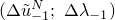

# 2.3.2 Modified Riks algorithm

### 2.3.2 Modified Riks algorithm

**Product: **Abaqus/Standard

It is often necessary to obtain nonlinear static equilibrium solutions for unstable problems, where the load-displacement response can exhibit the type of behavior sketched in [Figure 2.3.2&#8211;1](02s03a18.md)---that is, during periods of the response, the load and/or the displacement may decrease as the solution evolves. The modified Riks method is an algorithm that allows effective solution of such cases.

Figure 2.3.2&#8211;1 Typical unstable static response.

It is assumed that the loading is proportional---that is, that all load magnitudes vary with a single scalar parameter. In addition, we assume that the response is reasonably smooth---that sudden bifurcations do not occur. Several methods have been proposed and applied to such problems. Of these, the most successful seems to be the modified Riks method---see, for example, [Crisfield (1981)](07s01a01-References.md), [Ramm (1981)](07s01a01-References.md), and [Powell and Simons (1981)](07s01a01-References.md)---and a version of this method has been implemented in Abaqus. The essence of the method is that the solution is viewed as the discovery of a single equilibrium path in a space defined by the nodal variables and the loading parameter. Development of the solution requires that we traverse this path as far as required. The basic algorithm remains the Newton method; therefore, at any time there will be a finite radius of convergence. Further, many of the materials (and possibly loadings) of interest will have path-dependent response. For these reasons, it is essential to limit the increment size. In the modified Riks algorithm, as it is implemented in Abaqus, the increment size is limited by moving a given distance (determined by the standard, convergence rate-dependent, automatic incrementation algorithm for static case in Abaqus/Standard) along the tangent line to the current solution point and then searching for equilibrium in the plane that passes through the point thus obtained and that is orthogonal to the same tangent line. Here the geometry referred to is the space of displacements, rotations, and the load parameter mentioned above.
### Basic variable definitions

Let  = the degrees of freedom of the model) be the loading pattern, as defined with one or more of the loading options in Abaqus. Let  be the load magnitude parameter, so at any time the actual load state is , and let  be the displacements at that time.

The solution space is scaled to make the dimensions approximately the same magnitude on each axis. In Abaqus this is done by measuring the maximum absolute value of all displacement variables, , in the initial (linear) iteration. We also define . The scaled space is then spanned by

load ,

displacements and the solution path is then the continuous set of equilibrium points described by the vector  in this scaled space. All components of this vector will be of order unity. The algorithm is shown in [Figure 2.3.2&#8211;2](02s03a18.md) and is described below.

Figure 2.3.2&#8211;2 Modified Riks algorithm.

Suppose the solution has been developed to the point . The tangent stiffness, , is formed, and we solve

The increment size  in [Figure 2.3.2&#8211;2](02s03a18.md)) is chosen from a specified path length, , in the solution space, so that

and, hence,

(here  is  scaled by ). The value  is initially suggested by the user and is adjusted by the Abaqus/Standard automatic load incrementation algorithm for static problems, based on the convergence rate. The sign of ---the direction of response along the tangent line---is chosen so that the dot product of  on the solution to the previous increment, , is positive:

that is

It is possible that in some cases, where the response shows very high curvature in the  space, this criterion will cause the wrong sign to be chosen---see, for example, [Figure 2.3.2&#8211;3](02s03a18.md).

Figure 2.3.2&#8211;3 Example of incorrect choice of sign for .

 The wrong sign is rarely chosen in practical cases, unless the increment size is too large or the solution bifurcates sharply. To check for such cases is computationally expensive: one approach would be for the solution to be found at , so that we obtain a vector that gives a close approximation of the directed tangent at . Because the case is so rare, such a check is not included, and the simple dot product given above is used alone to determine the sign of . Thus, we have now found the point  in [Figure 2.3.2&#8211;2](02s03a18.md). The solution is now corrected onto the equilibrium path in the plane passing through  and orthogonal to , by the following iterative algorithm.

Initialize: 

For  iteration :

Form  the internal (stress) forces at the nodes,

at the state ---that is, at  in [Figure 2.3.2&#8211;2](02s03a18.md).

Check equilibrium:

If all the entries in  are sufficiently small, the increment has converged. If not, we proceed.

Solve:

That is, we solve simultaneously with two load vectors,  and , and obtain two displacement vectors,  and .

Now scale the vector , and add it to  where  is the projection of the scaled residuals onto  so that we move from  to  in the plane orthogonal to ---see [Figure 2.3.2&#8211;2](02s03a18.md). This gives the equation

which simplifies to give

and the solution point is now :

Update for the next iteration,

and return to (a) above for the next iteration.

The implementation in Abaqus/Standard includes the additional update after each iteration:

This causes the equilibrium search to be orthogonal to the last tangent, rather than to the tangent at the beginning of the increment. The main motivation for this additional modification comes from the use of the method in plasticity problems, where the first iteration of each increment uses the elastic material stiffness to establish the direction of straining and so provides a stiffness that is not representative of the tangent to the equilibrium path if active plasticity is occurring.

The total path length traversed is determined by the load magnitudes supplied by the user on the loading options; while the number of increments is determined by the user-specified time increment data, assisted by Abaqus/Standard's automatic incrementation scheme if that is chosen.
### Reference

### Reference

"Unstable collapse and postbuckling analysis,"  Section 6.2.4 of the Abaqus Analysis User's Guide