# 2.4.1 Implicit dynamic analysis

### 2.4.1 Implicit dynamic analysis

**Product: **Abaqus/Standard

Abaqus offers dynamic analysis options for both linear and nonlinear problems. In the case of purely linear systems, methods based on the eigenmodes of the system are almost always chosen because they can provide insight into the structure's behavior that is not otherwise available and because they are usually significantly more cost-effective than the direct integration methods that are usually used for nonlinear problems. The linear dynamic analysis methods provided in Abaqus/Standard are discussed in "Modal dynamics,"  Section 2.5. For mildly nonlinear dynamic analysis problems the "modal projection method" is provided. The basis of that method is to use the eigenmodes of the linear system (extracted from an eigenfrequency analysis) as a set of global Ritz functions---a set of global interpolation functions, in the terminology of the finite element method---whose amplitudes define the response. Abaqus/Standard provides direct time integration using the explicit, central difference operator for this option. For any more severely nonlinear case the dynamic response is obtained by direct time integration of all of the degrees of freedom of the finite element model. The methods provided for this type of analysis are discussed in this section.

The choice of operator used to integrate the equations of motion in a dynamic analysis is influenced by many factors. Abaqus/Standard is designed to analyze structural components, by which we mean that the overall dynamic response of a structure is sought, in contrast to wave propagation solutions associated with relatively local response in continua. [Belytschko (1976)](07s01a01-References.md) labels these "inertial problems" and classifies them by stating that "wave effects such as focusing, reflection, and diffraction are not important." Structural problems are considered "inertial" because the response time sought is long compared to the time required for waves to traverse the structure.

Dynamic integration operators are broadly characterized as implicit or explicit. Explicit schemes, as used in Abaqus/Explicit, obtain values for dynamic quantities at  based entirely on available values at time *t*. The central difference operator, which is the most commonly used explicit operator for stress analysis applications, is only conditionally stable, the stability limit being approximately equal to the time for an elastic wave to cross the smallest element dimension in the model. Implicit schemes remove this upper bound on time step size by solving for dynamic quantities at time  based not only on values at *t*, but also on these same quantities at . But because they are implicit, nonlinear equations must be solved. In structural problems implicit integration schemes usually give acceptable solutions with time steps typically one or two orders of magnitude larger than the stability limit of simple explicit schemes, but the response prediction will deteriorate as the time step size, , increases relative to the period, *T*, of typical modes of response. See, for example, [Hilber, Hughes, and Taylor (1977)](07s01a01-References.md) and [Hilber and Hughes (1978)](07s01a01-References.md) for a discussion of such errors. Three factors should be considered when selecting the maximum allowable time step size: the rate of variation of the applied loading, the complexity of the nonlinear damping and stiffness properties, and the typical period of vibration of the structure. In general, a maximum increment versus period ratio 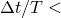 1/10 is a good rule of thumb for obtaining reliable results. Thus, the relative economy of the two techniques of integration depends on the stability limit of the explicit scheme, the ease with which the nonlinear equations can be solved for the implicit operator, the relative size of time increments that can provide acceptable accuracy with the implicit scheme compared to the stability limit of the explicit scheme, and the size of the model.

In Abaqus/Standard the time step for implicit integration can be chosen automatically on the basis of the "half-increment residual," a concept introduced in [Hibbitt and Karlsson (1979)](07s01a01-References.md). By monitoring the values of equilibrium residuals at 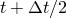 once the solution at  has been obtained, the accuracy of the solution can be assessed and the time step adjusted appropriately.

To discuss the dynamic procedures further, we write out the d'Alembert force in the overall equilibrium equation, [Equation 2.1.1&#8211;1](02s01a13-Procedures-overview-and-basic-equations.md). The body force at a point, , can be written as an externally prescribed body force, , and a d'Alembert force:

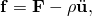where  is the current density of the material at this point and  is the displacement of the point. The body force term in the virtual work equation is

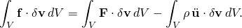The d'Alembert term can be written more conveniently in terms of the reference volume and reference density, 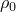, as

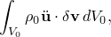where  is the acceleration field. When implicit integration is used, the equilibrium equations are written at the end of a time step (at time ), and  is calculated from the time integration operator. The interpolator approximates the displacement at a point as

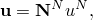so that

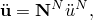provided that  are not displacement dependent. This is the case for most of the elements in Abaqus; the form taken for the d'Alembert force terms in those instances where it is not true (the Hermite cubic beams, B23 and B33) is discussed in detail in Chapter 3, "Elements." With this interpolation assumption, the d'Alembert force term is

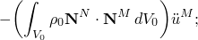that is, the consistent mass matrix times the accelerations of the nodal variables. The finite element approximation to equilibrium, [Equation 2.1.1&#8211;2](02s01a13-Procedures-overview-and-basic-equations.md), is

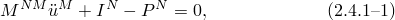where

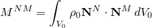is the consistent mass matrix,

is the internal force vector, and

is the external force vector. In this context the terms "matrix" and "vector" refer to matrices and vectors in the space of the nodal variables .

The definition of the mass matrix introduced above is the "consistent" mass: the mass matrix obtained by consistent use of the interpolation. The first-order elements in Abaqus all use "lumped" mass, where the mass matrix is a diagonal matrix. The lumped matrix is obtained by adding each row of the consistent matrix onto the diagonal. For these first-order elements the lumped mass matrix gives more accurate results in numerical experiments that calculate the natural frequencies of simple models.

Implicit operators available in Abaqus/Standard for time integration of the dynamic problem include the operator defined by [Hilber, Hughes, and Taylor (1977)](07s01a01-References.md) and the backward Euler operator. The Hilber-Hughes-Taylor operator is a generalization of the Newmark operator with controllable numerical damping---the damping being most valuable in the automatic time stepping scheme, because the slight high-frequency numerical noise inevitably introduced when the time step is changed is removed rapidly by a small amount of numerical damping. The operator replaces the actual equilibrium equation ([Equation 2.4.1&#8211;1](02s04a19-Implicit-dynamic-analysis.md)) with a balance of d'Alembert forces at the end of the time step and a weighted average of the static forces at the beginning and end of the time step:

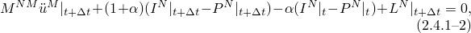where 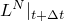 is the sum of all Lagrange multiplier forces associated with degree of freedom *N*. The operator definition is completed by the Newmark formulae for displacement and velocity integration:

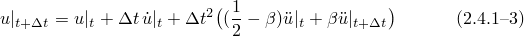and

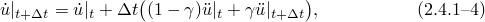with

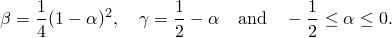

[Hilber, Hughes, and Taylor (1977)](07s01a01-References.md) present cogent arguments for the use of [Equation 2.4.1&#8211;2](02s04a19-Implicit-dynamic-analysis.md)&#8211;[Equation 2.4.1&#8211;4](02s04a19-Implicit-dynamic-analysis.md) for integrating structural dynamics problems. The main appeal of the operator is its controllable numerical damping and the form this damping takes, slowly growing at low frequencies, with more rapid growth in damping at high frequencies. Control over the amount of numerical damping is provided by the parameter : with , there is no damping and the operator is the trapezoidal rule (Newmark, 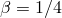); while with , significant damping is available. This operator is used primarily because the slight numerical damping it offers is needed in the automatic time stepping scheme. Each time step change introduces some slight noise or "ringing" into the solution; a little numerical damping (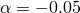 seems a good choice) quickly removes this high-frequency noise without having any significant effect on the meaningful, lower frequency response. An energy content output is available and should be printed to monitor the overall energy balance. This has been done in dynamic examples in the [Abaqus Example Problems Guide](exa-link.md) and shows that the numerical dissipation is always quite small (less than 1% of the total energy).

The integration of rotations during implicit dynamic calculations is done to preserve accuracy in cases where the rotary inertia is different in different directions in a body. For this purpose the accelerations are integrated in the body axis system, so that Newmark's formula gives the change in velocity as

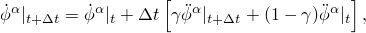where 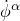 is the angular velocity of the node and 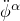 is its angular acceleration, both taken in the current direction of the  body axis at time *t* or at time ;  is the time increment.

In the global system this is

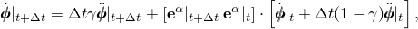where 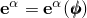 are orthonormal base vectors defining the body axis system. Since these are orthonormal vectors, this can be rewritten as

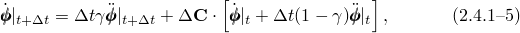where  is the incremental rotation matrix. Let 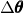 be the increment in rotation from time *t* to . Then  is

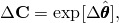 where 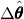 is the skew-symmetric matrix with axial vector . See "Rotation variables,"  Section 1.3.1, for a discussion of rotation variables, rotation matrices, and the exponential mapping of a skew-symmetric matrix.

Newmark's formula for the time integration of the rotation increment in the body axis system gives

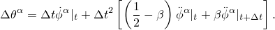 Since 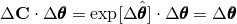, the components 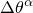 are the same relative to the body axes at time *t* or . In the global system this is

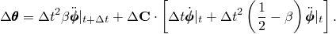 Solving for the unknown velocity and acceleration at time , the velocity update equation is

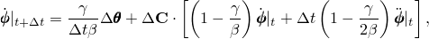 and the acceleration update equation becomes

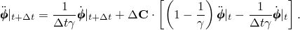

The backward Euler operator solves the equilibrium equation ([Equation 2.4.1&#8211;1](02s04a19-Implicit-dynamic-analysis.md)) at the end of the time step and updates the displacement and velocity using

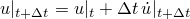and

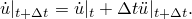

The automatic time stepping for dynamic problems in Abaqus is based on the half-increment residual first proposed in [Hibbitt and Karlsson (1979)](07s01a01-References.md). The concept is quite appealing intuitively. Satisfaction of [Equation 2.4.1&#8211;1](02s04a19-Implicit-dynamic-analysis.md) at the end of each time step (or actually of the Hilber-Hughes-Taylor form, [Equation 2.4.1&#8211;2](02s04a19-Implicit-dynamic-analysis.md)) ensures equilibrium in the discrete sense of the finite element model at these points in time but does not say anything about the quality of equilibrium at intermediate time points. The idea of the half-increment residual is to calculate the equilibrium residual error (the left-hand side of [Equation 2.4.1&#8211;1](02s04a19-Implicit-dynamic-analysis.md)) at some intermediate time point (chosen as ) and to assess the error in the dynamic response prediction by the magnitude of that error.

The half-increment residual is based on the assumption that the accelerations vary linearly over the time interval (this is the basis of Newmark's formulae) so that, for any nodal displacement or rotation component, *u*:

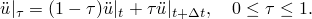

Having already solved for the state at , this equation, together with Newmark's formulae now written for the time interval from *t* to , requires that

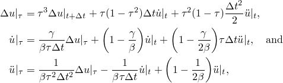where

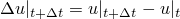is the increment in displacement obtained for the time step, .

With these equations it is possible to evaluate the equilibrium residual at any time within the step. Presumably, if the solution is accurate, this residual will be small compared to significant forces in the problem. The residual at the end of the time step is

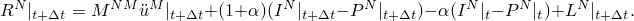The residual at the start of the step is

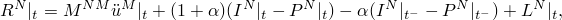where  is the time at the start of the previous time step during normal time stepping analysis or 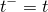 if this is the first increment after an initial acceleration or impact calculation. Then the residual at  is defined as

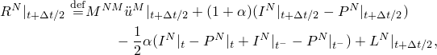where the 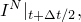 etc. are computed for conditions at time 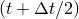 and

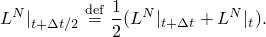The "half-increment residual," 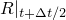, is defined as the magnitude of the largest entry in 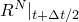 and provides a measure of accuracy of the time-stepping solution.

The motivation behind the calculation of the half-increment residual is to provide a measure of the accuracy of the solution for a given time step. Numerical tests show that it provides a sensitive accuracy check on dynamic solutions and suggest that, if *P* is a typical magnitude of real forces in an undamped elastic system (for which the high-frequency response must be modeled reasonably accurately), then

if 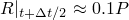 consistently, the time stepping solution has high accuracy;

if 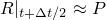 consistently, the time stepping solution has moderately good accuracy;

if 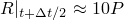 consistently, the time stepping solution is rather coarse.

Problems with large amounts of natural dissipation of energy, such as elastic-plastic systems, are usually less sensitive to time step choice than purely elastic problems, because the energy that appears in higher frequency modes is quickly dissipated. In such cases maximum half-increment residuals in the range of 1&#8211;10 times typical forces indicate quite acceptable accuracy for most studies, and even values of 10&#8211;100 times typical forces can give useful results for primary effects, such as overall deformation. Thus, the method can offer relatively cost-effective solutions for highly dissipative systems for which we require only moderately accurate prediction of the overall response.

The half-increment residual is the basis of the adaptive time incrementation scheme. If the half-increment residual is small, it indicates that the accuracy of the solution is high and the time step can be increased safely; conversely, if the half-increment calculation shows the solution is coarse, the time step used in the solution should be reduced. The algorithm is described in detail in "Time integration accuracy in transient problems,"  Section 7.2.4 of the Abaqus Analysis User's Guide. The algorithm is purely empirical, but experience shows that it works quite well [(Hibbitt and Karlsson, 1979)](07s01a01-References.md), most especially in initially excited problems with high dissipation, such as impulsively loaded problems (or problems with short duration forcing) with extensive plasticity. In these cases the scheme is economic because the time step naturally increases as the solution progresses and the high-frequency response is dissipated.

The above observations are based on using the Hilber-Hughes-Taylor operator with  The slight numerical damping that the operator introduces removes the noise that inevitably enters the solution when the time step is changed. Even in quite lengthy problems the overall energy totals, computed on the basis of physical mechanisms in the model, balance well. The energy balance calculation is useful in assessing a solution---for example, the extent to which energy is dissipated by plasticity can be measured---and it is recommended that the user request occasional printout of the energy balance calculation when doing any analysis with Abaqus.
### Reference

### Reference

"Implicit dynamic analysis using direct integration,"  Section 6.3.2 of the Abaqus Analysis User's Guide