# 2.4.2 Intermittent contact/impact

### 2.4.2 Intermittent contact/impact

**Product: **Abaqus/Standard

Many dynamic problems involve intermittent contact, often with severe impact occurring when the structures hit. The contact algorithms in Abaqus/Standard are designed to handle such cases. An example is the pipe whip problem, in which the fluid escaping from a ruptured pipe causes pipe motion and possible impact with restraints along the pipe. Depending on the geometry of the pipe and the position of the postulated break, severe impact can occur since the pipe may acquire high velocity before hitting a motionless restraint.

Impact conditions with hard contact are modeled in Abaqus/Standard with the assumption that, at the time of impact, the two impacting surfaces instantaneously acquire the same velocity in the direction of the impact. This "fully plastic" impact concept is essential to any discrete model, the accuracy of the physical representation of local effects being dependent on the spatial model adopted. It should be emphasized that the plastic impact assumption is local: it is assumed that, at impact, energy is dissipated by some mechanism that is not modeled and whose spatial and temporal scale is infinitesimal compared to the discrete model. In the case of a beam model of a pipe hitting some other structure, this would presumably be the local plastic deformation of the pipe wall where it impacts the other structure. The points that acquire the same velocity sometimes separate just after the impact: part of the dynamic contact algorithm is designed to handle this case.

The local plastic impact concept is quite different from the simple "assumed coefficient of restitution" methods sometimes used in scoping analyses in place of detailed analysis of the history of contact forces. The method discussed here is specifically designed to allow as much---or as little---of this local detail to be obtained, as required. The usual time integration procedures in Abaqus maintain the energy balance in terms of the energy mechanisms of the discrete model, so the instantaneous jumps that occur in the velocity and acceleration at impact imply that some other system of equations must govern the solution during impact. Thus, we view the impact events as separate from the usual time stepping and develop a set of impulse equations that allow the propagation of the solution over these instants of time and, hence, provide initial conditions from which the normal time stepping solution can continue to the next such event.

To develop the governing equations for impact, assume that, at some time , a part *I* of the surface of two bodies, *A* and *B*, comes into contact. Denote the velocities and accelerations of corresponding parts just before impact as

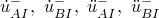and

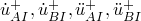just after impact.

The fully plastic impact assumption requires that corresponding points acquire the same velocity and acceleration in the direction of impact immediately after impact so that, at time 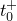:

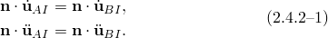 Here  is the current normal to the interface surface *I*.

Writing 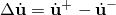 to describe the velocity "jump" at  at a point, we have

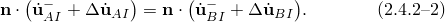

The component of the force per unit area between the bodies across *I* in the normal direction , 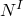, must satisfy

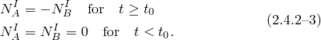

Since finite velocity jumps are occurring at the time of impact in infinitesimal time (compared to the time scale of the simulation), during the infinitesimal interval 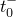 to ,  dominates all other forces in the system except for the d'Alembert forces. This simplifies the virtual work equation during  to  to

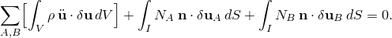Integrating from  to ,

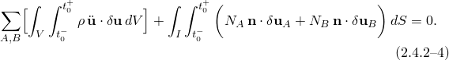

But 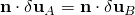 at , and 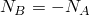, so the second term in [Equation 2.4.2&#8211;4](02s04a20-Intermittent-contactimpact.md) is zero. However, the constraint ([Equation 2.4.2&#8211;2](02s04a20-Intermittent-contactimpact.md)) must be satisfied by augmenting [Equation 2.4.2&#8211;4](02s04a20-Intermittent-contactimpact.md) with a Lagrange multiplier term with *H* as the multiplier:

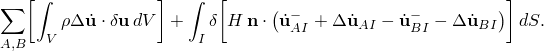

The first term has been integrated over  to  to give the velocity jump term. Taking the variation in the second term and noting that  cannot rotate in the infinitesimal time interval because there is no discontinuity in displacement, we obtain

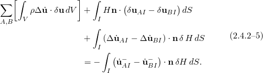This equation is the impulse condition, which can be solved for the velocity jump 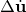 at all nodes. The solution also provides the impulse per unit area, *H*: the time integral of the pressure between the surfaces over the infinitesimal time of impact. The equilibrium equation written at time  and including the constraint that 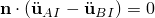 can then be used to obtain the initial accelerations immediately after impact.

The two sets of equations (for the velocity jumps and the initial accelerations at ) require solution of the mass matrix, augmented by the constraint, with different right-hand sides for the initial acceleration and the velocity jump equations. When the elements attached to the nodes that impact have consistent mass matrices, the equations will give velocity and acceleration jumps throughout that part of the model and not just at the impacting nodes themselves. From these initial conditions at  the usual time stepping equations can continue, augmented by the constraint that 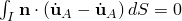, which is imposed by a Lagrange multiplier. Since this multiplier represents the interface pressure, its value is monitored for possible separation: if a negative value is seen (that is, if a state of tension exists between *A* and *B* across *I*), the constraint is removed: this requires another solution for the initial accelerations just after removal of the constraint, although there will be no velocity jump at that time. Separation can occur immediately after impact. If so, the equilibrium equations must be solved again without the constraint to find the corresponding accelerations.

In any real problem, impact and separation will occur at some intermediate point in a time step. To accommodate this, Abaqus/Standard first solves the time step by ignoring impact, then estimates (by linear interpolation) the average time of impact or separation of all points that change in the increment, 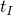, and again solves the increment to that time. All surface contact changes are assumed to take place at that interpolated time point, with the surface clearances adjusted as necessary. For reasonable time steps this geometric adjustment is slight.

Typically, the time step used in the solution following a severe impact event is one or two orders of magnitude smaller than that preceding the event. As the high frequency noise generated by impact dissipates (through plasticity and the artificial damping introduced by the parameter  in the time integration operator), the time step is expanded by the automatic time stepping algorithm and the solution proceeds accordingly.

Soft contact conditions treat impact as an "elastic" event that does not destroy any kinetic energy. The change in velocity is determined by the amount of interpenetration. Thus, with soft contact the standard implicit integration procedure is used and no impulse equations need be solved. Under truly high velocity impact conditions, this may result in nodes bouncing back immediately after impact. This may lead to excessive contact *chattering*, resulting in convergence problems and small time increments. For this reason, softened contact is not recommended in "true" impact calculations. However, in certain dynamic calculations where impact effects are not critical---such as sheet forming, drop forging, or rolling operations---soft contact can work well because cutbacks due to impact calculations are avoided. The soft contact constraint is enforced via Lagrange multipliers. If the soft contact constraint compatibility is not satisfied within the given tolerance, a severe discontinuity iteration is performed.
### Reference

### Reference

"Implicit dynamic analysis using direct integration,"  Section 6.3.2 of the Abaqus Analysis User's Guide