# 2.4.3 Subspace dynamics

### 2.4.3 Subspace dynamics

**Product: **Abaqus/Standard

An alternative approach provided in Abaqus/Standard for analysis of nonlinear dynamic problems is the "subspace projection" method. This method uses direct, explicit integration of the dynamic equations of equilibrium written in terms of a vector space spanned by a number of eigenvectors. The eigenmodes of the system, extracted in an eigenfrequency step prior to the dynamic analysis, are used as the global basis vectors. This method can be very effective for systems with mild nonlinearities that do not substantially change the mode shapes. The method cannot be used for contact problems. As with the other direct integration methods, it is more expensive in terms of computer time than the modal methods of purely linear dynamic analysis, but it is often significantly less expensive than the direct integration of all of the equations of motion of the model. This method is implemented in Abaqus/Standard using the explicit (central difference) operator to integrate the equations of motion projected onto the eigenmodes. In this procedure the explicit integration method is particularly effective because the eigenmodes are orthogonal with respect to the mass matrix so that the projected system always has a diagonal mass matrix and because the stability limit is determined by the highest eigenfrequency associated with the modes used in the analysis and not by the highest eigenfrequency of the structure.

Let us write the finite element approximation to the virtual work equations as

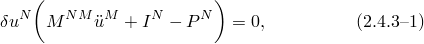where

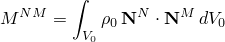is the consistent mass matrix,

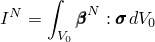is the internal force vector, and

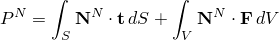is the external force vector.

The nodal displacements, velocities, accelerations, and the variations in displacement are expressed in terms of eigenmodes:

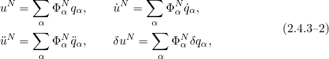where , 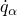, 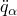, and 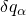 represent generalized displacement, velocity, acceleration, and displacement variation, respectively. Substitution into the virtual work expression yields the formula for the acceleration associated with mode  as

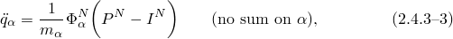where  is the generalized mass associated with mode :

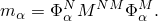From [Equation 2.4.3&#8211;3](02s04a21.md) it is seen that the element residuals are projected onto the vector space spanned by the chosen number of eigenmodes. Having calculated the generalized acceleration for each mode, the generalized displacement and velocity are calculated with the central difference operator

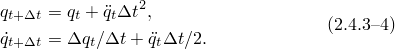The nodal values for all kinematic variables are obtained using the formul in [Equation 2.4.3&#8211;2](02s04a21.md).

When initial velocities are applied, specified either explicitly by the user or implicitly by continuation of the previous dynamic step, the initial velocity vector 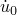 has to be projected into the eigenspace. This leads to an initial generalized velocity for the mode  in the form

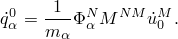

As in standard explicit dynamic integration, the method is conditionally stable. The stability limit is determined by the highest eigenfrequency of the modes used in the analysis:

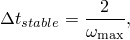where  is the highest circular frequency of the eigenmodes that are used as the basis of the solution. Since we will generally use a relatively small number of modes, this stability limit is usually much less restrictive than the stability limit for standard explicit integration.

Throughout the procedure a fixed time increment is used: the value is chosen as the smaller of the time increment specified by the user, or 80% of the stable time increment. The 80% factor is intended as a safety factor, so a small increase in the highest eigenfrequency caused by nonlinear effects will not cause the integration to become unstable.

The number of eigenvectors spanning the solution space for a subspace dynamic analysis can be specified by the user. The default number of vectors will be equal to the number of eigenvectors extracted in the eigenfrequency calculation.

It is possible to perform a subspace dynamic simulation for some time and then reextract the modes based on the current, stressed geometry (by using another eigenfrequency extraction step), followed by continuation of the analysis with the new modes as the subspace basis system. This can improve the accuracy of the method in certain cases.

Note that the method is noniterative; hence, there are no tolerances required for the procedure.
### Reference

### Reference

"Implicit dynamic analysis using direct integration,"  Section 6.3.2 of the Abaqus Analysis User's Guide