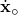
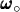

# 2.4.4 Equivalent rigid body dynamic motion

### 2.4.4 Equivalent rigid body dynamic motion

**Product: **Abaqus/Standard

It is often useful to obtain the equivalent rigid body motion of part of a model (or of the whole model): the position and translational velocity of the part's center of mass and its angular rotation and velocity about the same center of mass. Abaqus/Standard provides such output, based on equivalent momentum. This section defines how these values are calculated.

Let *V* be the volume of a part for which the equivalent rigid body motion values are requested. The density of the part in its initial configuration is , where , , are material coordinates in the part. The spatial position of a material particle in its initial configuration is  and in the current configuration is , resulting in a displacement of . We wish to compute the current spatial position of the center of mass of the part, ; the translational velocity of an equivalent rigid body, ; the angular velocity of this equivalent rigid body, ; the translational displacement of an equivalent rigid body motion, ; and the rotation of an equivalent rigid body motion around the center of mass, . In these definitions an "equivalent rigid body" means a rigid body with the same mass distribution and the same translational and angular momentum as the actual deforming part in the current configuration.

For simplicity of notation we define some quantities. The mass of the part is

Its first mass moment about the origin is

Its second mass moment about the origin is

where  is a unit matrix.

It is convenient to invoke the relation  (the summation convention is assumed), where  are the finite element interpolation functions associated with each degree of freedom and  is the vector of current nodal positions. We can now write

Recognizing that the primitive mass matrix is

we have

We can immediately obtain

and, by equating the translational momentum of the equivalent and the actual body,

The angular velocity of the part is defined by equating the angular momentum of the part and of the equivalent rigid body about the center of mass:

where

is the second mass moment of the part about its center of mass.

Abaqus uses the lumped mass formulation for low-order elements. As a consequence, the second mass moments of inertia can deviate from the theoretical values, especially for coarse meshes. Certain Abaqus elements produce lumped or structural contributions to this second mass moment (rotary inertias) not shown in these equations.

This provides

where

is the angular momentum of the part about the origin.

The perceived translational motion of the center of mass in an equivalent rigid body motion is calculated as

The equivalent rigid body rotation of the part with respect to its center of mass requires some conceptual approximations as follows. Denote the relative positions of a material particle with respect to the center of mass in the undeformed configuration and in the deformed configuration  and , respectively. Consider that the configurations are known and that the axis of rotation of the body is denoted by the unit vector . A material particle sees such rotation relative to the center of mass as

where the subscript *p* denotes the projection of a vector into a plane normal to . We now generalize this concept by integration of the constituent parts. Define

The average Euler rotation then follows with the equation

These integrals are not easily calculated, but with the modifications below they can be expanded in such a way that the (initially unknown) current center of mass, , only appears in products with the position of particles in the known current configuration.

A necessary condition for the validity of the intuitive generalization above is that if the part undergoes an arbitrary rigid body rotation, the formula returns the rotation. That can easily be proved as follows. Every material particle rotates exactly an angle  in such a way that

and, therefore,

In all of these equations the direction vector  is unknown. To determine  we consider the characteristics of the displacement field of a rigid body rotation. For such a field, 1) the displacement of a particle is orthogonal to the rotation vector, and 2) the displacement is orthogonal to the position vector at half the motion. In a deformable body context we try to determine  by forcing these two statements to be true in an average sense. Considering that we are looking strictly at a rotation with respect to the center of mass, its definition automatically ensures that the first statement is satisfied. The second condition can be written in the form

which is a homogeneous set of equations in the components of  with coefficients made out of integrals of known quantities, from which  can be solved. We can then calculate the projection of the old and new position onto the plane normal to  with

and by simple substitution one then obtains

where the vector  is easily calculated from available quantities. With  known,  becomes determined. The quantity *b* can be calculated using with the same expressions, which yields

Once  and *b* are known,  is readily determined.

The determination of the equivalent rigid body rotation is based on average particle translations. Rotational degrees of freedom are ignored in the calculation of this variable; it is assumed that such rotations will produce motions of points that will measurably contribute to the calculation. However, it is possible to find pathological cases in which that would not be the case; for instance, if the part of the model considered consists of rotary inertia elements only, the calculated average rigid body rotation will be calculated as zero, even if the elements have indeed rotated.
### Reference

### Reference

"Implicit dynamic analysis using direct integration,"  Section 6.3.2 of the Abaqus Analysis User's Guide