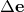

# 2.4.5 Explicit dynamic analysis

### 2.4.5 Explicit dynamic analysis

**Product: **Abaqus/Explicit

The explicit dynamics analysis procedure in Abaqus/Explicit is based upon the implementation of an explicit integration rule together with the use of diagonal or "lumped" element mass matrices. The equations of motion for the body are integrated using the explicit central difference integration rule

where  is velocity and  is acceleration. The superscript  refers to the increment number and  and  refer to midincrement values. The central difference integration operator is explicit in that the kinematic state can be advanced using known values of  and  from the previous increment. The explicit integration rule is quite simple but by itself does not provide the computational efficiency associated with the explicit dynamics procedure. The key to the computational efficiency of the explicit procedure is the use of diagonal element mass matrices because the inversion of the mass matrix that is used in the computation for the accelerations at the beginning of the increment is triaxial:

where  is the diagonal lumped mass matrix,  is the applied load vector, and  is the internal force vector. The explicit procedure requires no iterations and no tangent stiffness matrix.

Special treatment of the mean velocities ,  etc. is required for initial conditions, certain constraints, and presentation of results. For presentation of results, the state velocities are stored as a linear interpolation of the mean velocities:

The central difference operator is not self-starting because the value of the mean velocity  needs to be defined. The initial values (at time ) of velocity and acceleration are set to zero unless they are specified by the user. We assert the following condition:

Substituting this expression into the update expression for  yields the following definition of :

### Stability

The explicit procedure integrates through time by using many small time increments. The central difference operator is conditionally stable, and the stability limit for the operator (with no damping) is given in terms of the highest eigenvalue in the system as

In Abaqus/Explicit a small amount of damping is introduced to control high frequency oscillations. With damping the stable time increment is given by

where  is the fraction of critical damping in the highest mode. Contrary to our usual engineering intuition, introducing damping to the solution reduces the stable time increment.

The time incrementation scheme in Abaqus/Explicit is fully automatic and requires no user intervention. Abaqus/Explicit uses an adaptive algorithm to determine conservative bounds for the highest element frequency. An estimate of the highest eigenvalue in the system can be obtained by determining the maximum element dilatational mode of the mesh. The stability limit based upon this highest element frequency is conservative in that it will give a smaller stable time increment than the true stability limit that is based upon the maximum frequency of the entire model. In general, constraints such as boundary conditions and contact have the effect of compressing the eigenvalue spectrum, which the element by element estimates do not take into account. Abaqus/Explicit contains a global estimation algorithm, which determines the maximum frequency of the entire model. This algorithm continuously updates the estimate for the maximum frequency. Abaqus/Explicit initially uses the element by element estimates. As the step proceeds, the stability limit will be determined from the global estimator once the algorithm determines that the accuracy of the global estimation is acceptable. The global estimation algorithm is not used when any of the following capabilities are included in the model: fluid elements, JWL equation of state, infinite elements, material damping, dashpots, thick shells (thickness to characteristic length ratio larger than 0.92) or thick beams (thickness to length ratio larger than 1.0), and nonisotropic elastic materials with temperature and field variable dependency.

A trial stable time increment is computed for each element in the mesh using the following expression:

where  is the element maximum eigenvalue. A conservative estimate of the stable time increment is given by the minimum taken over all the elements. The above stability limit can be rewritten as

where  is the characteristic element dimension and  is the current effective, dilatational wave speed of the material. The characteristic element dimension is derived from an analytic upper bound expression for the maximum element eigenvalue. Considering the 4-node uniform strain quadrilateral (CPE4R), the characteristic element dimension is

where  is the element area and  is the element gradient operator  (see "Solid isoparametric quadrilaterals and hexahedra,"  Section 3.2.4). Similar characteristic element dimensions are derived for all element types found in Abaqus/Explicit.

The current dilatational wave speed is determined in Abaqus/Explicit by calculating the effective hypoelastic material moduli from the material's constitutive response. Effective Lam's constants,  and , are determined in the following manner. We define  as the increment in the equivalent pressure stress, ,  as the increment in the deviatoric stress,  as the increment of volumetric strain, and  as the deviatoric strain increment. We assume a hypoelastic stress-strain rule of the form

where  is the effective bulk modulus. The effective moduli can then be computed as

If the strain increments are insignificant, these relationships will not yield numerically meaningful results. In this circumstance Abaqus/Explicit sets the effective Lam's constants to the initial values for the material,  and . In the case where the volumetric strain increment is significant but the deviatoric stress increment is not, the effective shear modulus is estimated to be

These effective moduli represent the element stiffness and determine the current dilatational wave speed in the element as

### Bulk viscosity

Bulk viscosity introduces damping associated with the volumetric straining. Its purpose is to improve the modeling of high-speed dynamic events.

There are two forms of bulk viscosity in Abaqus/Explicit. The first is found in all elements and is introduced to damp the "ringing" in the highest element frequency. This damping is sometimes referred to as truncation frequency damping. It generates a bulk viscosity pressure, which is linear in the volumetric strain:

where  is a damping coefficient (default=.06),  is the current material density,  is the current dilatational wave speed,  is an element characteristic length, and  is the volumetric strain rate.

The second form of bulk viscosity pressure is found only in solid continuum elements (except CPS4R). This form is quadratic in the volumetric strain rate:

where  is a damping coefficient (default=1.2) and all other quantities are as defined for the linear bulk viscosity. The quadratic bulk viscosity is applied only if the volumetric strain rate is compressive.

The quadratic bulk viscosity pressure will smear a shock front across several elements and is introduced to prevent elements from collapsing under extremely high velocity gradients. Consider a simple one element problem in which the nodes on one side of the element are fixed and the nodes on the other side have an initial velocity in the direction of the fixed nodes. If the initial velocity is equal to the dilatational wave speed of the material, the element---without the quadratic bulk viscosity---would collapse to zero volume in one time increment (because the stable time increment size is precisely the transit time of a dilatational wave across the element). The quadratic bulk viscosity pressure will introduce a resisting pressure that will prevent the element from collapsing.

The bulk viscosity pressure is not included in the material point stresses because it is intended as a numerical effect only---it is not considered to be part of the material's constitutive response. The bulk viscosity pressures are based upon the dilatational mode of each element. The fraction of critical damping in the dilatational mode of each element is given by

Linear bulk viscosity is always included in Abaqus/Explicit. The parameters  and  can be redefined by the user. The default values are  and . The bulk viscosity parameters can be changed from step to step. If the default values are changed in a step, the new values will be used in any subsequent steps unless they are redefined.
### Rotational bulk viscosity for shell elements

For the displacement degrees of freedom, bulk viscosity introduces damping associated with volumetric straining. Linear bulk viscosity or truncation frequency damping is used to damp the high frequency ringing that leads to unwanted noise in the solution or spurious overshoot in the response amplitude. For the same reason, in shells the high frequency ringing in the rotational degrees of freedom is damped with linear bulk viscosity acting on the mean curvature strain rate. This damping generates a bulk viscosity "pressure moment," *m*, which is linear in the mean curvature strain rate:

where  is a damping coefficient (default = 0.06),  is the original thickness,  is the mass density,  is the current dilatational wave speed, *L* is the characteristic length used for rotary inertia and transverse shear stiffness scaling, and  is twice the increment in mean curvature. The dilatational wave speed is given in terms of the effective Lam constants as

The resultant pressure moment , where *h* is the current thickness, is added to the direct components of the moment resultant.
### Reference

### Reference

"Explicit dynamic analysis,"  Section 6.3.3 of the Abaqus Analysis User's Guide