# 2.5.1 Eigenvalue extraction

### 2.5.1 Eigenvalue extraction

**Product: **Abaqus/Standard

There are many important areas of structural analysis in which it is essential to be able to extract the eigenvalues of the system and, hence, obtain its natural frequencies of vibration or investigate possible bifurcations that may be associated with kinematic instabilities. For example, structural evaluation for seismic events is often based on linear analysis, using the structure's modes up to a limiting cutoff frequency, which is usually taken as 33 Hz (cycles/second). Once the modes are available, their orthogonality property allows the linear response of the structure to be constructed as the response of a number of single degree of freedom systems. This opens the way to several response evaluation methods that are computationally inexpensive and provide useful insight into the structure's dynamic behavior. Several such methods are provided in Abaqus/Standard and are described in the following sections.

The mathematical eigenvalue problem is a classical field of study, and much work has been devoted to providing eigenvalue extraction methods. [Wilkinson's (1965)](07s01a01-References.md) book provides an excellent compendium on the problem. The eigenvalue problems arising out of finite element models are a particular case: they involve large but usually narrowly banded matrices, and only a small number of eigenpairs are usually required. For many important cases the matrices are symmetric. The eigenvalue problem for natural modes of small vibration of a finite element model is

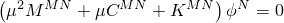or, in classical matrix notation,

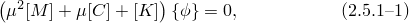where  is the mass matrix, which is symmetric and positive definite in the problems of interest here;  is the damping matrix;  is the stiffness matrix, which may include large-displacement effects, such as "stress stiffening" (initial stress terms), and, therefore, may not be positive definite or symmetric;  is the eigenvalue; and 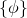 is the eigenvector---the mode of vibration. This equation is available immediately from a linear perturbation of the equilibrium equation of the system.

The eigensystem ([Equation 2.5.1&#8211;1](02s05a24-Eigenvalue-extraction.md)) in general will have complex eigenvalues and eigenvectors. This system can be symmetrized by assuming that  is symmetric and by neglecting  during eigenvalue extraction. The symmetrized system has real squared eigenvalues, 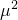, and real eigenvectors only.

Typically, for symmetric eigenproblems we will also assume that  is positive semidefinite. In this case  becomes an imaginary eigenvalue, 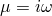, where  is the circular frequency, and the eigenvalue problem can be written as

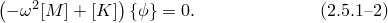If the model contains hybrid elements, contact pairs, or contact elements, the system of equations contains Lagrange multipliers and the stiffness matrix  becomes indefinite. However, all the terms of the mass matrix corresponding to the Lagrange multipliers are equal to zero. Therefore, all the eigenvalues are imaginary, and the eigenvalue problem can still be written as [Equation 2.5.1&#8211;2](02s05a24-Eigenvalue-extraction.md).

Abaqus provides eigenvalue extraction procedures for both symmetric and complex eigenproblems. For symmetrized eigenproblems Abaqus/Standard offers two approaches: Lanczos and subspace iteration methods. For complex eigenproblems the subspace projection method is used.
### Eigenvalue extraction for symmetric systems

The structural eigenvalue problem has received considerable attention since the advent of finite element models. [Ramaswami (1979)](07s01a01-References.md) summarizes available methods for the problem: the most attractive appear to be the Lanczos method (see, for example, [Newman and Pipano, 1973](07s01a01-References.md); [Parlett, 1980](07s01a01-References.md)) and the subspace iteration method, a classical method that was introduced into finite element applications by [Bathe and Wilson (1972)](07s01a01-References.md).

Both the subspace iteration and the Lanczos methods, using the Householder and Q-R algorithm for the reduced eigenproblem, have been implemented in Abaqus/Standard. The various parts of these algorithms are discussed in the remainder of this section.Subspace iteration---the basic algorithm

The application of the subspace iteration method to eigenproblems arising from finite element models of the dynamic behavior of structures has been discussed by a number of authors---see [Ramaswami (1979)](07s01a01-References.md) for references. The basic idea is a simultaneous inverse power iteration. A small set of base vectors is created, thus defining a "subspace": this "subspace" is then transformed, by iteration, into the space containing the lowest few eigenvectors of the overall system.

Assume that, at the *i*-th iteration, a set of *m* vectors, 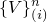, 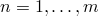, exists, where *m* is less than the number of variables in the finite element model. These are considered as the "base vectors" that define the *m*-dimensional subspace out of the *n* dimensions defined by the variables in the finite element model. We arrange these vectors as the columns in the matrix 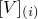. The number of rows of  is, thus, the size of the complete set of equations (the number of variables in the finite element model, *N*), and the number of columns is the dimension of the subspace, *m*.

The first step in the algorithm is to define a new set of base vectors by solving

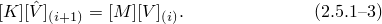This operation, a generalized "inverse power sweep" with *m* vectors, involves the solution of the complete set of linear stiffness equations for several right-hand-side vectors (with, after the first iteration of the method, a previously decomposed matrix).

The stiffness and mass matrices of the structure are then projected onto the subspace by

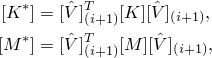thus defining a mass matrix, 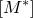, and a stiffness matrix, 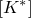, in the subspace. These matrices are of dimension *m* by *m*. The eigenproblem

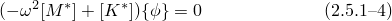is now solved completely in the subspace using the Householder and Q-R methods, which are discussed below.

The eigenvectors have now been defined in the reduced space and can be transformed back to the full space of the structural problem to define 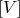 for the next iteration:

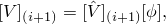where 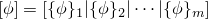. This completes an iteration.

With 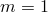 (a one-dimensional subspace), the method reduces to the simple "inverse power sweep" method (see [Wilkinson, 1965](07s01a01-References.md), or [Strang, 1976](07s01a01-References.md)).

The advantage of the subspace method is the extraction of the eigenvalues in reduced space, which will cause a rapid convergence to the eigenvectors in full space. The number of base vectors carried in the iterations and the choice of initial base vectors are, therefore, important for an economical solution. The convergence rate of a particular eigenvalue is proportional to 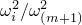, where 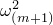 is the eigenvalue corresponding to the next vector, 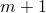 beyond the *m* vectors used to define the subspace. The default value of *m* used in Abaqus is 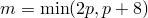, where *p* is the number of eigenvectors requested. If more vectors are used, the number of required iterations is reduced, but each iteration takes longer because of the greater number of right-hand sides. Increasing *m* can sometimes improve the performance of the algorithm significantly.

The choice of starting vectors is also important. There is no requirement that these should be close to the eigenvectors for rapid convergence. The Householder and Q-R steps rotate the vectors into the eigenvectors as long as the base vectors span the space of the eigenvectors. The approach used is to choose initial vectors that span this space as completely as possible. The algorithm used in Abaqus/Standard for this purpose is that of [Bathe and Wilson (1972)](07s01a01-References.md). They recommend using the diagonal mass terms as one vector: the other vectors are unit vectors, providing a set of single unit entries at the nodes and the degrees of freedom with the largest mass terms. A check is made to ensure that all degrees of freedom are represented in these additional vectors.

This completes the description of the basic subspace iteration algorithm as it is implemented in Abaqus/Standard. The small eigenproblem, for which all eigenpairs must be found, is solved by the Householder and Q-R algorithms. These algorithms are described at the end of this section.Lanczos eigensolver

The implementation of the Lanczos eigensolver as a powerful tool for extraction of the extreme eigenvalues and the corresponding eigenvectors of a sparse symmetric generalized eigenproblem has been discussed by a number of authors; see, for example, [Parlett (1980)](07s01a01-References.md), [Parlett and Nour-Omid (1989)](07s01a01-References.md), [Simon (1984)](07s01a01-References.md), and [Ericsson and Ruhe (1980)](07s01a01-References.md). A shifted block Lanczos algorithm was developed and described in detail by [Grimes, Lewis, and Simon (1994)](07s01a01-References.md).

The Lanczos procedure in Abaqus/Standard consists of a set of Lanczos "runs," in each of which a set of iterations called steps is performed. For each Lanczos run the following spectral transformation is applied:

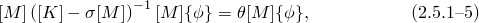where 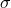 is the shift,  is the eigenvalue, and  is the eigenvector. This transformation allows rapid convergence to the desired eigenvalues. The eigenvectors of the symmetrized problem ([Equation 2.5.1&#8211;2](02s05a24-Eigenvalue-extraction.md)) and the transformed problem ([Equation 2.5.1&#8211;5](02s05a24-Eigenvalue-extraction.md)) are identical, while the eigenvalues of the original problem and the transformed problem are related in the following manner:

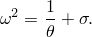

A Lanczos run will be terminated when its continuation is estimated to be inefficient. In general, only tens of eigenvalues (closest to the shift value) are computed in a single Lanczos run. The possibility of computing many eigenmodes by carrying out several runs with different shift values is an important feature of the Lanczos eigensolver.

Within each run a sequence of Krylov subspaces is created, and the best possible approximation of the eigenvectors on each subspace is computed in a series of "steps." In each Lanczos step the dimension of the subspace grows, allowing better approximation of the desired eigenvectors. This is in contrast to the subspace iteration method, in which the dimension of the subspace used to approximate the eigenvectors is fixed.

In theory the basic Lanczos process (in the assumption of "exact" computations without taking into account round-off errors) is able to determine only simple eigenvalues. The shifting strategy (and the Sturm sequence check as a part of it) detects missing modes and enforces computation of all the modes during the subsequent Lanczos runs. However, this strategy is expensive if the multiplicity of certain eigenvalues is high. Therefore, a "blocked" version of the Lanczos algorithm is implemented in Abaqus/Standard. The idea is to start with a block of orthogonal vectors and to increase the dimension of the Krylov subspaces by the block size at each Lanczos step. This approach allows automatic computation of all multiple eigenvalues if the largest multiplicity does not exceed the block size. Another important advantage of the blocked Lanczos method is that it allows efficient implementation of expensive computational kernels such as matrix-blocked vector multiplications, blocked back substitutions, and blocked vector products.

As discussed above, the Lanczos process consists of several Lanczos runs. Each Lanczos run is associated with some shift value that remains constant during the run. The initial shift value, , is determined (by a heuristic approach) using the geometric mean of the centers of the Gershgorin circles, termed the "problem scale." At the beginning of each Lanczos run a factorization of the shifted matrix 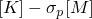 (where *p* is the run number) is carried out, after which a sequence of Lanczos steps is performed.

Each block Lanczos step *i* is implemented in Abaqus/Standard in the following manner:

Solve the system of linear equations with *b* right-hand sides (*b* is the Lanczos block size) using the factorized shifted matrix:

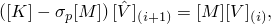where  is a block of Lanczos vectors. The number of rows of  is the number of variables in the finite element model, and the number of columns is the Lanczos block size *b*. The initial block of vectors 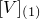 is a set of random vectors orthonormalized using the procedure: 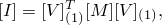 where 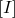 is the identity matrix.

Set the auxiliary block of vectors:

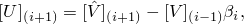where  is a 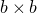 upper triangular matrix. 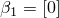.

Compute the symmetric matrix  of size *b*:

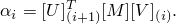

Formulate the Lanczos residual:

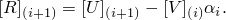

Normalize the residual. Compute a block of vectors, 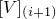, such that

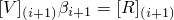and

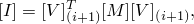where 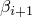 is a  upper triangular matrix.

Estimate the loss of orthogonality between  and 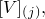 for 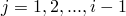, using the partial reorthogonalization technique; and perform reorthogonalization if necessary (see [Simon, 1984](07s01a01-References.md); [Grimes, Lewis, and Simon, 1994](07s01a01-References.md)).

Perform "local reorthogonalization": recompute  to provide

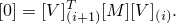

Solve the following reduced eigenvalue problem for the band matrix 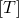:

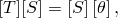where

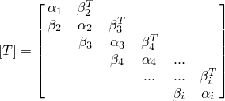and 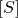 and 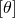 are, respectively, the matrices containing the eigenvectors and eigenvalues of the reduced eigenproblem. This problem is solved by the Householder and Q-R algorithms, which are discussed below.

Determine the error bounds in eigenvalue approximation for the symmetrized eigenvalue problem ([Equation 2.5.1&#8211;2](02s05a24-Eigenvalue-extraction.md)) (see [Parlett, 1980](07s01a01-References.md); [Grimes, Lewis, and Simon, 1994](07s01a01-References.md)). Check the termination conditions of the Lanczos run.The Lanczos run terminates if one of the following conditions is satisfied:

All the eigenvalues required for the current run are extracted.

The triangular matrix  is singular or ill-conditioned.

The number of Lanczos steps exceeds the maximum number allowed.

Continuation of the current run is evaluated to be inefficient. This decision is based on the estimation of the "cost per eigenvalue" over the next few steps (the Lanczos run is continued as long as the cost per eigenvalue is decreasing).

After termination of each Lanczos run, the converged eigenvectors of the symmetrized problem ([Equation 2.5.1&#8211;2](02s05a24-Eigenvalue-extraction.md)) are recovered using the blocks of vectors 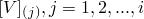 and the eigenvectors .

Once the Lanczos run for the shift  is completed, the shift value 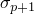 is computed using the results of all the previous Lanczos runs. To describe the shifting strategy, the following concepts are introduced:

The "computational interval" is the interval between the minimum and maximum eigenvalues of interest. This interval can be finite (both ends are finite), semi-infinite (only one end is finite), or infinite (both ends are infinite). The "center point" is the point in the computational interval nearest to the desired eigenvalues.

The Sturm sequence number, 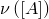, of a real nonsingular symmetric matrix  is the number of negative eigenvalues. This number is equal to the number of negative terms in the diagonal matrix  of the Cholesky decomposition  and is, therefore, available after the Cholesky decomposition is completed.

Let  and  be two shift values such that  Then the number of eigenvalues of the symmetrized problem ([Equation 2.5.1&#8211;2](02s05a24-Eigenvalue-extraction.md), assuming that  is positive definite or positive semidefinite) in the interval  is equal to  If this number is equal to the number of eigenvalues actually determined by the Lanczos algorithm, the interval  is called "a trust interval." The trust interval containing the center point is referred to as "a primary trust interval" (denoted by the key "+" in the trust intervals list printed in the message file). The shifting strategy is aimed at constructing the primary trust interval inside the computational interval containing the required number of eigenvalues closest to the center point.

One of the most important features in the formulation of the shift update strategy is the concept of a "sentinel." The sentinels are the endpoints of the intervals containing exclusively converged eigenvalues closest to the current shift value (in each direction). The sentinels are computed during each Lanczos run and are updated at the end of each step after the eigenvalue analysis of the reduced matrix  is completed. The basic assumption is that there are no missing eigenvalues inside the sentinels; therefore, they are excluded from the computation intervals for the upcoming Lanczos runs. This assumption is later verified on the basis of the Sturm sequence check, and a special procedure is activated if some eigenvalues are missing. If no missing eigenvalues are detected, the sentinels transform directly into the corresponding trust intervals.

The new shift values are selected on the basis of the nonconverged eigenvalue approximations after the Lanczos run is terminated. Assuming the same convergence properties for the upcoming runs, the new shift values are selected in such a way that the number of eigenvalues expected to be found in the upcoming runs will be close to the number of eigenvalues found inside the corresponding sentinels on the previous run.The Householder method with quarter rotation

The Householder method is used to reduce a general matrix to a symmetric tridiagonal form. A tridiagonal matrix is one whose only nonzero entries are on or immediately adjacent to the diagonal. The first step is to transform [Equation 2.5.1&#8211;4](02s05a24-Eigenvalue-extraction.md) to the form

where  is the identity matrix.

This is done by using a Cholesky decomposition of  and then premultiplying and postmultiplying  by the inverse of the lower and upper triangular matrices that are, thus, obtained:

where

To preserve symmetry in , it is necessary that the decomposition of  result in two matrices that are the transpose of each other. A Cholesky decomposition produces the desired result but adds the requirement that the matrix  be positive definite.  should always be positive definite (because  is positive definite in all of the problems considered here) if the base vectors defining the subspace are not linearly dependent across . In practice the choices made for starting values of the base vectors usually satisfy this requirement, although cases can arise when this is not true. Then Abaqus/Standard will reduce the dimensionality of the subspace to obtain a positive definite .

The Householder transformation starts with the matrix  and, proceeding one column at a time, reduces all the entries outside the tridiagonal part of the matrix to zero by the transformation

The matrix  is of the form

For the first transformation  is of the same order as  and ; that is, , the dimension of the subspace. However, each transformation reduces the order of  by one, the leading parts of  being 1 on the diagonal and 0 outside the diagonal, as illustrated above.

The matrix  is obtained by the following algorithm:

If this is the *k*th iteration, write the *k*th column of  below the diagonal as

Calculate the norm 

Define a vector,

Then,

This algorithm is developed in detail in [Strang's (1976)](07s01a01-References.md) book.

The Householder algorithm produces a symmetric tridiagonal matrix, which has the same eigenvalues as the original matrix, because the transformation ([Equation 2.5.1&#8211;6](02s05a24-Eigenvalue-extraction.md)) does not alter the eigenvalues.

The next step is to calculate the eigenvalues of the tridiagonal matrix. This is done by the Q-R algorithm. In this method the matrix , which is now tridiagonal (although this is not a requirement for the method to work), is factored into , where  is an orthonormal matrix (that is, ) and  is an upper-triangular matrix (that is, all the terms in  below the diagonal are zero).

The next matrix in the iteration is obtained by premultiplying and postmultiplying  by :

Because  is orthonormal, this will not affect the eigenvalues. This process gradually reduces the off-diagonal terms of  so that the diagonal terms approach the eigenvalues. To speed up convergence, a method of shifting is introduced, leading to the following iterative loop:

The shift cannot be used until the iteration is converging toward an eigenvalue; but once that is obvious, the shift value  can be set to the expected eigenvalue. This will lead to a significant improvement in the convergence rate. If the shift is done too early, with a value that is not close to an eigenvalue, it is quite possible that the process will converge to an incorrect number. The Q-R process will converge to the eigenvalues in ascending order; and as soon as an eigenvalue is obtained, the order of the matrix can be reduced by one.

The final step after the eigenvalues have been obtained is to calculate the eigenvectors by using the inverse power method to solve for an eigenvector, given any right-hand side:

where  is the eigenvalue just obtained and  is any vector. Because the left-hand-side matrix is singular in the direction of the eigenvector , this vector will be obtained regardless of the right-hand-side vector , as long as  is not orthogonal to the eigenvector. To ensure that consecutive vectors are orthogonal, especially in the case of multiple eigenvalues,  is always chosen to be orthogonal to the previously extracted eigenvectors. Since  is singular, a slight numerical shift must be included to decompose it and, thus, solve for . In the standard notation used in this guide, the matrix of eigenvectors  is written as , where N refers to the nodal variable in the problem and  is the mode number.
### Complex eigenvalue extraction

Abaqus/Standard offers the subspace projection method to solve for complex eigenvalues and right eigenvectors of the original eigenproblem ([Equation 2.5.1&#8211;1](02s05a24-Eigenvalue-extraction.md)).Subspace projection method

In the subspace projection method the original eigensystem ([Equation 2.5.1&#8211;1](02s05a24-Eigenvalue-extraction.md)) is projected onto a subspace spanned by the eigenvectors of the undamped, symmetric system ([Equation 2.5.1&#8211;2](02s05a24-Eigenvalue-extraction.md)). Thus, the symmetrized eigenproblem must be solved prior to the complex eigenvalue extraction procedure to create the subspace onto which the original system will be projected. Next, the original mass, damping, and stiffness matrices are projected onto the subspace of *N* eigenvectors:

Then, we arrive at the following eigenproblem:

Typically, the number of eigenvectors is relatively small; a few hundred is common. This small  complex eigenvalue system is solved using the standard QZ method for generalized nonsymmetric eigenproblems. Complex eigenvalues of the projected system are the approximation of the eigenvalues of the original system ([Equation 2.5.1&#8211;1](02s05a24-Eigenvalue-extraction.md)), but the right eigenvectors of the original system need to be recovered:

where  is the approximation of *k*-th right eigenvector of the original system.

The only energy density calculated in the eigenvalue extraction procedures is the elastic strain energy density, which for the complex eigenvalue extraction is defined as follows:

where  are real and imaginary components of the eigenstress tensor and  are real and imaginary components of the eigenstrain tensor.
### References

### References

"Eigenvalue buckling prediction,"  Section 6.2.3 of the Abaqus Analysis User's Guide

"Natural frequency extraction,"  Section 6.3.5 of the Abaqus Analysis User's Guide

"Complex eigenvalue extraction,"  Section 6.3.6 of the Abaqus Analysis User's Guide