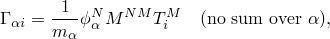

# 2.5.2 Variables associated with the natural modes of a model

### 2.5.2 Variables associated with the natural modes of a model

After an eigenfrequency step has been used to find the eigenvalues of a model, Abaqus/Standard automatically calculates the participation factor, the effective mass, and the composite modal damping for each mode so that these variables are available for use in subsequent linear dynamic analysis.
### Generalized mass

The "generalized mass" associated with mode  is

where  is the structure's mass matrix and  is the eigenvector for mode . The superscripts *N* and *M* refer to degrees of freedom of the finite element model.

Abaqus/Standard allows the user to choose between two types of eigenvector normalization: the eigenvectors can be scaled so that the largest entry in each vector is unity, or they can be normalized so that the generalized mass for each vector is unity (). The choice of eigenvector normalization type does not influence the results of subsequent modal dynamic steps. The normalization type determines only the manner in which the eigenvectors are represented.
### Modal participation factors

The participation factor for mode  in direction *i*, , is a variable that indicates how strongly motion in the global *x*-, *y*- or *z*-direction or rotation about one of these axes (indicated by *i*, *i = 1*, *2*, &#8230;, *6*) is represented in the eigenvector of that mode. It is defined as

where  defines the magnitude of the rigid body response of a degree of freedom in the model (*M*) to imposed rigid body motion (displacement or infinitesimal rotation) in the *i*-direction. For example, at a node with the usual three displacement and three rotation components,  is

where  is unity; and all other  zero, *x*, *y*, and *z* are the coordinates of the node; and , , and  represent the coordinates of the center of rotation. The participation factors are, thus, defined for the translational degrees of freedom and for rotation around the center of rotation.

For coupled acoustic-structural eigenfrequency analyses, an additional acoustic participation factor is computed for each mode as outlined in "Coupled acoustic-structural medium analysis,"  Section 2.9.1.
### Modal effective mass

The effective mass for mode  associated with kinematic direction *i*, *i = 1*, *2*, &#8230;, *6*) is defined as

If the effective masses of all modes are added in any particular direction, the sum should give the total mass of the model, except for mass at kinematically restrained degrees of freedom. Thus, if the effective masses of the modes used in the analysis add up to a value that is significantly less than the model's total mass, this suggests that modes that have significant participation in excitation in that direction have not been extracted.

For coupled acoustic-structural eigenfrequency analyses, an additional acoustic effective mass is computed for each mode as outlined in "Coupled acoustic-structural medium analysis,"  Section 2.9.1.
### Composite modal damping

Abaqus/Standard provides an option to define a composite damping factor for each material. These are assembled into fractions of critical damping values for each mode, , according to

where  is the critical damping fraction given for material *a* and  is the part of the structure's mass matrix made up of material *a*.
### References

### References

"Natural frequency extraction,"  Section 6.3.5 of the Abaqus Analysis User's Guide

"Material damping,"  Section 26.1.1 of the Abaqus Analysis User's Guide