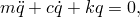
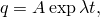
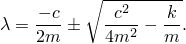
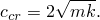
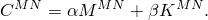
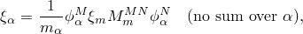
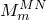
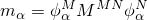

# 2.5.4 Damping options for modal dynamics

### 2.5.4 Damping options for modal dynamics

**Product: **Abaqus/Standard

For linear dynamic analysis based on modal superposition, several options are provided in Abaqus/Standard to introduce damping, as follows:
### Critical damping factors

The damping in each eigenmode can be given as a fraction of the critical damping for that mode.

The equation of motion for a one degree of freedom system (one of the eigenmodes of the system) is

where *m* is the mass, *c* the damping, *k* the stiffness, and *q* the modal amplitude.

The solution is of the form

where *A* is a constant, and

The solution will be oscillatory if the expression under the root sign is negative. Critical damping is defined as the damping that makes this expression zero:

If the system is critically damped, after any disturbance the system will return to a static equilibrium state as rapidly as possibly without any oscillation.

Typically, when damping is given as a fraction of critical damping associated with each mode, the values used are in the range of 1% to 10% of critical damping. This method of introducing damping has no physical basis in the finite element model: it is a purely mathematical concept introduced in association with the eigenmodes of the system. Thus, the concept cannot be extended to nonlinear applications where the equations of motion of the system are integrated directly and where the natural frequencies of the system are constantly changing because of nonlinearities.
### Rayleigh damping

Rayleigh damping is defined by a damping matrix formed as a linear combination of the mass and the stiffness matrices:

With Rayleigh damping the eigenvectors of the damped system are the same as the eigenvectors of the undamped system. Rayleigh damping can, therefore, be converted into critical damping fractions for each mode: this is the way Rayleigh damping is handled in Abaqus/Standard.

A form of Rayleigh damping is also provided in Abaqus for nonlinear analysis. When the problem is nonlinear the mass damping factor can be used directly: the stiffness damping factor is interpreted as creating viscoelastic behavior in which the viscosity is proportional to the elasticity, which gives exactly the stiffness proportional damping effect defined above for the linear case.
### Composite modal damping

When composite modal damping is used, a damping value is defined for each material as a fraction of critical damping to be associated with that material. These values are converted into a weighted average for each eigenmode, weighted by the mass matrix according to the equation

where  is the critical damping ratio used in mode ;  is the critical damping fraction defined for material *m*;  is the mass matrix associated with material *m*;  is the eigenvector of the th mode; and  is the generalized mass associated with the th mode (, no sum over ).
### Structural damping

Structural damping assumes that the damping forces are proportional to the forces caused by stressing of the structure and are opposed to the velocity. This form of damping can be used only if the displacement and velocity are exactly 90 out of phase, which is the case when the excitation is sinusoidal, so structural damping can be used only in steady-state and random response analysis. The damping forces are then

where  are the forces caused by stressing of the structure,  are the damping forces, *s* is the structural damping factor, and .

Any combination of damping options can be used in an analysis: the effects will be added if several damping definitions are chosen.
### Reference

### Reference

"Material damping,"  Section 26.1.1 of the Abaqus Analysis User's Guide