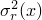

# 2.5.8 Random response analysis

### 2.5.8 Random response analysis

**Product: **Abaqus/Standard

Random response linear dynamic analysis is used to predict the response of a structure subjected to a nondeterministic continuous excitation that is expressed in a statistical sense by a cross-spectral density (CSD) matrix. The random response procedure uses the set of eigenmodes extracted in a previous eigenfrequency step to calculate the corresponding power spectral densities (PSD) of response variables (stresses, strains, displacements, etc.) and, hence---if required---the variance and root mean square values of these same variables. This section provides brief definitions and explanations of the terms used in this type of analysis. Detailed discussion of the theory of random response analysis is provided in the books by [Clough and Penzien (1975](07s01a01-References.md)), [Hurty and Rubinstein (1964)](07s01a01-References.md), and [Thompson (1988)](07s01a01-References.md).

Examples of random response analysis are the study of the response of an airplane to turbulence; the response of a car to road surface imperfections; the response of a structure to noise, such as the "jet noise" emitted by a jet engine; and the response of a building to an earthquake.

Since the loading is nondeterministic, it can be characterized only in a statistical sense. We need some assumptions to make this characterization possible. Although the excitation varies in time, in some sense it must be *stationary*---its statistical properties must not vary with time. Thus, if  is the variable being considered (such as the height of the road surface in the case of a car driving down a rough road), then any statistical function of *x*, , must have the same value regardless of what time origin we use to compute *f*:

We also need the excitation to be *ergodic*. This term means that, if we take several samples of the excitation, the time average of each sample is the same.

These restrictions ensure that the excitation is, statistically, constant. In the following discussion we also assume that the random variables are real, which is the case for the variables that we need to consider.
### Statistical measures

We define some measures of a variable that characterize it in a statistical sense.

The *mean value* of a random variable  is

Since the dynamic response is computed about a static equilibrium configuration, the mean value of any dynamic input or response variable will always be zero:

The *variance* of a random variable measures the average square difference between the point value of the variable and its mean:

Since  for our applications, the variance is the same as the *mean square value*:

The units of variance are (amplitude)2, so that---for example---the variance of a force has units of (force)2. Generally we prefer to use the same units as the variable itself. Therefore, output variables in Abaqus/Standard are given as *root mean square* ("RMS") values, .
### Correlation

Correlation measures the similarity between two variables. Thus, the *cross-correlation* between two random functions of time,  and , is the integration of the product of the two variables, with one of them shifted in time by some fixed value  to allow for the possibility that they are similar but shifted in time.

(Such a case would arise, for example, in studying a car driving along a rough road. If the separation of the axles is *d* and the car is moving at a steady speed *v*, the back axle sees the same road profile as the front axle, but delayed by a time . Assume that the road profile moves each wheel which, in turn applies a force to the car frame through the suspension. If  is the force applied to the rear axle (as a concentrated load in Abaqus) and  is the force applied to the front axle, .)

Figure 2.5.8&#8211;1 Two random records to be correlated.

The cross-correlation function is, thus, defined as

Since the mean value of any variable is zero, on average each variable has equal positive and negative content. If the variables are quite similar, their cross-correlation (for some values of ) will be large; if they are not similar, the product  will sometimes be negative and sometimes positive so that the integral over all time will provide a much smaller value, regardless of the choice of . A simple result is

For convenience the cross-correlation can be normalized to define the nondimensional *normalized cross-correlation*:

Thus, if , ; if , . If  and  are entirely dissimilar, . (When  the variables are said to be *orthogonal*.) Clearly , with small values of *r* indicating that  and  have quite different time histories.

Now consider the cross-correlation of a variable with itself: the *autocorrelation*. Intuitively we can see that if the variable is "very random," its autocorrelation will be very small whenever : there will be no time shift that allows the variable to correlate with itself. However, if the variable is not so random---if it is just a vibration at a fixed frequency---the autocorrelation will be close to  whenever  is chosen to be some integer multiple of half the period of the vibration. Thus, the autocorrelation provides a measure of how random a variable really is.

The autocorrelation of a variable  is, therefore,

Clearly, as , : the autocorrelation equals the variance (the mean square value). We can, therefore, also use the *normalized autocorrelation*:

Obviously  is symmetric about :

and the value of  never exceeds its value at :

The autocorrelation function of records with very similar amplitude over the wide range of frequencies drops off rapidly as  increases. This kind of function is known as a "wide band" random function.

Figure 2.5.8&#8211;2 Wide band noise record and its autocorrelation.

The most extreme wide band random function would have an autocorrelation that is just a delta function:

Such a function is called *white noise.* White noise has the same amplitude at all frequencies, and its autocorrelation is zero except at .

Figure 2.5.8&#8211;3 Autocorrelation of white noise.

Let us now consider the opposite case, known as a "narrow band" function. The extreme case of such a function is a simple sinusoidal vibration at a single frequency: . Then  must also be periodic, since  must attain the same value, , each time the shift, , corresponds to the period of vibration. Performing the integration through time,

Figure 2.5.8&#8211;4 Sine wave and its autocorrelation.

The autocorrelation, , thus tells us about the nature of the random variable. If  drops off rapidly as the time shift  moves away from , the variable has a broad frequency content; if it drops off more slowly and exhibits a cosine profile, the variable has a narrow frequency content centered around the frequency corresponding to the periodicity of .

Figure 2.5.8&#8211;5 Narrow band record and its autocorrelation.

We can extend this concept to detect the frequency content of a random variable by cross-correlating the variable with a sine wave: sweeping the wave over a range of frequencies and examining the cross-correlation tells us whether the random variable is dominated by oscillation at particular frequencies. We begin to see that the nature of stationary, ergodic random processes is best understood by examining them in the frequency domain.

As an illustration, consider a variable, , which contains many discrete frequencies. We can write  in terms of a Fourier series expanded in *N* steps of a fundamental frequency :

The series begins with the  term because the mean of the variable must be zero. We can write this series more compactly as a complex Fourier series (keeping in mind that we will be interested only in the real part):

where  is the complex amplitude of the *n*th term,  is the complex conjugate of :

and

The variance of  is

using the orthogonality of Fourier terms. Continuing,

where

is the *n*th component of the Fourier series.

Thus, thanks to the orthogonality of Fourier terms, the variance (the mean square value) of the series is the sum of the variances (the mean square values) of its components. In particular, we see that  is the variance, or mean square value, of the variable at the frequency .

The contribution to the variance of *x*, , at the frequency , per unit frequency, is thus

since we are stepping up the frequency range in steps of . The variance can, therefore, be written as

As we examine *x* as a function of frequency,  tells us the amount of "power" (in the sense of mean square value) contained in *x*, per unit frequency, at the frequency . As we consider smaller and smaller intervals, ,  is the *power spectral density (PSD)* of the variable *x*:

where *f* is the frequency in cycles per time (usually Hz).

Notice that  has units of (variable)2/frequency, where (variable) is the unit of the variable (displacement, force, stress, etc.). In this case "frequency" is almost always given in Hz, although---since Abaqus does not have any built-in units---the frequency could be expressed in any other units of cycles per time. However,  should not be given per circular frequency (radians per time): Abaqus assumes that , not .
### Fourier transforms

Since the variables of interest in random response analysis are characterized as functions of frequency, the Fourier transform plays a major role in converting from the time domain to the frequency domain and *vice versa*. The Fourier transform of , which we write as , is defined by

or, in terms of the circular frequency ,

Simple manipulation provides

so  is the amplitude of the cosine term in  at the circular frequency , while  is the amplitude of the sine term. We, thus, see the physical meaning of the Fourier transform---it provides the complex magnitude (the amplitude and phase) of the content of  at a particular frequency.

If  is real only (which is the case for the variables we need to consider), this expression shows that we must have

and

which means that

For completeness we also note the inverse transformation,

which shows that the transformations between the time and frequency domains are rather symmetrical.

We now need Parseval's theorem:

Applying this theorem to the variance (the mean square value):

Since  is real, we know that , and so

We have already shown that we can write the variance in terms of the power spectral density as

By comparison,

We also see that

To avoid integration over negative frequencies, we write the variance as

where  is the *single-sided PSD* defined as

Since , we see that

Now consider the autocorrelation function:

(using the result above). Thus, the power spectral density is the Fourier transform of the autocorrelation function. The inverse transform is

Since  is symmetric about  (), we can also write this equation as

so that

### Cross-spectral density

Following a similar argument to that used above to develop the idea of the power spectral density, we can define the *cross-spectral density (CSD) function*, , which gives the cross-correlation between two variables, , as

with the inverse transformation

Transforming the original definition of  to the frequency domain provides

By comparison,

We could also write

### Random response analysis

The general concept of random response analysis is now clear. A system is excited by some random loads or prescribed base motions, which are characterized in the frequency domain by a matrix of cross-spectral density functions, . Here we think of *N* and *M* as two of the degrees of freedom of the finite element model that are exposed to the random loads or prescribed base motions.

In typical applications the range of frequencies will be limited to those to which we know the structure will respond---we do not need to consider frequencies that are higher than the modes in which we expect the structure to respond.

The values of  might be provided by Fourier transformation of the cross-correlation of time records or by the Fourier transformation of the autocorrelation of a single time record, together with known geometric data, as in the case of the car driving along a roughly grooved road, where the autocorrelation of the road surface profile, together with the speed of the car and the axle separation, allow  to be defined for the front (1) and rear (2) axles, as shown above. (If, in this case, the road profile seen by the wheels on the left side of the car is not similar to that seen by the wheels on the right side of the car, the cross-correlation of the left and right road surface profiles will also be required to define the excitation.)

The system will respond to this excitation. We are usually interested in looking at the power spectral densities of the usual response variables---stress, displacement, etc. The PSD history of any particular variable will tell us the frequencies at which the system is most excited by the random loading.

We might also compute the cross-spectral densities between variables. These are usually not of interest, and Abaqus/Standard does not provide them. (They might be needed if the analysis involves obtaining results that, in turn, will define the loading for some other system. For example, the response of a building to seismic loading might be used to obtain the motions of the attachment points for a piping system in the building so that the piping system can then be analyzed. The only option would be to model the entire system together.)

An overall picture is provided by looking at the variance (the mean square value) of any variable; the RMS value is provided for this purpose. The RMS value is used instead of variance because it has the same units as the variable itself. Abaqus/Standard computes it by integrating the single-sided power spectral density of the variable over the frequency range, since

This integration is performed numerically by using the trapezoidal rule over the range of frequencies specified for the random response step:

where  is the  at the frequency  and *N* is the number of points at which the response was calculated. *N* will depend on the number of eigenmodes used in the superposition and on the user-specified number of points between the eigenfrequencies.

The user must ensure that enough frequency points are specified so that this approximate integration will be sufficiently accurate.

The transformation of the problem into the frequency domain inherently assumes that the system under study is responding linearly: the random response procedure is considered as a linear perturbation analysis step.

What remains, then, is for us to consider how Abaqus/Standard finds the linear response to the random excitation.
### The frequency response function

Random response is studied in the frequency domain. Therefore, we need the transformation from load to response as a function of frequency. Since the random response is treated as the integration of a series of sinusoidal vibrations, this transformation is based on the same steady-state response function used for a steady-state dynamic analysis and described in "Steady-state linear dynamic analysis,"  Section 2.5.7.

The discrete (finite element) linear dynamic system has the equilibrium equation

where  is the mass matrix,  is the damping matrix,  is the stiffness matrix,  are the external loads,  is the value of degree of freedom *N* of the finite element model (usually a displacement or rotation component, or an acoustic pressure), and  is an arbitrary virtual variation.

We project the problem onto the eigenmodes of the system. To do this the modes are first extracted from the undamped system:

(Here, and throughout the remainder of this section, repeated subscripts and superscripts are assumed to be summed over the appropriate range except when they are barred, like  above. Roman superscripts and subscripts indicate physical degrees of freedom; Greek superscripts and subscripts indicate modal variables.)

Typically the structural dynamic response is well represented by a small number of the lower modes of the model, so the number of modes is usually &#8211;, while the number of physical degrees of freedom might be &#8211;.

The eigenmodes are orthogonal across the mass and stiffness matrices:

The eigenmodes can be displacement or mass normalized. For displacement normalization the largest entry in  is 1.0; for mass normalization the largest entry is . In SIM architecture we normalize only with mass.

We assume that any damping is in the general form of "Rayleigh damping":

so that  will also project into a diagonal damping matrix .

The problem, thus, projects into a set of uncoupled modal response equations,

where

is the generalized load for mode  and  is the "generalized coordinate" (the modal amplitude) for mode .

Steady-state excitation is of the form

and creates response of similar form that we write as

where  is the *complex frequency response function* defined in "Steady-state linear dynamic analysis,"  Section 2.5.7.
### Response development

Random loading is defined by the cross-spectral density matrix , which links all loaded degrees of freedom (*N* and *M*). Projecting this matrix onto the modes provides the cross-spectral density function for the generalized (modal) loads:

The complex frequency response function then defines the response of the generalized coordinates as

where  is the complex conjugate of .

Finally, the response of the physical variables is recovered from the modal responses as

so that the power spectral density of degree of freedom  is

The PSDs for the velocity and acceleration of the same variable are

and

Recall that we may typically have &#8211; eigenmodes but many more (&#8211;) physical degrees of freedom. Therefore, if many of the physical degrees of freedom are loaded (as in the case of a shell structure exposed to random acoustic noise), it may be computationally expensive to perform operations such as

which involve products over all loaded physical degrees of freedom and must be done at each frequency in the range considered.

In contrast, operations such as

are relatively inexpensive since they are done independently for each combination of modes.

Forming

may be expensive if we choose to compute the results for a large selection of physical variables (displacements, velocities, accelerations, stresses, etc.). Abaqus/Standard will calculate the response only for the element and nodal variables requested. However, if a restart analysis is requested with the random response procedure, all variables are computed at the requested restart frequency, which can add substantially to the computational cost. The user is advised to write the restart file for the last increment only. To reduce the computational cost of random response analysis, Abaqus/Standard assumes that the cross-spectral density matrix for the loading can be separated into a frequency-dependent scalar function (containing the units of the CSD) and a set of coupling terms that are independent of frequency as follows:

Here *J* is the number of cross-correlation definitions included in the random response step. Each cross-correlation definition refers to an input complex frequency function, . The spatial cross-correlations are then defined by the complex set of values .

With this approach the cross-spectral density function for the generalized loads, , can be constructed as

Since the  are not functions of frequency, they can be computed once only, leaving the frequency-dependent operations to be done only in the space of the eigenmodes.

Although this procedure is not natural for typical correlated loadings (like road excitation or jet noise), loadings can always be defined this way by using enough cross-correlation definitions. The approach then reduces the computational cost for models with many loaded physical degrees of freedom. The approach works well for uncorrelated and fully correlated loadings, which are quite common cases.
### Decibel conversion

Abaqus/Standard allows the user to provide an input PSD (say ) in decibel units rather than units of power/frequency. There are various ways to convert from decibel units to units of power/frequency, depending on how the frequencies in one octave band are related to the frequencies in the next. A general formula relates the center (midband) frequencies  between octaves as

where the superscript  denotes  octave band and *x* is a chosen value. For example,  for *full octave band* conversion, and  for *one-third octave band* conversion. Abaqus/Standard uses full octave band conversion to convert from decibel units to units of power/frequency. For full octave band conversion, as shown by the above equation, the center frequency doubles from octave band to octave band.

Since decibel units are based upon log scales, the center frequency for an octave band bounded by lower frequency  and upper frequency  is given by

Since , we can easily show that

and

Thus, the change in frequency within any given octave band is

To convert from one type of conversion formula to the next, we need the following general decibel to power/frequency conversion equation:

where  is a reference power value. The subscript  means that the power reference is given for the type of conversion represented by *x* (e.g., full octave band conversion for  or one-third octave band conversion for ). When , we will simply use the notation . Thus, since Abaqus/Standard uses a full octave band conversion,  and

The PSD data can be given with respect to some other type of octave band frequency scale. In that case we can convert the PSD data at those frequencies coinciding with the full octave band scale by computing an equivalent full octave band reference power based on the following ratio:

For example, if we are given  (i.e., one-third octave band frequency scale), the equivalent full octave band reference power value would be

This conversion would be valid only at the one-third octave band center frequencies that coincide with the full octave band center frequencies. Thus, only every third data point should be considered.
### von Mises stress computation

The computation of PSD and RMS of von Mises stresses in Abaqus is based on work by [Segalman, et al. (1998)](07s01a01-References.md). Under this approach the PSD of von Mises stress at a node a is given by

where *m* is the number of modes,  are the elements of the PSD matrix of generalized displacements,

 are the modal stress components of the th mode at node a, and the constant matrix *A* is given by

Similarly, RMS of von Mises stress at a node a is computed as

where  are the elements of the variance matrix of generalized displacements.
### Reference

### Reference

"Random response analysis,"  Section 6.3.11 of the Abaqus Analysis User's Guide