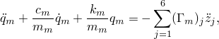
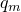
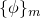
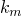
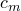
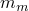
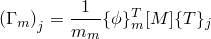

# 2.5.9 Base motions in modal-based procedures

### 2.5.9 Base motions in modal-based procedures

**Product: **Abaqus/Standard

Structures subjected to ground motion by earthquakes or other excitations such as explosions or dynamic action of machinery are examples in which support motions may have to be considered in the analysis of dynamic response. For modal-based dynamic analyses with modal dynamic, steady-state dynamic, or random response steps, the support motions are simulated by prescribed excitations called base motions that are applied to the suppressed degrees of freedom. The suppressed degrees of freedom are grouped into one or more bases. Multiple bases are required if base motions cannot be described by a single set of rigid body motions. A common case is that of a bridge whose supports are subjected to the same earthquake record but with a time shift.

The degrees of freedom that are suppressed without being assigned to a named base make up the *primary* base, which typically is the only base if the motion can be described by a single set of rigid body motions. The suppressed degrees of freedom that are associated with named boundary conditions make up the *secondary* base or bases. Abaqus/Standard uses different approaches to handle primary and secondary base motions. The modal participation method is used for primary base motions, and the "big mass" method is used for secondary base motions. Multiple bases can be used only in modal dynamic and steady-state dynamic analyses.
### Primary base motions

Let us consider structural motions *relative* to the base motion, . The total response, , of the dynamic system will now consist of the relative response, , and the applied base motion excitation, :

with similar expressions for velocities and accelerations. Substituting  in the linearized equation of motion gives

The base acceleration is converted into applied inertia loads . Here it has been assumed that there is no damping on rigid body modes (i.e., Rayleigh damping with  is not allowed). If the prescribed excitation is given in the form of a displacement or a velocity, Abaqus/Standard differentiates it to obtain the acceleration. The base motion vector can be expressed in terms of the rigid body mode vectors, , and time dependent base motion values, :

Projecting the equation of motion into the eigenspace we have

where  and  denote the relative generalized coordinate and mode shape for the mode *m*; ,  and  are modal stiffness, modal damping, and modal mass, respectively; and

is the modal participation factor for mode *m* and degree of freedom *j*.

Kinematic boundary conditions defined without being assigned a base name in an eigenfrequency step cannot be changed in any of the subsequent modal-based procedures. The kinematic constraints are built into the eigenvectors and into the participation factors for each mode, which implies that all degrees of freedom in the primary base must be subjected to the same rigid body motion.

The participation factors are used to calculate the equivalent forcing function, and the equation of motion is solved for the relative quantities (such as relative displacements, relative velocities, and relative accelerations---output variables U, V, and A, respectively). To obtain total kinematic quantities (such as total displacements, total velocities, and total accelerations---output variables TU, TV, and TA, respectively), the primary base motions are added to the relative responses.
### Secondary base motions

The base motion treatment described above cannot be applied to secondary bases. Instead, Abaqus/Standard uses a "big mass" approach to simulate the motion of secondary bases. In this approach a big mass (much bigger than the total mass of the structure) is added to each degree of freedom in a secondary base during the eigenfrequency step. This generates additional low frequency modes associated with the masses . As more big masses are applied, more low frequency modes will be extracted in the frequency analysis step. To keep the number of frequencies of interest the same, the number of eigenvalues extracted is automatically increased. Hence, the size of the subspace will grow proportionally to the number of degrees of freedom associated with secondary bases.

The desired base motion is obtained by applying a point force to each degree of freedom in the modal superposition step:

where  is the big mass and  is the applied acceleration prescribed for degree of freedom *N* associated with secondary supports.

Using the notation used in the equation of motion for primary base motions, the equation of motion for combined primary and secondary base motions is readily written as

with

where  is the diagonal matrix containing the big masses for secondary base *i* and  is the base motion applied to this base. The mass matrix  now contains the mass of the structure as well as the big masses associated with the secondary bases. Projecting the equation of motion into the eigenspace (expanded by the low frequency modes) we obtain

Again, the quantities solved for are relative to the primary support, including those obtained at the secondary supports.

The big masses should be chosen as large as possible to obtain accurate base motions but should not be so large as to cause excessive round-off errors or overflows. To provide six digits of numerical accuracy, Abaqus/Standard chooses each big mass equal to 106 times the total mass of the structure and each big rotary inertia equal to 106 times the total moment of inertia of the structure.

For acoustic pressure degree of freedom the big mass is calculated as equal to 106 times the total acoustic mass of the model. Secondary base motions for acoustic pressure are available only with the SIM architecture.

The big masses, which are introduced in the eigenfrequency step, are not included in the model for other steps in a multiple step analysis. Hence, the total mass of the structure and the printed messages about masses and inertia of the entire model are not affected. However, the presence of the masses will be noticeable in the output tables printed in the eigenvalue extraction step, as well as in the information for the generalized masses and effective masses. See "Double cantilever subjected to multiple base motions,"  Section 1.4.12 of the Abaqus Benchmarks Guide, for an example of the use of the base motion feature.
### References

### References

"Transient modal dynamic analysis,"  Section 6.3.7 of the Abaqus Analysis User's Guide

"Mode-based steady-state dynamic analysis,"  Section 6.3.8 of the Abaqus Analysis User's Guide

"Random response analysis,"  Section 6.3.11 of the Abaqus Analysis User's Guide

"Amplitude curves,"  Section 34.1.2 of the Abaqus Analysis User's Guide