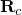
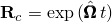

# 2.7.1 Steady-state transport analysis

### 2.7.1 Steady-state transport analysis

**Product: **Abaqus/Standard

Abaqus/Standard provides a specialized analysis capability to model the steady-state behavior of a cylindrical deformable body rolling along a flat rigid surface. The capability uses a reference frame that removes the explicit time dependence from the problem so that a purely spatially dependent analysis can be performed. For an axisymmetric body traveling at a constant ground velocity and constant angular rolling velocity, a steady state is possible in a frame that moves at the speed of the ground velocity but does not spin with the body in the rolling motion. This choice of reference frame allows the finite element mesh to remain stationary so that only the part of the body in the contact zone requires fine meshing.
### Kinematics of steady-state rolling

The kinematics of the rolling problem are described in terms of a coordinate frame that moves along with the ground motion of the body. In this moving frame the rigid body rotation is described in a spatial or Eulerian manner and the deformation in a material or Lagrangian manner. It is this kinematic description that converts the steady moving contact field problem into a purely spatially dependent simulation.

We consider the case shown in [Figure 2.7.1&#8211;1](02s07a35.md), where the ground velocity of the body is described in terms of a constant cornering motion.

Figure 2.7.1&#8211;1 Constant cornering motion.

The body is rotating with a constant angular rolling velocity  around a rigid axle  at , which in turn rotates with constant angular velocity  around the fixed cornering axis  through point . Hence, the motion of a particle  at time *t* consists of a rigid rolling rotation to position , described by

followed by a deformation to point , and a subsequent cornering rotation (or precession) around  to position  so that

where  is the cornering rotation given by  and  is the skew-symmetric matrix associated with the rotation vector . Similarly,  is the spinning rotation matrix defined as  and  is the skew-symmetric matrix associated with the rotation vector . The velocity of the particle then becomes

To describe the deformation of the body, we define a map , which gives the position of point  at time *t* as a function of its location  at time *t* so that  It follows that

where

Noting that , and introducing the circumferential direction , where  is the radius of a point on the reference body, the velocity of the reference body can be written as , so that

where *S* is the distance-measuring coordinate along the streamline. Using this result, together with , the velocity of the particle can be written as

The acceleration is obtained by a second differentiation and some manipulation:

To obtain expressions for the velocity and acceleration in the reference frame tied to the body, we use the transformations

so that we obtain

and

For steady-state conditions these expressions reduce to

and

The first term in the last expression can be identified as the acceleration that gives rise to centrifugal forces resulting from rotation about . Noting that  is a measure of velocity, the second term can be identified as the acceleration that gives rise to Coriolis forces. The last term combines the acceleration that gives rise to Coriolis and centrifugal forces resulting from rotation about . When the deformation is uniform along the circumferential direction, this Coriolis effect vanishes so that the acceleration gives rise to centrifugal forces only.

The velocity of the center of the body  (which must lie on the axis ) is

since the motions due to rolling and deformation vanish on the axis.

To obtain the expression for straight line motion, as shown in [Figure 2.7.1&#8211;2](02s07a35.md), we move  far away from the center of the body  but keep  the same. In that case  and, hence, in the limit

which corresponds to straight line rolling.

Figure 2.7.1&#8211;2 Straight line rolling.

### Inertia

The virtual work contribution from the d'Alembert forces is

Using the divergence theorem, the virtual work contribution becomes

and the rate of virtual work becomes

For straight line rolling only the last term in each expression needs to be taken into account.
### Performing a harmonic analysis about a nonlinear base state

To perform a steady-state dynamic or frequency analysis on a rolling tire, it is necessary to linearize the virtual work expressions about the base state. Assuming a harmonic solution of the form , it can be shown that, for the case of straight line rolling, the linearized rate of virtual work is

 The first term is the load stiffness contribution due to the spinning motion about the axle. The second term is an imaginary antisymmetric gyroscopic operator. The third term is the standard mass operator.
### Contact conditions

To obtain the contact conditions, we start with the expressions for velocity derived in the previous section. For points on the surface of the deformable body

where  is the cornering axis (which must be normal to the rigid surface) and  is the cornering angular velocity around . Assuming that the velocity of a point on the foundation (or rigid surface) is , the relative motion becomes

where . This equation can be split into normal and tangential components. The rate of penetration is

For any point in contact ; hence,

which in incremental form reduces to the standard contact condition

For steady-state conditions  and .

Similarly, the rate of slip is

where  are two orthogonal unit vectors tangent to the contact surface so that . For steady-state conditions , so

Variations in  yield

For straight line rolling we can replace  by  so that we obtain

and

To complete the formulation, a relationship between frictional stress and slip velocity must be developed. A Coulomb friction law is provided for steady-state rolling. The law assumes that slip occurs if the frictional stress,

is equal to the critical stress, , where  and  are shear stresses along ,  is the friction coefficient, and *p* is the contact pressure. On the other hand, when , no relative motion occurs. The condition of no relative motion is approximated in Abaqus by stiff viscous behavior

where  is the tangential slip velocity and  is the "stick viscosity," which follows from the relation

The allowable viscous slip velocity is defined as a fraction of the circumferential velocity

where  is a user-defined slip tolerance.

These expressions contribute to the standard virtual work contribution for slip,

and rate of virtual work for slip,

### Reference

### Reference

"Steady-state transport analysis,"  Section 6.4.1 of the Abaqus Analysis User's Guide