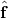
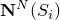
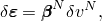
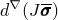
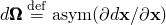
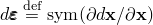

# 2.8.2 Discretized equilibrium statement for a porous medium

### 2.8.2 Discretized equilibrium statement for a porous medium

**Product: **Abaqus/Standard

Equilibrium is expressed by writing the principle of virtual work for the volume under consideration in its current configuration at time *t*:

where  is a virtual velocity field,  is the virtual rate of deformation,  is the true (Cauchy) stress,  are surface tractions per unit area, and  are body forces per unit volume.

For our system  will often include the weight of the wetting liquid,

where  is the density of the wetting liquid and  is the gravitational acceleration, which we assume to be constant and in a constant direction (so that, for example, the formulation cannot be applied directly to a centrifuge experiment unless the model in the machine is small enough that  can be treated as constant). For simplicity we consider this loading explicitly so that any other gravitational term in  is associated only with the weight of the dry porous medium. Thus, we write the virtual work equation as

where  are all body forces except the weight of the wetting liquid.

In a finite element model equilibrium is approximated as a finite set of equations by introducing interpolation functions. The notation used to indicate such discretization are those quantities with uppercase superscripts (for example, ), which represent nodal variables, with the summation convention adopted for the superscripts. The interpolation is assumed to be based on material coordinates in the material skeleton (a "Lagrangian" formulation).

For simplicity, in this section we consider only the case where the problem has no internal constraints---such as incompressibility---and the discretization is made entirely by approximating equilibrium: this results in the displacement (or stiffness) method. Mixed formulation ("hybrid") elements are available for porous medium analysis with Abaqus/Standard, but consideration of such formulations does not require any important extension of the development at this stage.

The virtual velocity field is interpolated by

where  are interpolation functions defined with respect to material coordinates, .

The virtual rate of deformation is interpolated as

where, in the simplest case,

although more general forms are used in some of the elements in Abaqus.

The virtual work equation is thus discretized as

where the  are assumed to be independent.

The term conjugate to  on the left-hand side of this equation is referred to subsequently as the internal force array, :

Likewise, the external force array, , is taken from the right-hand side:

( includes any d'Alembert forces).

Choosing each  to be nonzero in turn expresses equilibrium as a balance of internal and external forces:

These discretized equilibrium equations, together with the continuity equation discussed in "Continuity statement for the wetting liquid phase in a porous medium,"  Section 2.8.4, define the state of the porous medium. The equilibrium equations are written at the end of a time increment when implicit integration is used and, for all but the simplest cases, they are nonlinear. Newton's method is often used for their solution. Also, small, linear perturbations of the system are sometimes of interest (an example is the small vibration problem). These considerations imply a need for the Jacobian matrix of the system, which defines the variation of each term in the equations with respect to the basic variables of the discretized problem, which---for this case---are the nodal positions,  (or, equivalently, the displacements ), and the nodal wetting liquid pressure values, . Symbolically we write such a variation of a term, *f* say, as , meaning

From the variation of discretized equilibrium, [Equation 2.8.2&#8211;2](02s08a37.md), the term  gives rise to the mass matrix (for the d'Alembert forces) and the "load stiffness matrix" in the Jacobian. The load stiffness matrix is discussed in Chapter 3, "Elements," and Chapter 6, "Loading and Constraints," for particular load types. The load stiffness term associated with the weight of the wetting liquid is

where

is the ratio of volume in the current configuration to volume in the reference configuration.

The term  is

The first term includes , which is the variation of stress caused by variations in nodal positions and pore liquid pressure values. In a continuum sense (that is, before the spatial discretization of the solution variables) this term is defined by the effective stress principle and by the constitutive assumptions used for the material and is discussed in more detail below. Introducing the spatial discretization into the second term provides a contribution to the initial stress matrix.

Since the effective stress, , is generally stored as components associated with spatial directions, the rotation of the material during an increment must be included in the formulation. This issue is discussed in detail in "Rate of deformation and strain increment,"  Section 1.4.3; "Stress rates,"  Section 1.5.3; "State storage,"  Section 1.5.4; and "Solid element formulation,"  Section 3.2.2. For the purpose of the present development we assume that the variation of stress is

where  is the variation in effective stress associated with constitutive response in the material (that is, caused by variations in the strain or other state variables) and  is the spin of the material. Using this assumption, the Jacobian contribution from stress in the porous medium is

where  is the strain rate (the "rate of deformation") so that

### References

### References

"Coupled pore fluid diffusion and stress analysis,"  Section 6.8.1 of the Abaqus Analysis User's Guide

"Geostatic stress state,"  Section 6.8.2 of the Abaqus Analysis User's Guide