# 2.8.4 Continuity statement for the wetting liquid phase in a porous medium

### 2.8.4 Continuity statement for the wetting liquid phase in a porous medium

**Product: **Abaqus/Standard

Abaqus/Standard provides capabilities for particular cases of fluid flow through a porous medium. These cases are associated with having a relatively incompressible wetting liquid present in the medium. The medium may be wholly or partially saturated, with this liquid. When the medium is only partially saturated the remainder of the voids is filled with another fluid. An example is a geotechnical problem, with soil containing water and air: continuity is written for the water phase.

The wetting liquid can attach to and, thus, be trapped by certain solid particles in the medium: this volume of trapped liquid attached to solid particles forms a "gel."

A porous medium is modeled approximately in Abaqus by attaching the finite element mesh to the solid phase. Liquid can flow through this mesh. A continuity equation is, therefore, required for the liquid, equating the rate of increase in liquid mass stored at a point to the rate of mass of liquid flowing into the point within the time increment. This continuity statement is defined in this section. It is written in a variational form as a basis for finite element approximation. The liquid flow is described by introducing Darcy's law or, alternatively, Forchheimer's law. The continuity equation is satisfied approximately in the finite element model by using excess wetting liquid pressure as the nodal variable (degree of freedom 8), interpolated over the elements. The equation is integrated in time by using the backward Euler approximation. The total derivative of this integrated variational statement of continuity with respect to the nodal variables is required for the Newton iterations used to solve the nonlinear, coupled, equilibrium and continuity equations. This expression is also derived in this section.

Consider a volume containing a fixed amount of solid matter. In the current configuration this volume occupies space *V* with surface *S*. In the reference configuration it occupied space 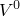. Wetting liquid can flow through this volume: at any time the volume of such "free" liquid (liquid that can flow if driven by pressure) is written 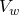. Wetting liquid can also become trapped in the volume, by absorption into the gel. The volume of such trapped liquid is written 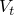.

The total mass of wetting liquid in the control volume is

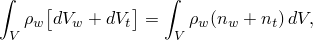where  is the mass density of the liquid.

The time rate of change of this mass of wetting liquid is

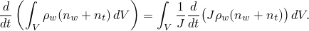

The mass of wetting liquid crossing the surface and entering the volume per unit time is

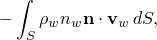where 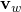 is the average velocity of the wetting liquid relative to the solid phase (the seepage velocity) and  is the outward normal to *S*.

Equating the addition of liquid mass across the surface *S* to the rate of change of liquid mass within the volume *V* gives the wetting liquid mass continuity equation

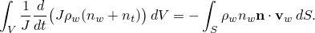Using the divergence theorem and because the volume is arbitrary, this provides the pointwise equation

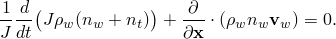

The equivalent weak form is

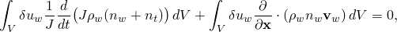where 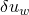 is an arbitrary, continuous, variational field. This statement can also be written on the reference volume:

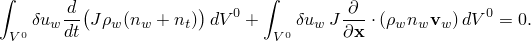

In Abaqus/Standard this continuity statement is integrated approximately in time by the backward Euler formula, giving

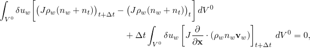which, over the current volume, is

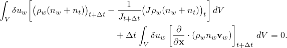We now drop the subscript 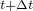 by adopting the convention that any quantity not explicitly associated with a point in time is taken at .

The divergence theorem allows the equation to be rewritten as

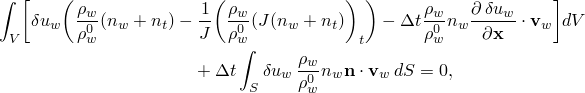where---for convenience---we have normalized the equation by the density of the liquid in the reference configuration, 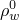.

Since 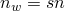, this is the same as

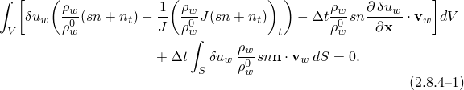
### Constitutive behavior

The constitutive behavior for pore fluid flow is governed either by Darcy's law or by Forchheimer's law. Darcy's law is generally applicable to low fluid flow velocities, whereas Forchheimer's law is commonly used for situations involving higher flow velocities. Darcy's law can be thought of as a linearized version of Forchheimer's law. Darcy's law states that, under uniform conditions, the volumetric flow rate of the wetting liquid through a unit area of the medium, 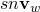, is proportional to the negative of the gradient of the piezometric head ([Bear, 1972](07s01a01-References.md)):

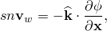where 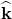 is the permeability of the medium and  is the piezometric head, defined as

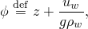where *z* is the elevation above some datum and *g* is the magnitude of the gravitational acceleration, which acts in the direction opposite to *z*. On the other hand, Forchheimer's law states that the negative of the gradient of the piezometric head is related to a quadratic function of the volumetric flow rate of the wetting liquid through a unit area of the medium ([Desai, 1975](07s01a01-References.md)):

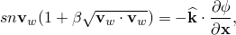where 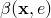 is a "velocity coefficient" ([Tariq, 1987](07s01a01-References.md)). This nonlinear permeability can be defined to be dependent on the void ratio of the material. We see that, as the fluid velocity tends to zero, Forchheimer's law approaches Darcy's law. Also, if , the two flow laws are identical.

 can be anisotropic and is a function of the saturation and void ratio of the material.  has units of velocity (length/time). [Some authors refer to  as the hydraulic conductivity ([Bear, 1972](07s01a01-References.md)) and define the permeability as

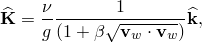where  is the kinematic viscosity of the fluid (the ratio of the fluid's dynamic viscosity to its density).]

We assume that *g* is constant in magnitude and direction, so

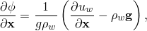where 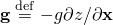 is the gravitational acceleration (we assume that  varies slowly with position).

The permeability of a particular fluid in a multiphase flow system depends on the saturation of the phase being considered and on the porosity of the medium. We assume these dependencies are separable, so

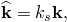where  provides the dependency on saturation, with 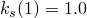 and 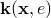 is the permeability of the fully saturated medium.

The function  can be defined by the user. [Nguyen and Durso (1983)](07s01a01-References.md) observe that, in steady flow through a partially saturated medium, the permeability varies with 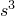. We, therefore, take  by default.

Introducing the flow constitutive law allows the mass continuity equation ([Equation 2.8.4&#8211;1](02s08a39-Continuity-statement-for-the-wetting-liq.md)) to be written

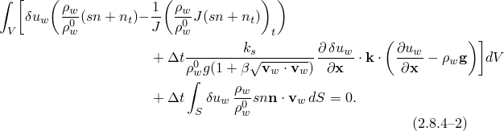
### Volumetric strain in the liquid and grains

The bulk behavior of the grains was discussed in "Constitutive behavior in a porous medium,"  Section 2.8.3. From [Equation 2.8.3&#8211;2](02s08a38-Constitutive-behavior-in-a-porous-medium.md),

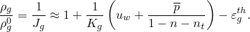Combining this with [Equation 2.8.1&#8211;4](02s08a36-Effective-stress-principle-for-porous-me.md) and neglecting all but first-order terms in small quantities, we obtain

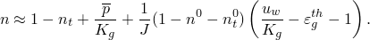Using [Equation 2.8.3&#8211;1](02s08a38-Constitutive-behavior-in-a-porous-medium.md) and again neglecting second-order terms in small quantities, we obtain

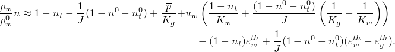Combining this result with [Equation 2.8.3&#8211;4](02s08a38-Constitutive-behavior-in-a-porous-medium.md), and again approximating to first-order in small quantities,

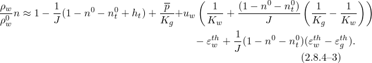
### Saturation

Because  measures pressure in the wetting liquid and we neglect the pressure in the other fluid phase in the medium (see "Effective stress principle for porous media,"  Section 2.8.1), the medium is fully saturated for 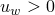. Negative values of  represent capillary effects in the medium. For 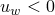 it is known (see, for example, [Nguyen and Durso, 1983](07s01a01-References.md)) that, at a given value of capillary pressure, , the saturation lies within certain limits. Typical forms of these limits are shown in [Figure 2.8.4&#8211;1](02s08a39-Continuity-statement-for-the-wetting-liq.md).

Figure 2.8.4&#8211;1 Typical liquid absorption and exsorption behavior.

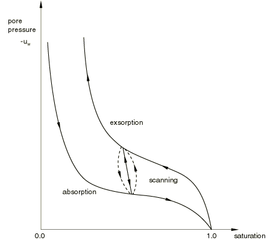 We write these limits as , where 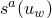 is the limit at which absorption will occur (so that ), and  is the limit at which exsorption will occur, and thus . We assume that these relationships are uniquely invertible and can, thus, also be written as 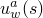 during absorption and 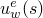 during exsorption. We also assume that some wetting liquid will always be present in the medium: 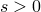.

[Bear (1972)](07s01a01-References.md) suggests that the transition between absorption and exsorption and vice versa takes place along "scanning" curves. We approximate these with a straight line, as shown in [Figure 2.8.4&#8211;1](02s08a39-Continuity-statement-for-the-wetting-liq.md).

Saturation is treated as a state variable that may have to change if the wetting liquid pressure is outside the range for which its value is admissible according to that actual data corresponding to [Figure 2.8.4&#8211;1](02s08a39-Continuity-statement-for-the-wetting-liq.md). The evolution of saturation as a state variable is defined as follows. Assume that the saturation at time *t*, 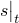, is known. It must satisfy the constraints

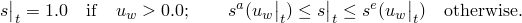We solve the continuity equation for 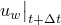, initially assuming 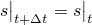. We then obtain 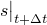 by the following rules:

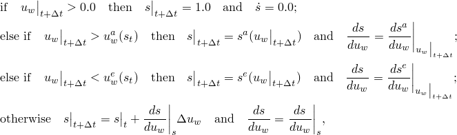 where  is the slope of the scanning line. These choices are shown in [Figure 2.8.4&#8211;2](02s08a39-Continuity-statement-for-the-wetting-liq.md).

Figure 2.8.4&#8211;2 Evolution of *s* in unsaturated cases.

### Jacobian contribution

The Jacobian contribution from the continuity equation is obtained from the variation of [Equation 2.8.4&#8211;2](02s08a39-Continuity-statement-for-the-wetting-liq.md) with respect to  and  at time .

Consider first the surface integral. The surface divides into that part across which the liquid mass flow rate, , is prescribed and that part where the wetting liquid pressure, , is prescribed. Thus, the only contribution of this term to the Jacobian is the variation in the integral caused by change in surface area in that part where the mass flow is prescribed. We neglect this contribution.

The remaining part of the variation of [Equation 2.8.4&#8211;2](02s08a39-Continuity-statement-for-the-wetting-liq.md) is

Using [Equation 2.8.4&#8211;3](02s08a39-Continuity-statement-for-the-wetting-liq.md) we have

 and, thus, neglecting small terms compared to unity,

[Equation 2.8.3&#8211;5](02s08a38-Constitutive-behavior-in-a-porous-medium.md) shows that , which is defined by the evolution equation given in "Constitutive behavior in a porous medium,"  Section 2.8.3, and so makes no contribution to the Jacobian.

Finally, the Jacobian contribution from the permeability term is rather complex in the general case of the nonlinear Forchheimer flow law. Although we include it in the software, here we only write the linearized flow version reflecting Darcy's law ():

Using these results provides the Jacobian of the continuity equation as

### References

### References

"Coupled pore fluid diffusion and stress analysis,"  Section 6.8.1 of the Abaqus Analysis User's Guide

"Pore fluid flow properties,"  Section 26.6.1 of the Abaqus Analysis User's Guide