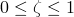
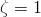
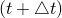

# 2.8.5 Solution strategy for coupled diffusion/deformation

### 2.8.5 Solution strategy for coupled diffusion/deformation

**Product: **Abaqus/Standard

The governing equations of pore fluid diffusion/deformation are

There are two common approaches to solving these coupled equations. One approach is to solve one set of equations first and then use the results obtained to solve the second set of equations. These results in turn are fed back into the first set of equations to see what changes (if any) result in the solution. This process continues until succeeding iterations produce negligible changes in the solutions obtained. This is the so-called staggered approach to the solution of coupled systems of equations. The second approach is to solve the coupled systems directly. This direct approach is used in Abaqus/Standard because of its rapid convergence even in severely nonlinear cases.

We first introduce a time integration operator in the pore fluid flow equation. The operator chosen is the simple one-step method:

where . In fact, to ensure numerical stability, we choose  (backward difference) so that

With this operator the pore fluid flow equation at time  can be rewritten as

Using the Newton linearization, the flow equation becomes

Then the coupled system of equations to be solved is

and

where

These equations form the basis of the iterative solution of a time step in a coupled flow deformation solution in Abaqus/Standard. They are, in general, nonsymmetric. The lack of symmetry may be due to a number of effects: changes in geometry, dependence of permeability on void ratio, changes in saturation in partially saturated cases, and inclusion of fluid gravity load terms in total pore pressure analyses. The steady-state version of the coupled problem is also nonsymmetric.

Abaqus/Standard uses the nonsymmetric equation solver by default in all steady-state or partially saturated coupled analyses; in other cases it uses the symmetric solver by default. In the latter cases, if the effects of changes in geometry or nonlinear permeability are significant, or if a total pore pressure (versus excess pore pressure) analysis is performed, the user is advised to activate the unsymmetric solver.
### Reference

### Reference

"Coupled pore fluid diffusion and stress analysis,"  Section 6.8.1 of the Abaqus Analysis User's Guide