# 2.9.1 Coupled acoustic-structural medium analysis

### 2.9.1 Coupled acoustic-structural medium analysis

**Products: **Abaqus/Standard  Abaqus/Explicit

Abaqus provides a set of elements for modeling a fluid medium undergoing small pressure variations and interface conditions to couple these acoustic elements to a structural model. These elements are provided to model a variety of phenomena involving dynamic interactions between fluid and solid media.

Steady-state harmonic (linear) response analysis can be performed for a coupled acoustic-structural system, such as the study of the noise level in a vehicle. The steady-state procedure is based on direct solution of the coupled complex harmonic equations, as described in "Direct steady-state dynamic analysis,"  Section 2.6.1; on a modal-based procedure, as described in "Steady-state linear dynamic analysis,"  Section 2.5.7; or on a subspace-based procedure, as described in "Subspace-based steady-state dynamic analysis,"  Section 2.6.2. Mode-based linear transient dynamic analysis is also available, as described in "Modal dynamic analysis,"  Section 2.5.5.

The acoustic fluid elements can also be used with nonlinear response analysis (implicit or explicit direct integration) procedures: whether such results are useful depends on the applicability of the small pressure change assumption in the fluid. Often in coupled fluid-solid problems the fluid forces in this linear regime are high enough that nonlinear response of the structure needs to be considered. For example, a ship subjected to underwater incident wave loads due to an explosion may experience plastic deformation or large motions of internal machinery may occur.

The acoustic medium in Abaqus may have velocity-dependent dissipation, caused by fluid viscosity or by flow within a resistive porous matrix material. In addition, rather general boundary conditions are provided for the acoustic medium, including impedance, or "reactive," boundaries.

The possible conditions at the surface of the acoustic medium are:

Prescribed pressure (degree of freedom 8) at the boundary nodes. (Boundary conditions can be used to specify pressure at any node in the model.)

Prescribed inward normal derivative of pressure per unit density of the acoustic medium through the use of a concentrated load on degree of freedom 8 of a boundary node. If the applied load has zero magnitude (that is, if no concentrated load or other boundary condition is present), the inward normal derivative of pressure (and normal fluid particle acceleration) is zero, which means that the default boundary condition of the acoustic medium is a rigid, fixed wall (Neumann condition).

Acoustic-structural coupling defined either by using surface-based coupling procedures (see "Surface-based acoustic-structural medium interaction,"  Section 5.2.7) or by placing ASI coupling elements on the interface between the acoustic medium and a structure.

An impedance condition, representing an absorbing boundary between the acoustic medium and a rigid wall or a vibrating structure or representing radiation to an infinite exterior.

An incident wave loading, representing the inward normal derivative of pressure per unit density of the acoustic medium resulting from the arrival of a specified wave. The formulation of this loading case is discussed in "Loading due to an incident dilatational wave field,"  Section 6.3.1. It is applicable to problems involving blast loads and to acoustic scattering problems.The flow resistance and the properties of the absorbing boundaries may be functions of frequency in steady-state response analysis but are assumed to be constant in the direct integration procedure. This section defines the formulation used in these elements.
### Acoustic equations

The equilibrium equation for small motions of a compressible, adiabatic fluid with velocity-dependent momentum losses is taken to be

where *p* is the excess pressure in the fluid (the pressure in excess of any static pressure);  is the spatial position of the fluid particle; 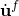 is the fluid particle velocity;  is the fluid particle acceleration;  is the density of the fluid;  is the "volumetric drag" (force per unit volume per velocity); and  are *i* independent field variables such as temperature, humidity of air, or salinity of water on which  and  may depend (see "Acoustic medium,"  Section 26.3.1 of the Abaqus Analysis User's Guide). The d'Alembert term has been written without convection on the assumption that there is no steady flow of the fluid. This is usually considered sufficiently accurate for steady fluid velocities up to Mach 0.1.

The constitutive behavior of the fluid is assumed to be inviscid, linear, and compressible, so

where  is the bulk modulus of the fluid.

For an acoustic medium capable of undergoing cavitation, the absolute pressure (sum of the static pressure and the excess dynamic pressure) cannot drop below the specified cavitation limit. When the absolute pressure drops to this limit value, the fluid is assumed to undergo free expansion without a corresponding drop in the dynamic pressure. The pressure would rebuild in the acoustic medium once the free expansion that took place during the cavitation is reversed sufficiently to reduce the volumetric strain to the level at the cavitation limit. The constitutive behavior for an acoustic medium capable of undergoing cavitation can be stated as

where a pseudopressure 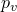, a measure of the volumetric strain, is defined as

where  is the fluid cavitation limit and   is the initial acoustic static pressure. A total wave formulation is used for a nonlinear acoustic medium undergoing cavitation. This formulation is very similar to the scattered wave formulation presented below except that the pseudopressure, defined as the product of the bulk modulus and the compressive volumetric strain, plays the role of the material state variable instead of the acoustic excess pressure. The acoustic excess pressure is readily available from this pseudopressure subject to the cavitation condition.
### Physical boundary conditions in acoustic analysis

Acoustic fields are strongly dependent on the conditions at the boundary of the acoustic medium. The boundary of a region of acoustic medium that obeys [Equation 2.9.1&#8211;1](02s09a41-Coupled-acoustic-structural-medium-analy.md) and [Equation 2.9.1&#8211;2](02s09a41-Coupled-acoustic-structural-medium-analy.md) can be divided into subregions *S* on which the following conditions are imposed:| , | where the value of the acoustic pressure p is prescribed. |
| --- | --- |
| , | where we prescribe the normal derivative of the acoustic medium. This condition also prescribes the motion of the fluid particles and can be used to model acoustic sources, rigid walls (baffles), incident wave fields, and symmetry planes. |
| , | the "reactive" acoustic boundary, where there is a prescribed linear relationship between the fluid acoustic pressure and its normal derivative. Quite a few physical effects can be modeled in this manner: in particular, the effect of thin layers of material, whose own motions are unimportant, placed between acoustic media and rigid baffles. An example is the carpet glued to the floor of a room or car interior that absorbs and reflects acoustic waves. This thin layer of material provides a "reactive surface," or impedance boundary condition, to the acoustic medium. This type of boundary condition is also referred to as an imposed impedance, admittance, or a "Dirichlet to Neumann map." |
| , | the "radiating" acoustic boundary. Often, acoustic media extend sufficiently far from the region of interest that they can be modeled as infinite in extent. In such cases it is convenient to truncate the computational region and apply a boundary condition to simulate waves passing exclusively outward from the computational region. |
| , | where the motion of an acoustic medium is directly coupled to the motion of a solid. On such an acoustic-structural boundary the acoustic and structural media have the same displacement normal to the boundary, but the tangential motions are uncoupled. |
| , | an acoustic-structural boundary, where the displacements are linearly coupled but not necessarily identically equal due to the presence of a compliant or reactive intervening layer. This layer induces an impedance condition between the relative normal velocity between acoustic fluid and solid structure and the acoustic pressure. It is analogous to a spring and dashpot interposed between the fluid and solid particles. As implemented in Abaqus, an impedance boundary condition surface does not model any mass associated with the reactive lining; if such a mass exists, it should be incorporated into the boundary of the structure. |
| , | a boundary between acoustic fluids of possibly differing material properties. On such an interface, displacement continuity requires that the normal forces per unit mass on the fluid particles be equal. This quantity is the natural boundary traction in Abaqus, so this condition is enforced automatically during element assembly. This is also true in one-dimensional analysis (i.e., piping or ducts), where the relevant acoustic properties include the cross-sectional areas of the elements. Consequently, fluid-fluid boundaries do not require special treatment in Abaqus. |
### Formulation for direct integration transient dynamics

In Abaqus the finite element formulations are slightly different in direct integration transient and steady-state or modal analyses, primarily with regard to the treatment of the volumetric drag loss parameter and spatial variations of the constitutive parameters. To derive a symmetric system of ordinary differential equations for implicit integration, some approximations are made in the transient case that are not needed in steady state. For linear transient dynamic analysis, the modal procedure can be used and is much more efficient.

To derive the partial differential equation used in direct integration transient analysis, we divide [Equation 2.9.1&#8211;1](02s09a41-Coupled-acoustic-structural-medium-analy.md) by , take its gradient with respect to , neglect the gradient of 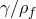, and combine the result with the time derivatives of [Equation 2.9.1&#8211;2](02s09a41-Coupled-acoustic-structural-medium-analy.md) to obtain the equation of motion for the fluid in terms of the fluid pressure:

The assumption that the gradient of  is small is violated where there are discontinuities in the quantity  (for example, on the boundary between two elements that have a different  value).Variational statement

An equivalent weak form for the equation of motion, [Equation 2.9.1&#8211;3](02s09a41-Coupled-acoustic-structural-medium-analy.md), is obtained by introducing an arbitrary variational field, , and integrating over the fluid:

Green's theorem allows this to be rewritten as

Assuming that *p* is prescribed on 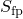, the equilibrium equation, [Equation 2.9.1&#8211;1](02s09a41-Coupled-acoustic-structural-medium-analy.md), is used on the remainder of the boundary to relate the pressure gradient to the motion of the boundary:

Using this equation, the term 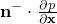 is eliminated from [Equation 2.9.1&#8211;4](02s09a41-Coupled-acoustic-structural-medium-analy.md) to produce

where, for convenience, the boundary "traction" term

has been introduced.

Except for the imposed pressure on , all the other boundary conditions described above can be formulated in terms of 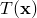. This term has dimensions of acceleration; in the absence of volumetric drag this boundary traction is equal to the inward acceleration of the particles of the acoustic medium:

When volumetric drag is present, the boundary traction is the normal derivative of the pressure field, divided by the true mass density: a force per unit mass of fluid. Consequently, when volumetric drag exists in a transient acoustic model, a unit of  yields a lower local volumetric acceleration, due to drag losses.

In direct integration transient dynamics we enforce the acoustic boundary conditions as follows:| On , | p is prescribed and . |
| --- | --- |
| On , | where we prescribe the normal derivative of the acoustic pressure per unit density: In the absence of volumetric drag in the medium, this enforces a value of fluid particle acceleration, . An imposed  can be used to model the oscillations of a rigid plate or body exciting a fluid, for example. A special case of this boundary condition is , which represents a rigid immobile boundary. As mentioned above, if the medium has nonzero volumetric drag, a unit of imposed at the boundary will result in a relatively lower imposed particle acceleration. Incident wave fields on a boundary of a fluid are modeled with a  that varies in space and time, corresponding to the effect of the arrival of the wave on the boundary. See "Loading due to an incident dilatational wave field,"  Section 6.3.1. |
| On , | the reactive boundary between the acoustic medium and a rigid baffle, we apply a condition that relates the velocity of the acoustic medium to the pressure and rate of change of pressure:where  and  are user-prescribed parameters at the boundary. This equation is in the form of an admittance relation; the impedance expression is simply the inverse. The layer of material, in admittance form, acts as a spring and dashpot in series distributed between the acoustic medium and the rigid wall. The spring and dashpot parameters are  and , respectively; they are per unit area of the acoustic boundary. Using this definition for the fluid velocity, the boundary tractions in the variational statement become |
| On , | the radiating boundary, we apply the radiation boundary condition by specifying the corresponding impedance:using the admittance parameters of Equation 2.9.1&#8211;47 and Equation 2.9.1&#8211;48, defined below. |
| On , | the acoustic-structural interface, we apply the acoustic-structural interface condition by equating displacement of the fluid and solid, which enforces the condition where  is the displacement of the structure. In the presence of volumetric drag it follows that the acoustic boundary traction coupling fluid to solid is In Abaqus/Standard the formulation of the transient coupled problem would be made nonsymmetric by the presence of the term . In the great majority of practical applications the acoustic tractions associated with volumetric drag are small compared to those associated with fluid inertia, so this term is ignored in transient analysis: |
| On , | the mixed impedance boundary and acoustic-structural boundary, we apply a condition that relates the relative outward velocity between the acoustic medium and the structure to the pressure and rate of change of pressure: This relative normal velocity represents a rate of compression (or extension) of the intervening layer. Applying this equation to the definition of , we obtain for the transient case This expression for  is the sum of its definitions for  and . In the steady-state case the effect of volumetric drag on the structural displacement term in the acoustic traction is included: |

These definitions for the boundary term, , are introduced into [Equation 2.9.1&#8211;6](02s09a41-Coupled-acoustic-structural-medium-analy.md) to give the final variational statement for the acoustic medium (this is the equivalent of the virtual work statement for the structure):

The structural behavior is defined by the virtual work equation,

where  is the stress at a point in the structure, *p* is the pressure acting on the fluid-structural interface,  is the outward normal to the structure,  is the density of the material, 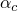 is the mass proportional damping factor (part of the Rayleigh damping assumption for the structure),  is the acceleration of a point in the structure,  is the surface traction applied to the structure, 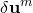 is a variational displacement field, and  is the strain variation that is compatible with . For simplicity in this equation all other loading terms except the fluid pressure and surface traction  have been neglected: they are imposed in the usual way.The discretized finite element equations

[Equation 2.9.1&#8211;14](02s09a41-Coupled-acoustic-structural-medium-analy.md) and [Equation 2.9.1&#8211;15](02s09a41-Coupled-acoustic-structural-medium-analy.md) define the variational problem for the coupled fields 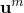 and *p*. The problem is discretized by introducing interpolation functions: in the fluid 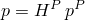, 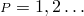 up to the number of pressure nodes and in the structure 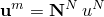, 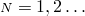 up to the number of displacement degrees of freedom. In these and the following equations we assume summation over the superscripts that refer to the degrees of freedom of the discretized model. We also use the superscripts 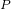, 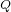 to refer to pressure degrees of freedom in the fluid and 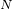, 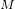 to refer to displacement degrees of freedom in the structure. We use a Galerkin method for the structural system; the variational field has the same form as the displacement: 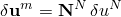. For the fluid we use 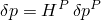 but with the subsequent Petrov-Galerkin substitution

 The new function 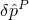 makes the single variational equation obtained from summing [Equation 2.9.1&#8211;14](02s09a41-Coupled-acoustic-structural-medium-analy.md) and [Equation 2.9.1&#8211;15](02s09a41-Coupled-acoustic-structural-medium-analy.md) dimensionally consistent:

where, for simplicity, we have introduced the following definitions:

where 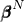 is the strain interpolator. This equation defines the discretized model. We see that the volumetric drag-related terms are "mass-like"; i.e., proportional to the fluid element mass matrix.

The term 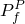 is the nodal right-hand-side term for the acoustical degree of freedom , or the applied "force" on this degree of freedom. This term is obtained by integration of the normal derivative of pressure per unit density of the acoustic medium over the surface area tributary to a boundary node.

In the case of coupled systems where the forces on the structure due to the fluid---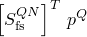 are very small compared to the rest of the structural forces---the system can be solved in a "sequentially coupled" manner. The structural equations can be solved with the  term omitted; i.e., in an analysis without fluid coupling. Subsequently, the fluid equations can be solved, with 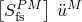 imposed as a boundary condition. This two-step analysis is less expensive and advantageous for systems such as metal structures in air.Time integration

The equations are integrated through time using the standard implicit (Abaqus/Standard) and explicit (Abaqus/Explicit) dynamic integration options. From the implicit integration operator we obtain relations between the variations of the solution variables (here represented by 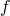) and their time derivatives:

The equations of evolution of the degrees of freedom can be written for the implicit case as

The linearization of this equation is

where 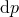 and 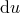 are the corrections to the solution obtained from the Newton iteration,  is the structural stiffness matrix, and 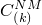 is the structural damping matrix. These equations are symmetric if the constituent stiffness, damping, and mass matrices are symmetric.

For explicit integration the fluid mass matrix is diagonalized in a manner similar to the treatment of structural mass. The explicit central difference procedure described in "Explicit dynamic analysis,"  Section 2.4.5, is applied to the coupled system of equations.Summary of additional approximations of the direct integration transient formulation

As mentioned above, derivation of symmetric ordinary differential equations in the presence of volumetric drag requires some approximations in addition to those inherent in any finite element method. First, the spatial gradients of the ratio of volumetric drag to mass density in the fluid are neglected. This may be important in lossy, inhomogeneous acoustic media. Second, to maintain symmetry, the effect of volumetric drag on the fluid-solid boundary terms is neglected. Finally, the effect of volumetric drag on the radiation boundary conditions is approximate. If any of these effects is expected to be significant in an analysis, the user should realize that the results obtained are approximate.
### Formulation for steady-state response using nodal degrees of freedom

The direct-solution steady-state dynamic analysis procedure is to be preferred over the transient formulation if volumetric drag is significant. This formulation uses the nodal degrees of freedom in the solid and acoustic regions directly to form a large linear system of equations defining the coupled structural-acoustic mechanics at a single frequency. If volumetric drag effects are not significant, the mode-based procedures (see below) are preferred because of their efficiency.

All model degrees of freedom and loads are assumed to be varying harmonically at an angular frequency , so we can write

where 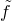 is the constant complex amplitude of the variable . Thus,

We begin with the equilibrium equation

and use the harmonic time-derivative relations to obtain

We define the complex density, , as

and, thus, write

The equilibrium equation is now in a form where the density is complex and the acoustic medium velocity does not enter. We divide this equation by 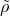 and combine it with the second time derivative of the constitutive law, [Equation 2.9.1&#8211;2](02s09a41-Coupled-acoustic-structural-medium-analy.md), to obtain

We have not used the assumption that the spatial gradient of 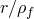 is small, as was done in the transient dynamics formulation.Variational statement

The development of the variational statement parallels that for the case of transient dynamics, as though the volumetric drag were absent and the density complex. The variational statement is

Integrating by parts, we have

In steady state the boundary traction is defined as

This expression is not the Fourier transform of the boundary traction defined above for the transient case. The steady-state definition is based on the complex density and includes the volumetric drag effect in such a way that it is always equal to the acceleration of the fluid particles. The application of boundary conditions may be slightly different for some cases in steady state due to this definition of the traction. | On , | is prescribed, analogous to transient analysis. |
| --- | --- |
| On , | we prescribe The condition  is enforced, even in the presence of volumetric drag. |
| On , | the reactive boundary between the acoustic medium and a rigid baffle, we apply |
| On , | the radiating boundary, we apply the radiation boundary condition impedance in the same form as for the reactive boundary but with the parameters as defined in Equation 2.9.1&#8211;42 and Equation 2.9.1&#8211;43. |
| On , | the acoustic-structural interface, we equate the displacement of the fluid and solid as in the transient case. However, the acoustic boundary traction coupling fluid to solid,can be applied without affecting the symmetry of the overall formulation. Consequently, the acoustic tractions in the steady-state case make no assumptions about volumetric drag. |
| On , | the mixed impedance boundary and acoustic-structural boundary, the condition results in the definitionIn this case the effect of volumetric drag is included without approximation. |The final variational statement becomes

This equation is formally identical to [Equation 2.9.1&#8211;4](02s09a41-Coupled-acoustic-structural-medium-analy.md), except for the pressure "stiffness" term, the radiation boundary conditions, and the imposed boundary traction term. Because the volumetric drag effect is contained in the complex density, the acoustic-structural boundary term in this formulation does not have the limitation that the volumetric drag must be small compared to other effects in the acoustic medium. In addition, in this formulation the applied flux on an acoustic boundary represents the inward acceleration of the acoustic medium, whether or not the volumetric drag is large. Finally, the radiation boundary conditions do not make any approximations with regard to the volumetric drag parameter.

The above equation uses the complex density, 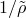. We manipulate it into a form that has real coefficients and an additional time derivative through the relations

to obtain

The discretized finite element equations

Applying Galerkin's principle, the finite element equations are derived as before. We arrive again at [Equation 2.9.1&#8211;17](02s09a41-Coupled-acoustic-structural-medium-analy.md) with the same matrices except for the damping and stiffness matrices of the acoustic elements and the surfaces that have imposed impedance conditions, which now appear as

The matrix modeling loss to volumetric drag is proportional to the fluid stiffness matrix in this formulation.

For steady-state harmonic response we assume that the structure undergoes small harmonic vibrations, identified by the prefix 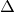, about a deformed, stressed base state, which is identified by the subscript 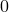. Hence, the total stress can be written in the form

where 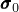 is the stress in the base state;  is the elasticity matrix for the material;  is the stiffness proportional damping factor chosen for the material (to give the stiffness proportional contribution to the Rayleigh damping, thus introducing the viscous part of the material behavior); and, from the discretization assumption,

To solve the steady-state problem, we assume that the governing equations are satisfied in the base state, and we linearize these equations in terms of the harmonic oscillations. For the internal force vector this yields

and [Equation 2.9.1&#8211;17](02s09a41-Coupled-acoustic-structural-medium-analy.md) can be rewritten, using the time-harmonic relations, as

with

(this stiffness includes the initial stress matrix, so "stress stiffening" and "load stiffness" effects associated with the base state stress and loads are included) and

 We have also added the "global" parts of the "structural damping" terms

 and

 to the equation. These damping terms model finite energy loss in the low-frequency limit in steady-state dynamics---see "Direct steady-state dynamic analysis,"  Section 2.6.1, and "Subspace-based steady-state dynamic analysis,"  Section 2.6.2. It should be noted that the acoustic "structural damping" operator inherits the frequency dependence of the acoustic stiffness matrix caused by volumetric drag.

We assume that the loads and (because of linearity) the response are harmonic; hence, we can write

and

where 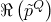, 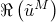, 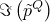, and 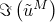 are the real and imaginary parts of the amplitudes of the response; 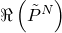 and 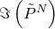 are the real and imaginary parts of the amplitude of the force applied to the structure; 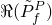 and 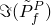 are the real and imaginary parts of the amplitude of the acoustic traction (dimensions of volumetric acceleration) applied to the fluid; and  is the circular frequency. We substitute these equations into [Equation 2.9.1&#8211;23](02s09a41-Coupled-acoustic-structural-medium-analy.md) and use the time-harmonic form of [Equation 2.9.1&#8211;16](02s09a41-Coupled-acoustic-structural-medium-analy.md), 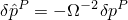, which yields the coupled complex linear equation system

where

and

If  is symmetric, [Equation 2.9.1&#8211;24](02s09a41-Coupled-acoustic-structural-medium-analy.md) is symmetric. The system may be quite large, because the real and imaginary parts of the structural degrees of freedom and of the pressure in the fluid all appear in the system. This set of equations is solved for each frequency requested in the direct-solution steady-state dynamics procedure. If damping is absent, the user can specify that only the real matrix equation should be factored in the analysis. Nonzero volumetric drag values () for the acoustic medium and nonzero  values for the impedances represent damping. As mentioned above for the transient case, the coupled system can be split into an uncoupled structural analysis and an acoustic analysis driven by the structural response, provided the fluid forces on the structure are small.
### Formulation for eigenvalue extraction and mode-based procedures

From the discretized equation, [Equation 2.9.1&#8211;17](02s09a41-Coupled-acoustic-structural-medium-analy.md), we can write the frequency domain problem as

where  is a natural (as opposed to forced response) frequency. The indices have been suppressed for brevity. This system is due to [Zienkiewicz and Newton (1969)](07s01a01-References.md) and is used in Abaqus as the starting point for mode-based procedures. Suppressing any damping terms, forcing, and any terms associated with a reactive surface,

Interpreted as a linear eigenvalue problem (where 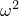 is the eigenvalue), this equation cannot be solved directly in Abaqus due to the unsymmetric stiffness and mass matrices. However, it can be shown that these equations do yield real-valued natural frequencies and modes, suggesting that they can be rewritten in symmetric forms.

Application of the modes of [Equation 2.9.1&#8211;25](02s09a41-Coupled-acoustic-structural-medium-analy.md) to form a reduced system (see below) must be done with some caution, since this unsymmetric system has distinct left and right eigenvector sets. In particular, the "singular modes" associated with zero frequency are of interest because they describe the low-frequency limiting behavior of the system (or the "rigid-body motion" in a kinematic sense) and are, therefore, essential for the construction of an accurate projected frequency domain operator. The right singular modes of the coupled system are

In other words, there is a "structural" singular right mode 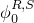 associated with the kernel of  and an "acoustic" singular right mode 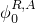 associated with the kernel of 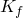. The left singular modes are solutions to

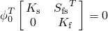and are

The right acoustic and left structural singular modes are coupled, with nontrivial fields on the structural and acoustic domains. These coupled singular modes are a consequence of the stiffness term in [Equation 2.9.1&#8211;25](02s09a41-Coupled-acoustic-structural-medium-analy.md), and they must be computed if this system is to be projected.

An alternative frequency domain formulation, due to [Everstine (1981)](07s01a01-References.md), involves the substitution 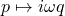 and results in a formally symmetric system:

The corresponding coupled eigenproblem is quadratic, but the singular mode structure of this system is much simpler---the left and right pairs are identical due to symmetry, and the singular modes are uncoupled due to the diagonal structure of the stiffness matrix. The modes are simply

Lanczos formulation

Introducing an auxiliary variable, , augmenting the system of equations with , and manipulating the equations yields

 This augmented system of equations is due to Ohayon and is used only for Lanczos eigenvalue extraction. The auxiliary variable  is internal to Abaqus/Standard and is not available for output. If  is singular, orthogonalization against the singular acoustic modes is done in the Lanczos eigensolver.

The left and right eigenvectors for the original system of equations, [Equation 2.9.1&#8211;25](02s09a41-Coupled-acoustic-structural-medium-analy.md), can be constructed from the Lanczos solution. As mentioned above, the singular modes are essential for construction of an accurate projected operator. It is easy to verify that the Lanczos system has the following structural singular mode:

However, if we seek nontrivial acoustic singular modes (i.e., , such that ), we easily find that  but also that

If a nontrivial  exists,  is singular; therefore, for a solution  to exist, the right-hand-side must be orthogonal to the null space of . But we quickly observe that

Consequently, to find an acoustic singular mode using the Lanczos formulation, we construct a perturbation "force"  such that  The Lanczos formulation will yield the nontrivial singular acoustic mode

The left and right eigenvectors of the original, unsymmetric system [Equation 2.9.1&#8211;25](02s09a41-Coupled-acoustic-structural-medium-analy.md), including the singular modes, can be constructed from the Lanczos solutions :

where

For any nonsingular acoustic mode , , where  is the circular eigenfrequency. The left and right eigenvector subspaces are then used to compute modal quantities (generalized mass, participation factors, and effective mass) and to project the mass, stiffness, and damping matrices in mode-based procedures (such as subspace-based steady-state dynamic analysis or transient modal dynamic analysis) to obtain a reduced system of equations. Most of these computations are conducted in a very similar fashion to the way they are carried out in the pure structural problem and will not be discussed here. In addition, for each mode an acoustic fraction of the generalized mass is computed as the ratio between acoustic contributions to the generalized mass and to the total generalized mass.

The only exception worth a brief discussion is the choice for the calculation of the acoustic participation factors and effective masses, as follows. First, a "rigid body" acoustic mode, , analogous to the rigid body modes for the structural problem outlined in "Variables associated with the natural modes of a model,"  Section 2.5.2, is chosen to be a constant pressure field of unity. A total "acoustic mass" is then defined as . Left and right acoustic participation factors are defined as

and

Abaqus/Standard will then report the acoustic participation factor computed as

 and an acoustic effective mass computed as

The scaling by  in the equation for  is arbitrary. However, this scaling ensures that when all eigenmodes are extracted, the sum of all acoustic effective masses is 1.0 (minus the contributions from nodes constrained in the acoustic degree of freedom).Frequency-domain solution using projections onto modal spaces

Distinct modal space projection methods for coupled forced structural-acoustic response exist in Abaqus for the following cases: using coupled modes from Lanczos, using uncoupled modes from Lanczos, and using uncoupled modes from Abaqus/AMS. In the Lanczos mode cases the forced response is computed using the Zienkiewicz-Newton equation, with separate right and left projection operators. In the Abaqus/AMS uncoupled mode case the Everstine equation is used for the forced response and the right and left projection operators are identical. This case is described in more detail below.Using uncoupled Abaqus/AMS modes

In this case the Everstine equation is used for the coupled forced response problem and modes are computed from decoupled structural and acoustic Abaqus/AMS runs. In nodal degrees of freedom the forced response is governed by

where  and  here are the complete assembled damping matrices for the structure and fluid, including viscous and structural damping, as well as boundary impedance effects. Using transformations constructed from the acoustic and structural modes,

and representations of the structural and acoustic fields in the spaces spanned by these modes,

we obtain

The terms in this matrix correspond to the nodal degree-of-freedom operators, projected onto the modal spaces. The damping and coupling matrices in modal coordinates are full and unsymmetric.
### Volumetric drag and fluid viscosity

The medium supporting acoustic waves may be flowing through a porous matrix, such as fiberglass used for sound deadening. In this case the parameter  is the *flow resistance*, the pressure drop required to force a unit flow through the porous matrix. A propagating plane wave with nominal particle velocity  loses energy at a rate

 Fluids also exhibit momentum losses without a porous matrix resistive medium through coefficients of shear viscosity  and bulk viscosity . These are proportionality constants between components of the stress and spatial derivatives of the shear strain rate and volumetric strain rate, respectively. In fluid mechanics the shear viscosity term  is usually more important than the bulk term ; however, acoustics is the study of volumetrically straining flows, so both constants can be important. The linearized Navier-Stokes equations for adiabatic perturbations about a base state can be expressed in terms of the pressure field alone [(Morse and Ingard, 1968)](07s01a01-References.md):

In steady state this linearized equation can be written in the form of [Equation 2.9.1&#8211;19](02s09a41-Coupled-acoustic-structural-medium-analy.md), with

so that the viscosity effects can be modeled as a volumetric drag parameter with the value

If the combined viscosity effects are small,

 so we can write

In steady-state form

where  is the forcing frequency. This leads to the following analogy between viscous fluid losses and volumetric drag or flow resistance:

 with density constant with respect to frequency. The energy loss rate for a propagating plane wave in this linearized, adiabatic, small-viscosity case is

### Acoustic output quantities

Several secondary quantities are useful in acoustic analysis, derived from the fundamental acoustic pressure field variable. In steady-state dynamics the acoustic particle velocity at any field point is

 The acoustic intensity vector, a measure of the rate of flow of energy at a point, is

In an acoustic medium the stress tensor is simply the acoustic pressure times the identity tensor, , so this expression simplifies to

The "hats" denote complex conjugation. The real part of the intensity is referred to as the "active intensity," and the imaginary part is the "reactive intensity."Acoustic contribution factors

Acoustic contribution factors help the user interpret the behavior of a coupled structural-acoustic system by showing the relationship between the acoustic pressure and either specific structural surfaces or specific structural modes. In the literature they are sometimes referred to as acoustic "participation factors," but since this term is used in Abaqus to describe characteristics of modes (see "Variables associated with the natural modes of a model,"  Section 2.5.2), a different nomenclature is chosen here.

First, consider an acoustic medium in contact with a structure undergoing time-harmonic vibration. The structure exerts a traction on the fluid at each point on the wetted surface, causing harmonic pressure in the acoustic medium. In a given solution to a coupled forced response problem, it is sometimes useful to separate the pressure into constituent parts, each due to the vibration of a portion of the wetted surface. For example, in an automotive acoustic problem it may be useful to determine the parts of the acoustic pressure field due to the windows, floor, and other panels separately. The pressure field  generated by some given structural vibration acting only on structural surface , with all other parts of the wetted surface held fixed, is defined as the acoustic contribution factor of that surface:

where  and  is the coupling matrix associated with surface partition .  can correspond to a group of disjoint surfaces (for example, all the window glass in an automobile) or to a single node. Because the natural boundary condition in Abaqus for acoustic elements is a rigid wall, [Equation 2.9.1&#8211;34](02s09a41-Coupled-acoustic-structural-medium-analy.md) corresponds physically to an acoustic field coupled to the structure only at surface , with all other bounding surfaces rigid.

For example, if a single panel's acoustic contribution is separated from the total acoustic pressure,

the coupled system of equations for the structural acoustic problem can be written

 where . This equation makes it clear that the panel's acoustic contribution factor depends on the solution to the specific coupled harmonic forced response problem. However, it is more efficient to solve for  and  instead and then solve for  using [Equation 2.9.1&#8211;34](02s09a41-Coupled-acoustic-structural-medium-analy.md).

When subspace-based steady-state dynamics or mode-based steady-state dynamics is used,  and  are projected; in turn, these projected matrices depend on whether the preceding eigenanalysis step was coupled or uncoupled. For the uncoupled case separate modal transformations  and  correspond to the acoustic and structural modes, and

The transformed equation defining  becomes

The contribution of a specific mode to the acoustic pressure of a forced harmonic coupled system may be of interest as well. Physically, a modal acoustic contribution factor is the part of the acoustic field in a forced response problem due to the action of one structural (or coupled) mode on the acoustic fluid. The calculation of a modal acoustic contribution factor depends on whether the modes in question are uncoupled or coupled structural-acoustic modes. However, its definition is analogous to the surface or panel acoustic contribution factor: it is the acoustic response due to forcing on the wetted surface due only to a single mode of interest, with all other modes held fixed. Starting from [Equation 2.9.1&#8211;34](02s09a41-Coupled-acoustic-structural-medium-analy.md), but using the entire wetted surface coupling operator ,

where  is the structural response of the coupled problem, restricted to mode . If coupled mode transformations are used, this equation becomes

If there is no acoustic force  in the coupled system of interest and no damping or boundary impedances in the acoustic fluid, this equation is simply the *J*th row of the acoustic part of the projected coupled harmonic forced response problem. Consequently, the modal acoustic contribution  due to mode *J* is simply equal to the *J*th modal coefficient of the solution to the coupled problem, , times the *J*th column of the pressure partition of the modal transformation, . Thus, no additional solution is required to obtain modal acoustic contribution factors when using coupled mode projections if acoustic forcing is absent. If acoustic forcing or damping is present in the coupled response problem defining , [Equation 2.9.1&#8211;37](02s09a41-Coupled-acoustic-structural-medium-analy.md) must be solved after the solution  is obtained.

When uncoupled modes are used in the projection for the solution of a coupled system, there is no direct relationship between acoustic and structural mode shapes. Therefore, application of the uncoupled modal transformations to the harmonic forced response problem does not produce the same trivial result as in the coupled mode case. The system resulting from the application of the separate uncoupled mode transformations  and  to [Equation 2.9.1&#8211;36](02s09a41-Coupled-acoustic-structural-medium-analy.md) must be solved for the modal coefficients  corresponding to forcing via structural mode :

### Impedance and admittance at fluid boundaries

[Equation 2.9.1&#8211;11](02s09a41-Coupled-acoustic-structural-medium-analy.md) (or alternatively [Equation 2.9.1&#8211;9](02s09a41-Coupled-acoustic-structural-medium-analy.md)) can be written in a complex admittance form for steady-state analysis:

where we define

The term  is the complex admittance of the boundary, and  is the corresponding complex impedance. Thus, a required complex impedance or admittance value can be entered for a given frequency by fitting data to the parameters  and  using [Equation 2.9.1&#8211;39](02s09a41-Coupled-acoustic-structural-medium-analy.md).

For absorption of plane waves in an infinite medium with volumetric drag, the complex impedance can be shown to be

For the impedance-based nonreflective boundary condition in Abaqus/Standard, the equations above are used to determine the required constants  and . They are a function of frequency if the volumetric drag is nonzero. The small-drag versions of these equations are used in the direct time integration procedures, as in [Equation 2.9.1&#8211;46](02s09a41-Coupled-acoustic-structural-medium-analy.md).
### Radiation boundary conditions

Many acoustic studies involve a vibrating structure in an infinite domain. In these cases we model a layer of the acoustic medium using finite elements, to a thickness of  to a full wavelength, out to a "radiating" boundary surface. We then impose a condition on this surface to allow the acoustic waves to pass through and not reflect back into the computational domain. For radiation boundaries of simple shapes---such as planes, spheres, and the like---simple impedance boundary conditions can represent good approximations to the exact radiation conditions. In particular, we include local algebraic radiation conditions of the form

 where  is the wave number and  is the complex density (see [Equation 2.9.1&#8211;18](02s09a41-Coupled-acoustic-structural-medium-analy.md)). *f* is a geometric factor related to the metric factors of the curvilinear coordinate system used on the boundary, and  is a spreading loss term (see [Table 2.9.1&#8211;1](02s09a41-Coupled-acoustic-structural-medium-analy.md)).

Table 2.9.1&#8211;1 Boundary condition parameters.| Geometry | f |  |
| --- | --- | --- |
| Plane | 1 | 0 |
| Circle or circular cylinder | 1 |  |
| Ellipse or elliptical cylinder |  |  |
| Sphere | 1 |  |
| Prolate spheroid |  |  |Comparison of [Equation 2.9.1&#8211;41](02s09a41-Coupled-acoustic-structural-medium-analy.md) and [Equation 2.9.1&#8211;9](02s09a41-Coupled-acoustic-structural-medium-analy.md) reveals that, for steady-state analysis, there exists a direct analogy to the reactive boundary equation, [Equation 2.9.1&#8211;21](02s09a41-Coupled-acoustic-structural-medium-analy.md), with

 and

For transient procedures the treatment of volumetric drag in the acoustic equations and the radiation conditions necessitates an approximation. In the acoustics equation we use the boundary term

Combining [Equation 2.9.1&#8211;41](02s09a41-Coupled-acoustic-structural-medium-analy.md) with [Equation 2.9.1&#8211;44](02s09a41-Coupled-acoustic-structural-medium-analy.md), expanding about , and retaining only first-order terms leads to

The Fourier inverse of the steady-state form results in the transient boundary condition

This expression involves independent coefficients for pressure and its first derivative in time, unlike the transient reactive boundary expression ([Equation 2.9.1&#8211;10](02s09a41-Coupled-acoustic-structural-medium-analy.md)), which includes independent coefficients for the first and second derivatives of pressure only. Consequently, to implement this expression, we define the admittance parameters

 and

so the boundary traction for the transient radiation boundary condition can be written

The values of the parameters *f* and  vary with the geometry of the boundary of the radiating surface of the acoustic medium. The geometries supported in Abaqus are summarized in [Table 2.9.1&#8211;1](02s09a41-Coupled-acoustic-structural-medium-analy.md). In the table  refers to the eccentricity of the ellipse or spheroid;  refers to the radius of the circle, sphere, or the semimajor axis of the ellipse or spheroid;  is the vector locating the integration point on the ellipse or spheroid;  is the vector locating the center of the ellipse or spheroid; and  is the vector that orients the major axis.

These algebraic boundary conditions are approximations to the exact impedance of a boundary radiating into an infinite exterior. The plane wave condition is the exact impedance for plane waves normally incident to a planar boundary. The spherical condition exactly annihilates the first Legendre mode of a radiating spherical surface; the circular condition is asymptotically correct for the first mode [(Bayliss et al., 1982)](07s01a01-References.md). The elliptical and prolate spheroidal conditions are based on expansions of elliptical and prolate spheroidal wave functions in the low-eccentricity limit [(Grote and Keller, 1995)](07s01a01-References.md); the prolate spheroidal condition exactly annihilates the first term of its expansion, while the elliptical condition is asymptotic.
### An improvement on radiation boundary conditions for plane waves

As already pointed out, the radiation boundary conditions derived in the previous section for plane waves are actually based on the presumption that the sound wave impinges on the boundary from an orthogonal direction. But this is not always the case. [Figure 2.9.1&#8211;1](02s09a41-Coupled-acoustic-structural-medium-analy.md) shows a general example for plane waves in which the sound wave direction differs from the boundary normal by an angle of .

Figure 2.9.1&#8211;1 A plane wave not normally incident to the boundary.

To consider this situation accurately, we adopt the plane-wave radiation equation used in [Sandler (1998)](07s01a01-References.md); i.e.,

where  is the sound speed with  and  is the corresponding speed normal to the boundary. This exact description of the geometry is the starting point for many developments of approximate absorbing boundary conditions (see, for example, [Engquist and Majda, 1977)](07s01a01-References.md). Thus, we have

Using the first-order expanding approximation to the second term in the square root in the above equation (similar to what we did to reach [Equation 2.9.1&#8211;45](02s09a41-Coupled-acoustic-structural-medium-analy.md)), we can obtain an improved radiation boundary condition

It can be found from comparison that this equation differs from [Equation 2.9.1&#8211;46](02s09a41-Coupled-acoustic-structural-medium-analy.md) only by a factor of  for plane waves. In two dimensions the  can be calculated as

The normal and tangential derivatives  and  at the integration points can be evaluated using the corresponding element along the radiation boundary surface (see [Figure 2.9.1&#8211;2](02s09a41-Coupled-acoustic-structural-medium-analy.md)); i.e.,

where  are the nodal pressure values of the element.

Figure 2.9.1&#8211;2 An element along the boundary.

The method described in this section can be used only for direct integration transient dynamics; it cannot be used with steady-state or modal response. In addition, it is available for planar, axisymmetric, and three-dimensional geometries.

Finally, the method makes the equilibrium equations nonlinear, as shown in [Equation 2.9.1&#8211;52](02s09a41-Coupled-acoustic-structural-medium-analy.md). Although in theory the iteration process in Abaqus/Standard can solve the nonlinear equilibrium equations accurately, the use of a small half-increment residual tolerance is strongly suggested since in many cases the pressure and its related residual along the radiation boundaries are very weak relative to the other places in the modeled domain. The computation of  at the integration point is based on the nodal pressures. The nodal pressures are updated using the explicit central difference procedure described in "Explicit dynamic analysis,"  Section 2.4.5.
### References

### References

"Acoustic, shock, and coupled acoustic-structural analysis,"  Section 6.10.1 of the Abaqus Analysis User's Guide

"Acoustic medium,"  Section 26.3.1 of the Abaqus Analysis User's Guide

"Acoustic and shock loads,"  Section 34.4.6 of the Abaqus Analysis User's Guide