# 2.11.2 Shell heat conduction

### 2.11.2 Shell heat conduction

**Product: **Abaqus/Standard

This section describes the formulation used in the shell heat conduction elements in Abaqus/Standard. The basis of the elements is a combination of piecewise quadratic interpolation of temperature through the thickness of the shell and either linear interpolation (in elements DS3 and DS4) or quadratic interpolation (in elements DS6 and DS8) on the reference surface of the shell. The isoparametric interpolation functions for the shell reference surface are identical in form to those used for the solid quadrilateral and triangular elements and can be found in "Solid isoparametric quadrilaterals and hexahedra,"  Section 3.2.4, and "Triangular, tetrahedral, and wedge elements,"  Section 3.2.6, respectively. Nodal temperature values are stored at a set of points through the thickness (points *P* below) at each node of the element (nodes *N* below). For the purpose of numerical integration of the finite element equations, a 2  2 Gauss integration scheme with a 2  2 nodal integration scheme for the internal energy and specific heat term is used for the quadrilateral element DS4 and a 3  3 Gauss integration scheme is used for the quadrilateral element DS8. Three- and six-point integration schemes are used for the triangular elements DS3 and DS6, respectively, the details of which can be found in "Triangular, tetrahedral, and wedge elements,"  Section 3.2.6.

Let 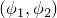 be material coordinates of a point in the reference surface of the shell, and let 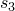 measure position through the thickness of the shell so that 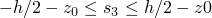, where *h* is the thickness of the shell,  is the offset of the reference surface from the midsurface as discussed in "Transverse shear stiffness in composite shells and offsets from the midsurface,"  Section 3.6.8. The position of any point in the shell is given by

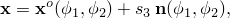where

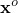

is the position of a point in the reference surface, and

is the unit normal to the reference surface of the shell.The temperature interpolation can be written as

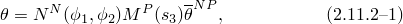where

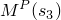

is a piecewise parabolic interpolation,

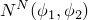

is an interpolator in the reference surface, and

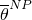

are nodal temperature values (at node *N*, point *P* through the thickness).

The basic heat energy balance is [Equation 2.11.1&#8211;3](02s11a43-Uncoupled-heat-transfer-analysis.md), with the approximate Jacobian matrix for the Newton method based on

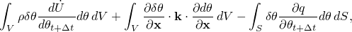where 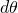 is the correction to the temperature solution at time . The derivation of this form is discussed in "Uncoupled heat transfer analysis,"  Section 2.11.1. The form of these terms for shell heat conduction elements is obtained by introducing the interpolator, [Equation 2.11.2&#8211;1](02s11a44-Shell-heat-conduction.md), and neglecting the change in area, with respect to , of surfaces parallel to the reference surface.

The internal energy rate term (the first term in [Equation 2.11.1&#8211;3](02s11a43-Uncoupled-heat-transfer-analysis.md)) contributes, to the residual,

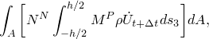and to the Jacobian,

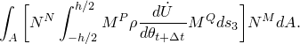

For the second term the temperature derivatives are taken with respect to a local orthogonal system 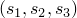, where 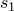 and 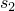 measure distance along local base vectors  and , in the reference surface of the shell, set up according to the standard convention in Abaqus for such local systems in shells. The term is formed by first introducing an intermediate set of temperature values,

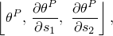corresponding to each temperature value point through the thickness, at each section where integration through the thickness is performed. Since the number of temperature values on the section is the same as the number of integration points, 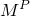 is unity in the appropriate locations and zero everywhere else. Then we can interpolate to the section by

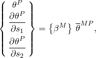where

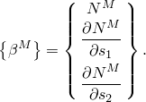The piecewise quadratic interpolation through the thickness then gives

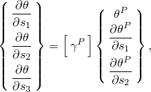where

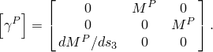The conductivity term in the Jacobian then is

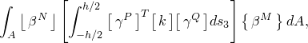where 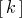 is the local conductivity matrix and the same term multiplied by 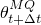 appears in the residual.

Finally, the external flux terms contribute

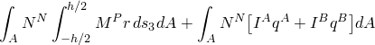to the residual and

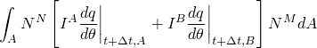to the Jacobian, where

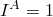

at point *A* through the thickness

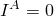

at all other points through the thickness,and points *A* and *B* are on the top and bottom surfaces of the shell.
### Reference

### Reference

"Three-dimensional conventional shell element library,"  Section 29.6.7 of the Abaqus Analysis User's Guide