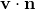
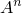
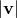
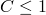

# 2.11.3 Convection/diffusion

### 2.11.3 Convection/diffusion

**Product: **Abaqus/Standard

The formulation in this section describes a capability for modeling heat transfer with convection in Abaqus/Standard. The resulting elements can be used in any general heat transfer mesh. These elements have a nonsymmetric Jacobian matrix: the nonsymmetric capability is invoked automatically if elements of this type are included in the model. Both steady-state and transient capabilities are provided. The transient capability introduces a limit on the time increment (the limit is defined below): the time increment is adjusted to satisfy this limit if necessary. The steady-state versions of the elements can be used in a transient analysis, which means that transient effects in the fluid are not included in the model. The formulation is based on the work of Yu and Heinrich ([1986](07s01a01-References.md), [1987](07s01a01-References.md)).
### Thermal equilibrium equation

The thermal equilibrium equation for a continuum in which a fluid is flowing with velocity , is

where  is the temperature at a point,  is an arbitrary variational field,  is the fluid density,  is the specific heat of the fluid,  is the conductivity of the fluid, *q* is the heat added per unit volume from external sources,  is the heat flowing into the volume across the surface on which temperature is not prescribed (),  is the outward normal to the surface,  is spatial position, and *t* is time. Although most fluids will have isotropic conductivity, so that  (where  is a scalar and  is a unit matrix), we provide for anisotropic conductivity to cover such cases as that of fluid flowing through a set of baffle plates whose conductivity is smeared into that of the fluid.

The boundary conditions are that  is prescribed over some part of the surface, , and that the heat flux per unit area entering the domain across the rest of the surface, , is prescribed or is defined by convection and/or radiation conditions. For example, the boundary layer between fluid convection elements and solid elements might be modeled by DINTER*x*-type elements. The boundary term in the thermal equilibrium equation defines

This implies that  is the flux associated with conduction across the surface only---any convection of energy across the surface is not included in . This makes no difference if the surface is part of a solid body (where  would be defined by heat transfer into the adjacent body), since then the normal velocity into that body, , is zero. But it does make a difference when there is fluid crossing the surface, as---for example---on the upstream and downstream boundaries of the mesh. In this case the choice of  for the natural boundary condition (instead of using the total flux crossing the surface) is desirable because it avoids spurious reflections of energy back into the mesh as the fluid flows through the surface.

These equations are discretized with respect to position by using first-order isoparametric elements. The fluid velocity, , is assumed to be known. (Abaqus actually requires that the mass flow rate of the fluid per unit area be defined, because this is generally more convenient for the user. The velocity is computed from the mass flow rate and the density of the fluid.)

The time discretization generates the solution at time  from the known solution at time *t*.

The interpolation for the temperature, , is defined over an element and over a time increment as

where the  are standard isoparametric functions and the time interpolation, , is linear:

where  is the time increment and .

The Petrov-Galerkin discretization proposed by Yu and Heinrich couples this linear interpolation with the weighting functions

where

 is the average fluid velocity over the element;  is its magnitude; and *h* is a characteristic element length measure, defined below.  and  are control parameters. The  term in the weighting is introduced to eliminate artificial diffusion of the solution, while the  term is introduced to avoid numerical dispersion. Yu and Heinrich show that the optimal choices are

where  is the local Pclet number in an element and *C* is the local Courant number, defined as

The above expression for  yields negative values for very small fluid velocities, which may destabilize the solution; hence, for low velocities dispersion control is switched off.

The characteristic element length measure, *h*, is defined by Yu and Heinrich as follows.

Let  be the  isoparametric line across the element passing through its centroid. The projection of  in the direction of the fluid velocity vector at the element's centroid is

Then we define *h* as

When  is nonzero, these elements require that  for numerical stability.

Since the weighting functions are biased ("upwinding"), they are discontinuous from one element to the next. Some care is, therefore, required in manipulating the weak form of the thermal equilibrium equation (see [Hughes and Brooks, 1982](07s01a01-References.md)). In particular, the usual integration by parts of the conduction term

can be performed only for the continuous part of the weighting functions used to discretize : otherwise, continuity of heat flux between elements is not assured. For convenience we write the discontinuous part of the weighting as

The weak form of thermal equilibrium is

This can be rewritten as

We now integrate this equation from time *t* to  to provide an average equilibrium statement for the increment. We use the results

and

to give

For the steady-state case the third term in this equation is omitted. In both transient and steady-state forms the contribution of such a convective element to the system of equations for the heat transfer model is not symmetric, requiring the use of the nonsymmetric matrix storage and solution scheme.
### Reference

### Reference

"Uncoupled heat transfer analysis,"  Section 6.5.2 of the Abaqus Analysis User's Guide