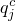
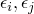
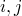
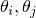
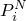
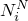
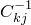
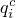

# 2.11.4 Cavity radiation

### 2.11.4 Cavity radiation

**Product: **Abaqus/Standard

The formulation described in this section provides a capability for modeling heat transfer with cavity thermal radiation (in addition to the radiation boundary conditions described in "Uncoupled heat transfer analysis,"  Section 2.11.1). Cavities are defined in Abaqus/Standard as collections of surfaces that are composed of facets. In axisymmetric and two-dimensional cases a facet is a side of an element; in three-dimensional cases a facet can be a face of a solid element or a surface of a shell element. For the purposes of the cavity radiation calculations, each facet is assumed to be isothermal and to have a uniform emissivity.

Based on the cavity definition, cavity radiation elements are created internally by Abaqus. These elements can generate large matrices since they couple the temperature degree of freedom of every node on the cavity surface. Their Jacobian matrix is nonsymmetric: the nonsymmetric solution capability is automatically invoked if cavity radiation calculations are requested in the analysis. Both steady-state and transient capabilities are provided.

The theory on which this cavity radiation formulation is based is well-known and can be found in [Holman (1990)](07s01a01-References.md) and [Siegel and Howell (1980)](07s01a01-References.md). This section describes the formulation of the cavity radiation flux contributions and respective Jacobian for the Newton method used for the solution of the nonlinear radiation problem. The geometrical issues associated with the calculation of radiation view factors necessary in the formulation are addressed in "View factor calculation,"  Section 2.11.5.
### Thermal radiation

Our formulation is based on *gray body* radiation theory, which means that the monochromatic emissivity of the body is independent of the wavelength of propagation of the radiation. Only *diffuse* (nondirectional) reflection is considered. Attenuation of the radiation in the cavity medium is not considered. Using these assumptions together with the assumption of isothermal and isoemissive cavity facets, we can write the equations for radiation fluxes per unit area into cavity facets as

where  is the flux into facet ;  are the emissivities of facets ;  is the Stefan-Boltzmann constant;  is the geometrical view factor matrix;  are the temperatures of facets ;  is the value of absolute zero on the temperature scale being used; and  is the Kronecker delta.

In the special case of *blackbody* radiation, where no reflection takes place (emissivity equal to one), [Equation 2.11.4&#8211;1](02s11a46.md) reduces to

### Spatial interpolation

The variables used to solve the discrete approximation of the heat transfer problem with cavity radiation are the temperatures of the nodes on the cavity surface. Since we assume that for cavity radiation purposes each facet is isothermal, it is necessary to calculate an average facet *temperature radiation power*. We first define temperature radiation power as

where the subscript *i* refers to facet quantities and the superscript *N* refers to nodal quantities.

Then, we interpolate the average facet temperature radiation power from the facet nodal temperatures as

where *N* is the number of nodes forming the facet and  are nodal contribution factors calculated from area integration as

where  is the area and  are the interpolation functions for facet *i*.

The radiation flux into facet *i* can now be written as

and the nodal contributions from the radiation flux on each facet can be written as

The total radiation flux at node *N* is then

### Cavity radiation flux and Jacobian contributions

Abaqus/Standard provides two different schemes for obtaining the cavity radiation flux defined in [Equation 2.11.4&#8211;1](02s11a46.md): a robust, serial method, suitable for small cavities, and a fully parallel method recommended for large cavities.Serial solution of the cavity radiation equations

Thermal radiation problems involving small cavities allow us to solve [Equation 2.11.4&#8211;1](02s11a46.md) for the radiation flux per unit area into a cavity facet as

where

[Equation 2.11.4&#8211;5](02s11a46.md) requires the computation of the inverse , which is why this method is suitable only for small cavities. The radiation flux into facet *i* can then be written as

where

or more compactly as

where

Substituting [Equation 2.11.4&#8211;3](02s11a46.md) and [Equation 2.11.4&#8211;6](02s11a46.md) above into [Equation 2.11.4&#8211;4](02s11a46.md), we can write the nodal contributions from the radiation flux as

where

The radiation flux  is evaluated based on temperatures at the end of the increment, coordinates at the end of the increment, and emissivities at the beginning of the increment. Any time variation of the coordinates during the heat transfer analysis is predefined as translational and/or rotational motion and, therefore, provides no contribution to the Jacobian. Any variation of the emissivities as a function of temperature and predefined field variable changes with time is treated explicitly (values at the beginning of the increment are used) and, therefore, also provides no contribution to the Jacobian. You can specify the maximum allowable emissivity change during an increment of the heat transfer analysis. Thus, the only Jacobian contribution is provided by temperature variations.

The Jacobian contribution arising from the cavity radiation flux is then written trivially as

In all practical cases this Jacobian is unsymmetric. This exact unsymmetric Jacobian is always used when the serial method for cavity radiation analysis is performed.Solution of parallel-decomposed cavities

Abaqus/Standard provides a parallel scheme for the calculation of view factors and the solution of the cavity radiation equations of large cavities. Once parallel decomposition is enabled for a particular cavity, Abaqus/Standard will use an iterative solution technique for obtaining the radiative heat fluxes from [Equation 2.11.4&#8211;1](02s11a46.md). This iterative technique is based on a Krylov method with a preconditioner.

Since we do not obtain the inverse  as in the serial method above, we do not have access to the exact Jacobian in [Equation 2.11.4&#8211;8](02s11a46.md). Instead, we use an approximation to the Jacobian based on small changes to the irradiation (any part not due to emission from the surface). Since the resulting approximation is sparse, iterations during solution of the heat transfer finite element equations are carried out much faster than with the exact expression. However, since the Jacobian is approximate, convergence will not be quadratic in the vicinity of the solution. In fact, Abaqus/Standard may require many more iterations when cavity parallel decomposition is enabled than with the serial method, especially in the case of steady-state analyses and models containing surfaces with low emissivities. In these cases we recommend switching the analysis to transient steps and allowing for more iterations per increment in the solution of the heat transfer finite element equations.
### Reference

### Reference

"Cavity radiation,"  Section 41.1.1 of the Abaqus Analysis User's Guide