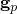
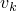

# 2.11.5 View factor calculation

### 2.11.5 View factor calculation

**Product: **Abaqus/Standard

Cavity radiation occurs when surfaces of the model can see each other and, thus, exchange heat with each other by radiation ([Figure 2.11.5&#8211;1](02s11a47-View-factor-calculation.md)). Such exchange depends on view factors that measure the relative interaction between the surfaces composing the cavity. View factor calculation is rather complicated for anything but the most trivial geometries. Abaqus offers an automatic view factor calculation capability for two- and three-dimensional cases as well as for axisymmetric situations. This capability can take into account general surface blocking (or shadowing) as well as the most common forms of radiation symmetry. The view factor calculation can also be automatically repeated a number of times throughout the analysis history (this is user-controlled) if cavity surfaces are moved in space causing the view factors to change.

Figure 2.11.5&#8211;1 Heat exchange between surfaces by radiation.

SIMULIA is pleased to acknowledge that the view factor calculation technology implemented in Abaqus was derived from technology originally developed by the Atomic Energy Authority of the United Kingdom; see, for example, [Johnson (1987)](07s01a01-References.md). The remainder of this section contains a general description of this technology.
### View factor between elementary areas

The dimensionless view factor  between two elementary areas,  and , satisfies the relation

where  is the distance between the two areas and  are the angles between  and the normals to the surfaces of the areas ([Figure 2.11.5&#8211;2](02s11a47-View-factor-calculation.md)). The view factor also satisfies the reciprocity relation

Figure 2.11.5&#8211;2 Schematic of view factor calculation.

 When the areas  and  are small compared with the distance , we can compute view factors in an area-lumped fashion; so the integral [Equation 2.11.5&#8211;1](02s11a47-View-factor-calculation.md) would become

However, this expression is singular in , so it is not well behaved for general surfaces. Thus, we use

The limit of [Equation 2.11.5&#8211;3](02s11a47-View-factor-calculation.md) for large  is [Equation 2.11.5&#8211;2](02s11a47-View-factor-calculation.md).

If the areas  and  are not small compared with the distance , but one of the areas is much larger than the other (say ), we can use the formula

where  is the unit normal to the smaller area . The vector  is normal to the triangle defined by the centroid of  area  and the edge  of area , and  has magnitude equal to the angle opposite to edge . See, for example, [ Hottel and Sarofim (1967)](07s01a01-References.md).

For all other configurations Abaqus uses the method developed by [Mitalas and Stephenson (1966)](07s01a01-References.md), where Stokes theorem is used in [Equation 2.11.5&#8211;1](02s11a47-View-factor-calculation.md) and one of the contour integrals is solved analytically. The remaining contour integral is evaluated numerically,

 where  is the dot product between edge  of area  and edge  of area . The angles , , and  are the angles of the triangle defined by edge  and the integration point . The scalars , , and  are the lengths of the sides opposed to , , and , respectively.  The height of the triangle perpendicular to side  is . The integration point length is  along the edge .
### Discretization

Cavities are composed of surfaces; and surfaces, in turn, are made up of finite element faces. For the purpose of view factor calculations, one can then think of a cavity as a collection of element faces (or facets) corresponding to the finite element discretization around the cavity.In the two- and three-dimensional cases the element faces composing cavities can be treated as elementary areas and, thus, [Equation 2.11.5&#8211;1](02s11a47-View-factor-calculation.md) applies. In axisymmetric cases the element faces represent rings so that the view factors involve two ring surfaces looking at each other. This requires an integration over  where it is important to account for "horizon" effects ([Johnson, 1987](07s01a01-References.md)).

In so far as the view factor calculations are concerned, first- and second-order element faces are treated similarly in the sense that the midside nodes of the faces in the second-order elements are ignored. This means that a pair of four-noded faces looking at each other will produce the same view factor as a pair of eight-noded faces with corner nodes coinciding with the nodes of the four-noded faces.
### Radiation blocking

Radiation within a cavity implies that every surface exchanges heat with every other surface. The problem is made more complex when solid bodies are interposed between radiating surfaces blocking (or shadowing) off some but not all the possible paths along which heat can be radiated from the facets of one surface to the facets of another surface ([Figure 2.11.5&#8211;3](02s11a47-View-factor-calculation.md)).

Figure 2.11.5&#8211;3 Blocking or shadowing example.

It is inconceivable that the user could handle this complexity in all but the simplest situations. Therefore, by default, Abaqus automatically checks if blocking takes place for every possible radiation path in a cavity. This requires that the program check if the ray joining the centers of each pair of facets intersects any other facet. For cavities with a large number of facets this can be very time consuming. For this reason Abaqus allows the user to guide its blocking algorithm by accepting input of which surfaces cause blocking, thus significantly reducing the computational effort required. If a ray between two facets intersects any other facet, then in the two- and three-dimensional cases that ray is eliminated and no radiative heat transfer takes place between the facets. In the axisymmetric case blocking is much more complicated since each element face in the finite element model represents a ring. This is handled automatically and requires that the program calculate which part of the  extent of the ring is blocked.
### Radiation symmetries

Use of symmetry can greatly reduce the size of a problem, but---in the case of cavity radiation---it requires that special facilities for definition and handling of symmetries be available. Abaqus provides capabilities for three different kinds of symmetries: simple reflection symmetry, periodic symmetry, and cyclic symmetry. Reflection symmetry allows one additional image of the model to be created by reflection through a line in two dimensions or reflection through a plane in three dimensions. Periodic symmetry can be used to create multiple images of the model by periodic repetition in two- or three-dimensional space according to a periodic distance vector. Cyclic symmetry creates multiple images of the model by cyclic repetition about a point in two dimensions or by cyclic repetition about an axis in three dimensions. Combinations of the different types of symmetry are supported.

To illustrate the handling of symmetries during view factor calculation, consider the case of a simple reflection symmetry in two-dimensional space ([Figure 2.11.5&#8211;4](02s11a47-View-factor-calculation.md)).

Figure 2.11.5&#8211;4 Reflection symmetry example.

 Radiation between facet *i* (with its centroid at point *A*) and facet *j* (with its centroid at point *B*) has two contributions: one arising from the ray between points *A* and *B* and the other coming from the ray between points *A* and , where  is the mirror image of *B*. The length of ray  is defined directly in the model. The definition of the length of ray  requires that point *C* on the reflection symmetry line be located such that  and  make equal angles to it; ray  then has length . Similar logic can be extended to the three-dimensional case.

In axisymmetric cases symmetry about the axis of symmetry of the model is always implied, and the only other symmetries allowed are simple reflection through a plane normal to the axis of symmetry or periodic repetition in the direction of the axis of symmetry.
### View factor checking

The dimensionless view factor is a purely geometrical quantity, and it has some special properties. One property that allows us to check the accuracy of the calculation is that, for a completely enclosed cavity

This sum is equal to one as a result of the fact that all rays from surface *i* must strike some other surface *j* in an enclosed cavity. For an open cavity this sum is always less than one, indicating radiation to the ambient.

The quantity in [Equation 2.11.5&#8211;6](02s11a47-View-factor-calculation.md) is calculated for every facet of each cavity, and its value is used to provide a check to control the accuracy of the view factor calculation.
### Radiation to ambient

The quantity calculated in [Equation 2.11.5&#8211;6](02s11a47-View-factor-calculation.md) can deviate from unity so long as the cavity is not fully enclosed. The user can define such an open cavity by giving the value of the ambient temperature in the cavity definition. In this case the difference between one and the quantity calculated in [Equation 2.11.5&#8211;6](02s11a47-View-factor-calculation.md) for each facet of the open cavity is considered to be the fraction radiating from that facet to the surrounding medium.
### References

### References

"Thermal contact properties,"  Section 37.2.1 of the Abaqus Analysis User's Guide

"Cavity radiation,"  Section 41.1.1 of the Abaqus Analysis User's Guide