# 2.12.1 Coupled thermal-electrical analysis

### 2.12.1 Coupled thermal-electrical analysis

**Product: **Abaqus/Standard

Joule heating arises when the energy dissipated by an electrical current flowing through a conductor is converted into thermal energy. Abaqus/Standard provides a fully coupled thermal-electrical procedure for analyzing this type of problem. Coupling arises from two sources: the conductivity in the electrical problem is temperature dependent, and the internal heat generated in the thermal problem is a function of electrical current. The thermal part of the problem includes all the heat conduction and heat storage (specific and latent heat) features described in "Uncoupled heat transfer analysis,"  Section 2.11.1. (Forced heat convection caused by fluid flowing through the mesh is not considered.)

The thermal-electrical elements have both temperature and electrical potential as nodal variables.

This section describes the governing equilibrium equations, the constitutive model, boundary conditions, the surface interaction model, finite element discretization, and the components of the Jacobian used.
### Governing equations

The electric field in a conducting material is governed by Maxwell's equation of conservation of charge. Assuming steady-state direct current, the equation reduces to

where *V* is any control volume whose surface is *S*,  is the outward normal to *S*,  is the electrical current density (current per unit area), and 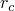 is the internal volumetric current source per unit volume.

The divergence theorem is used to convert the surface integral into a volume integral:

and since the volume is arbitrary, this provides the pointwise differential equation

The equivalent weak form is obtained by introducing an arbitrary, variational, electrical potential field, 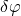, and integrating over the volume:

Using first the chain rule and then the divergence theorem, this statement can be rewritten as

where  is the current density entering the control volume across *S*.
### Constitutive behavior

The flow of electrical current is described by Ohm's law:

where 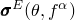 is the electrical conductivity matrix;  is the temperature; and  are any predefined field variables. The conductivity can be isotropic, orthotropic, or fully anisotropic.  is the electrical field intensity defined as

Since a potential rise occurs when a charged particle moves against the electrical field, the direction of the gradient is opposite to that of the electrical field. Using this definition of the electrical field, Ohm's law is rewritten as

The constitutive relation is linear; that is, it assumes that the electrical conductivity is independent of the electrical field.

Introducing Ohm's law, the governing conservation of charge equation becomes

### Thermal energy balance

The heat conduction behavior is described by the basic energy balance relation

where *V* is a volume of solid material, with surface area *S*;  is the density of the material; *U* is the internal energy;  is the thermal conductivity matrix; *q* is the heat flux per unit area of the body, flowing into the body; and *r* is the heat generated within the body. The thermal problem is discussed in detail in "Uncoupled heat transfer analysis,"  Section 2.11.1.

[Equation 2.12.1&#8211;4](02s12a48-Coupled-thermal-electrical-analysis.md) and [Equation 2.12.1&#8211;5](02s12a48-Coupled-thermal-electrical-analysis.md) describe the electrical and thermal problems, respectively. Coupling arises from two sources: the conductivity in the electrical problem is temperature dependent, 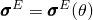, and the internal heat generation in the thermal problem is a function of electrical current, 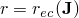, as described below.
### Thermal energy due to electrical current

Joule's law describes the rate of electrical energy, 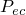, dissipated by current flowing through a conductor as

Using [Equation 2.12.1&#8211;2](02s12a48-Coupled-thermal-electrical-analysis.md) and [Equation 2.12.1&#8211;3](02s12a48-Coupled-thermal-electrical-analysis.md), Joule's law is rewritten as

In a steady-state analysis  is evaluated at time . In a transient analysis an averaged value of  is obtained over the increment

where  and 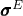 are values at time . The amount of this energy released as internal heat is

where 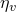 is an energy conversion factor.
### Surface conditions

The surface---*S*---of the body consists of parts on which boundary conditions can be prescribed---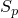---and parts that can interact with nearby surfaces of other bodies---. Prescribed boundary conditions include the electrical potential, 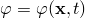; temperature, ; electrical current density, 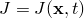; heat flux, ; and surface convection and radiation conditions. The surface interaction model includes heat conduction and radiation effects between the interface surfaces and electrical current flowing across the interface. Heat conduction and radiation are modeled by

and

respectively, where  is the temperature on the surface of the body under consideration,  is the temperature on the surface of the other body, 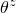 is the value of absolute zero on the temperature scale being used, 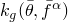 is the gap thermal conductance, 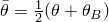 is the average interface temperature, is the average of any predefined field variables at A and B, and *F* and  are constants.

The electrical current flowing between the interface surfaces is modeled as

where 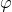 is the electrical potential on the surface of the body under consideration,  is the electrical potential on the surface of the other body, and 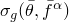 is the gap electrical conductance. The electrical energy dissipated by the current flowing across the interface,

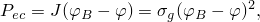 is released as heat on the surfaces of the bodies:

where 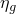 is an energy conversion factor and *f* specifies how the total heat is distributed between the interface surfaces.  is evaluated at the end of the time increment in a steady-state analysis, and an averaged value over the time increment is used in a transient analysis. This is described in detail in "Heat generation caused by electrical current,"  Section 5.2.6.

Introducing the surface interaction effects and electrical energy released as thermal energy, the governing electric and thermal equations become

and

### Spatial discretization

In a finite element model equilibrium is approximated as a finite set of equations by introducing interpolation functions. Discretized quantities are indicated by uppercase superscripts (for example, 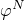). The summation convention is adopted for the superscripts. The discretized quantities represent nodal variables, with nodes shared between adjacent elements and appropriate interpolation chosen to provide adequate continuity of the assumed variation.

The virtual electrical potential field is interpolated by

where 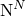 are the interpolation functions. The discretized electrical equation is then written as

Since  is arbitrary,

The temperature field in the thermal problem is approximated by the same set of interpolation functions:

Using these interpolation functions and a backward difference operator to integrate the internal energy rate, 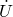, the thermal energy balance relation is obtained:

### Jacobian contributions

The Jacobian contributions are obtained by taking variations of [Equation 2.12.1&#8211;8](02s12a48-Coupled-thermal-electrical-analysis.md) and [Equation 2.12.1&#8211;9](02s12a48-Coupled-thermal-electrical-analysis.md) with respect to the electrical potential, , and the temperature, , at time . This yields

The term 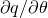 in the 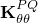 component includes prescribed surface convection and radiation conditions. The surface interaction terms 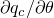, 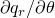, and 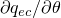 are evaluated in "Heat generation caused by electrical current,"  Section 5.2.6.

The Jacobian contributions give rise to an unsymmetric system of equations, requiring the use of the nonsymmetric matrix storage and solution scheme.
### Reference

### Reference

"Coupled thermal-electrical analysis,"  Section 6.7.3 of the Abaqus Analysis User's Guide