# 2.14.1 Substructuring and substructure analysis

### 2.14.1 Substructuring and substructure analysis

**Product: **Abaqus/Standard

The basic substructuring idea is to consider a "substructure" (a part of the model) separately and eliminate all but the degrees of freedom needed to connect this part to the rest of the model so that the substructure appears in the model as a "substructure": a collection of finite elements whose response is defined by the stiffness (and mass) of these retained degrees of freedom denoted by the vector, 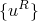.

In Abaqus/Standard the response within a substructure, once it has been reduced to a substructure, is considered to be a linear perturbation about the state of the substructure at the time it is made into a substructure. Thus, the substructure is in equilibrium with stresses , displacements 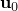, and other state variables  when it is made into a substructure. Then, whenever it responds as a substructure, the total value of a displacement or stress component at some point within the substructure is

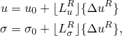where 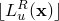 and 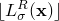 are linear transformations between the retained degrees of freedom of the substructure and the component of displacement or stress under consideration. The substructure must be in a self-equilibriating state when it is made into a substructure (except for reaction forces at prescribed boundary conditions that are applied to internal degrees of freedom in the substructure). If the substructure has been loaded to a nonzero state with some of its retained degrees of freedom fixed, these fixities are released at the time the substructure is created and any reaction forces at them converted into concentrated loads that are part of the preload state. This means that the contribution of the substructure to the overall equilibrium of the model is defined entirely by its linear response. Since the purpose of the substructuring technique is to have the substructure contribute terms only to the retained degrees of freedom, we need to define its external load vector 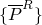, formed from the nonzero substructure load cases applied to the substructure, and its internal force vector, 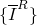, as a sum of linear transformations of the retained variables 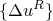 and their velocities and accelerations:

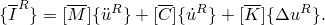We refer to 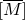 as the reduced mass matrix for the substructure, 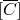 as its reduced damping matrix, and 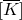 as its reduced stiffness. These "reduced" mass, damping, and stiffness matrices connect the retained degrees of freedom only.

The reduced stiffness matrix is easily derived when only static response is considered. Since the response of a substructure is entirely linear, its contribution to the virtual work equation for the model of which it is a part is

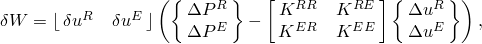where 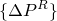 and 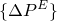 are consistent nodal forces applied to the substructure during its loading as a substructure (they do not include the self-equilibriating preloading of the substructure) and

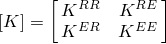is its tangent stiffness matrix.

Since the internal degrees of freedom in the substructure, 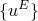, appear only within the substructure, the equilibrium equations conjugate to 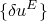 in the contribution to the virtual work equation given above are complete within the substructure, so that

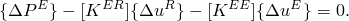These equations can be rewritten to define 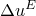 as

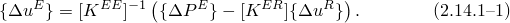The substructure's contribution to the static equilibrium equations is, therefore,

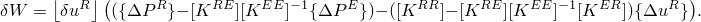Thus, for static analysis the substructure's reduced stiffness is

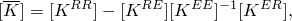and the contribution of the substructure load cases applied to the substructure is the load vector

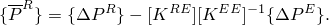

The static modes defined by [Equation 2.14.1&#8211;1](02s14a50-Substructuring-and-substructure-analysis.md) may not be sufficient to define the dynamic response of the substructure accurately. The substructure's dynamic representation may be improved by retaining additional degrees of freedom not required to connect the substructure to the rest of the model; that is, some of the 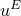 can be moved into 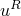. This technique is known as Guyan reduction. An additional, and generally more effective, technique is to augment the response within the substructure by including some generalized degrees of freedom, 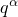, associated with natural modes of the substructure. The simplest such approach is to extract some natural modes from the substructure with all retained degrees of freedom constrained, so that [Equation 2.14.1&#8211;1](02s14a50-Substructuring-and-substructure-analysis.md) is augmented to be

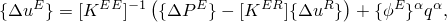with the variation

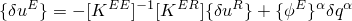and the time derivatives

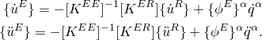The 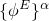 are the eigenmodes of the substructure, obtained with all retained degrees of freedom constrained, and the  are the generalized displacements---the magnitudes of the response in these normal modes.

The contribution of the substructure to the virtual work equation for the dynamic case is

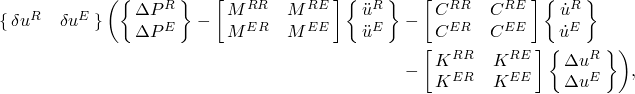where

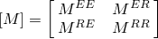is the substructure's mass matrix,

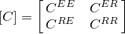is its damping matrix, and

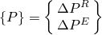is the nodal force vector in the substructure.

With the assumed dynamic response within the substructure, the internal degrees of freedom in this contribution ( and its time derivatives) can be transformed to the retained degrees of freedom and the normal mode amplitudes, reducing the system to

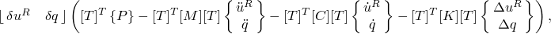where

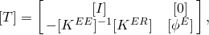in which 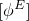 is the matrix of eigenvectors, 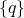 is the vector of generalized degrees of freedom,  is a unit matrix, and 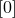 is a null matrix.
### Large-rotation substructures

Large-rotation substructures require first the computation of an equivalent rigid body rotation matrix  associated with the substructure's motion. Since the substructure exhibits only small deformations, one can use the original and current positions of two nodes in two-dimensional analyses or three nodes in three-dimensional analyses to compute two rectangular local systems and then the rotation matrix. For example, in three dimensions Abaqus/Standard computes a reference (average) point using the three nodes in the original configuration. The first unit direction vector, 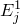, points from this average point to the first node. The third direction, 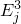, is taken to be the normal to the plane defined by the three nodes and the second direction, 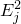, is simply the cross product of the third and first directions. The process is repeated in the current configuration to compute a local system, 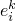. The rotation matrix can then be easily computed as 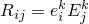.

Abaqus/Standard automatically picks the two or three nodes used for the computation of the rotation matrix  from the substructure's retained nodes. In most cases only retained nodes with at least all translational degrees of freedom retained can be canditates. For example, in three-dimensional analyses the first node used for the equivalent rigid body calculation is chosen to be the node with the highest stiffness (largest diagonal value) in the substructure. The second node is chosen to be the retained node farthest apart from the first node with the provision that its nodal stiffness is high enough (at least 0.01% of the stiffness of the first node). The third node is picked to be the retained node for which the distance to the line defined by the first and second node is maximum (with the same stiffness requirement as for the second node). In the rare case when less than three (in three-dimensional analyses) valid candidate nodes are retained, the  matrix is computed directly from the nodal rotations of the stiffest node with all rotational degrees of freedom retained.

To compute internal forces associated with a substructure in large rotations, Abaqus/Standard computes strain-inducing displacements/rotations by "subtracting" the rigid body motion from the substructure's nodal displacements/rotations. For translational degrees of freedom the strain-inducing displacements  at a node can be computed using

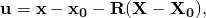where  and  are the original and current positions of the node and  and  are the original and current coordinates of an average point (calculated as outlined above). For rotational degrees of freedom the total rotation matrix at a node (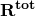) is the compound rotation between the strain-inducing rotation matrix and the rigid body rotation

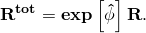The strain-inducing rotations  can then be easily extracted. The internal force in the substructure can thus be written as

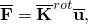where

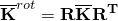is the rigid body rotated stiffness matrix and

is the strain-inducing displacement-rotation vector.

Similarly, in dynamics the reduced mass (including the coupling between nodal displacements/rotations and eigenmode contributions) is rigid body rotated before any mass contributions are included in the virtual work associated with the substructure.
### Fixed direction gravity loading

When gravity loading that acts in a fixed direction is defined, Abaqus/Standard will create internally at the generation level a number of load cases (two in two-dimensional analyses and three in three-dimensional analyses) corresponding to unit gravity loads in the substructure's directions. At the usage level the total rotation matrix of the substructure  (includes both the user-specified rotation/mirroring and the rotation of the substructure in nonlinear geometry analyses) is first used to rotate back the user-specified unit direction  for the gravity load. Thus, the user-specified directions are now expressed in the local (rotating) system associated with the substructure (). The internally generated unit load cases are then scaled by the components of  and by the appropriate magnitude and amplitude and then added to the external force in the model.
### Reference

### Reference

"Substructuring,"  Section 10.1 of the Abaqus Analysis User's Guide