# 2.15.1 Submodeling analysis

### 2.15.1 Submodeling analysis

**Products: **Abaqus/Standard  Abaqus/Explicit

Submodeling is the technique of studying a local part of a model with a refined mesh, based on interpolation of the solution from an initial, global model onto appropriate parts of the boundary of the submodel. The method is most useful when it is necessary to obtain an accurate, detailed solution in the local region and the detailed modeling of that local region has negligible effect on the overall solution. The response at the boundary of the local region is defined by the solution for the global model and it, together with any loads applied to the local region, determines the solution in the submodel. The technique relies on the global model defining this submodel boundary response with sufficient accuracy.

Submodeling can be applied quite generally in Abaqus. With a few restrictions different element types can be used in the submodel compared to those used to model the corresponding region in the global model. Both the global model and the submodel can use solid elements, or they can both use shell elements. A special option is available to use a submodel consisting of solid elements with a global model consisting of shell elements. The material response defined for the submodel may also be different from that defined for the global model. Both the global model and the submodel can have nonlinear response and can be analyzed for any sequence of analysis procedures. The procedures do not have to be the same for both models.

The submodel is run as a separate analysis. The only link between the submodel and the global model is the transfer of the time-dependent values of variables to the relevant driven variables of the submodel. The only information in the global model available to the submodel analysis is the file output data written during the global model analysis. These data contain, by default, the undeformed coordinates of all global model nodes and element information for all elements in the global model (see "Results file output format,"  Section 5.1.2 of the Abaqus Analysis User's Guide). The user must have requested appropriate responses in the area where the submodel boundary is located.

Two forms of the submodeling technique are implemented in Abaqus. The more general node-based submodeling technique transfers node-located solution variables, most commonly displacements, from global model nodes to submodel nodes. A surface-based submodeling technique, which transfers material point stress results from the global model to surface load integration points in the submodel, is also available.
### Node-based submodeling

Node-based submodeling is the most commonly used technique. With this technique global model responses are used to prescribe boundary conditions at the driven nodes in the submodel.Interpolation procedure and tolerance checking

In the solid-to-solid case the positions of the submodel boundary nodes (the driven nodes) are determined with respect to the global model, and the appropriate element interpolation functions are used to obtain the values of the degrees of freedom at the driven nodes. An "exterior tolerance," which the user can specify, is used to check whether it is valid to extrapolate values from the global model. In cases where the submodel boundary nodes fall outside the global model, the extrapolation is valid if the distance between the driven nodes and the free surface of the global model falls within the specified tolerance.

A similar check is done along the global model boundaries for the shell-to-shell submodeling case. We also check whether the driven nodes of the submodel lie sufficiently close to the midsurface of the shell elements in the global model. To simplify the calculations, the closest point in the global model is approximated by measuring the distance in the direction normal to a flat approximation to each shell element in the global model, as shown in [Figure 2.15.1&#8211;1](02s15a51.md).

Figure 2.15.1&#8211;1 Flat surface approximation in shell-to-shell submodeling.

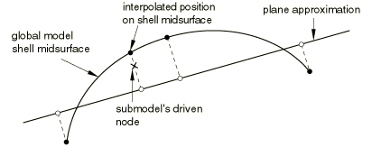For the shell-to-solid case Abaqus uses two kinds of tolerances to determine the relation between the submodel and the global model. First, the closest point on the shell midsurface of the global model is determined. This point will subsequently be referred to as the "image node" of the driven node. The exterior tolerance parameter is used to check if the image node lies within the domain of the global model. Then the distance between the driven node and its image is checked against half of the maximum shell thickness specified by the user (see [Figure 2.15.1&#8211;2](02s15a51.md)).

Figure 2.15.1&#8211;2 Center zone in shell-to-solid submodeling.

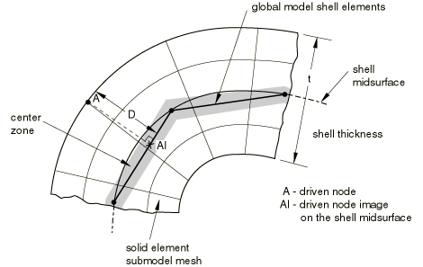

If the node is within the half thickness plus the exterior tolerance, it is accepted. This check is only approximate if the global model has varying shell thickness, and in that case it will not protect the user in parts of the global model that have a small thickness compared to the maximum thickness specified by the user.

After the locations of the driven nodes (or image nodes for the shell-to-solid case) are determined, the prescribed values of the driven variables are interpolated from the values written to the file output for the global model. These must have been written with a sufficiently high frequency to obtain accurate values at the driven nodes. All components of displacements, temperatures, charges, and---for complex steady-state dynamic analysis---the phase angles as well as the amplitudes have to be written for the global model nodes from which the values for the driven nodes will be interpolated. For small global models responses will typically be written for all nodes. For large global models node sets can be created that contain the nodes in the regions around the submodel boundary.

For solid-to-solid and shell-to-shell submodeling, the interpolated values of displacements, rotations, temperatures, etc. are applied directly to the driven nodes. For these nodes the user can specify the individual degrees of freedom that are driven.Driven variables for shell-to-solid submodeling

In the shell-to-solid case the driven degrees of freedom are chosen automatically, depending on the distance between the driven node and the midsurface of the shell. If the node lies within the center zone (specified by the user; see [Figure 2.15.1&#8211;2](02s15a51.md)), all displacement components are driven. If the node lies outside the center zone, only the displacement components parallel to the shell midsurface are driven. By default, the size of the center zone is taken as 10% of the maximum shell thickness. The procedure is described in detail below. The center zone should be large enough so that it contains at least one layer of nodes. If the transverse shear stresses at the submodel boundary are high and the submodel is highly refined in the thickness direction, this can result in high local stresses, since the shear force at the submodel boundary is only transferred at the driven nodes within the center zone. High transverse shear stresses occur only in regions where bending moments vary rapidly, and it is better not to locate the submodel boundary in such regions. It is best to locate the submodel boundary in areas of low transverse shear stress in the global model.

All displacement degrees of freedom are driven when the driven node lies within the center zone. For geometrically linear analysis these prescribed displacements are obtained from the displacements and rotations of the image node as

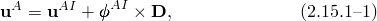where 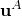 is the prescribed displacement of driven node *A*, 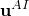 and 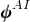 are the interpolated displacement and rotation of the image node, and  is the vector connecting the image node to the driven node:

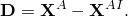

For large-displacement analysis finite rotations must be taken into account. The finite rotation equivalent of [Equation 2.15.1&#8211;1](02s15a51.md) is

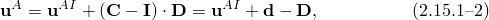where  is the rotation matrix as defined in "Rotation variables,"  Section 1.3.1;  is the identity tensor; and 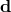 is the rotated vector connecting the image node to the driven node in the current configuration:

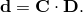

For driven nodes outside the center zone only the displacement components parallel to the shell midsurface are driven. For the geometrically linear case this leads to the constraints

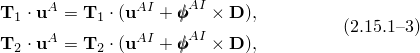where 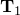 and 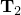 are two (unit) vectors orthogonal to . The equivalent expressions for the geometrically nonlinear case are

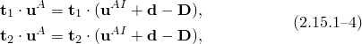where 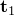 and  are two (unit) vectors orthogonal to .

Since the submodeling capability in Abaqus is quite general and allows the use of different procedure types in both analyses, there are several possibilities for the evaluation of the values at driven nodes as follows. In all cases Abaqus assumes that the global model and the submodel both use small- or large-displacement theory.

In the schemes listed below the first procedure type applies to the global analysis and the second to the submodel analysis.

General procedure to general procedure for small-displacement theory: [Equation 2.15.1&#8211;1](02s15a51.md) is used inside the center zone, and [Equation 2.15.1&#8211;3](02s15a51.md) is used outside the center zone.

General procedure to general procedure for large-displacement theory: [Equation 2.15.1&#8211;2](02s15a51.md) is used inside the center zone, and [Equation 2.15.1&#8211;4](02s15a51.md) outside the center zone.

General procedure to linear perturbation procedure for small-displacement theory:

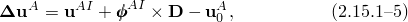 inside the center zone, and

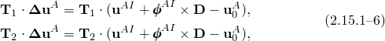outside the center zone; 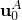 denotes the base state in the submodel.

General procedure to linear perturbation procedure for large-displacement theory:

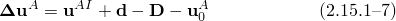 inside the center zone, and

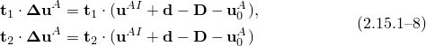outside the center zone, where 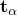 denotes the tangent vector. The exact formulation would require the use of the base state normal vector 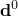 and the base state tangent vector 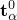. Since they are not available, Abaqus approximates them with the current normal vector *d* and current tangent vector .

Linear perturbation procedure to general procedure for small-displacement theory:

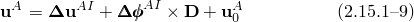inside the center zone, and

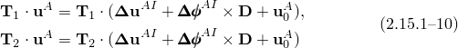outside the center zone;  denotes the base state in the submodel.

Linear perturbation procedure to general procedure for large-displacement theory:

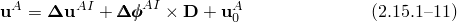inside the center zone, and

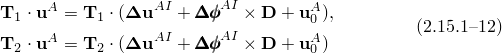outside the center zone. Since the base state is not available, an approximate form is used, where  is used in place of  and 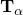 is used for . With the above assumptions cases 5 and 6 are governed by the same equations. The approximation will give good results for cases with a small base state rotation field in the global analysis.

Linear perturbation procedure to linear perturbation procedure for small-displacement theory:

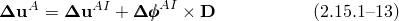inside the center zone, and

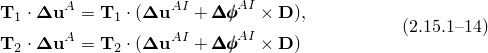outside the center zone.

Linear perturbation procedure to linear perturbation procedure for large-displacement theory:

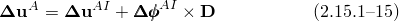inside the center zone, and

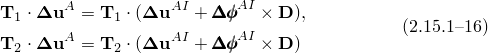outside the center zone. Since the base state is not available, *D* is used in place of  and  in place of . With the above assumptions cases 7 and 8 are governed by the same equations. The approximation will give good results for cases with a small base state rotation field in the global analysis.
### Surface-based submodeling

With the surface-based submodeling technique global model responses are used to prescribe fluxes on driven surfaces in the submodel. Currently this technique is limited to use with stresses, and the flux is a surface-applied traction.Interpolation procedure and tolerance checking

The interpolation procedure resembles that for node-based submodeling in solids. In the surface-based case, though, the positions of the submodel boundary surface integration points (the driven integration points) are determined with respect to the global model, and the appropriate element interpolation functions are used to obtain the values of the stress tensor at the given integration point. An "exterior tolerance," which the user can specify, is used to check whether it is valid to extrapolate values from the global model. In cases where the submodel falls outside the global model, the extrapolation is valid if the distance between the driven integration points and the free surface of the global model falls within the specified tolerance.Stress solution smoothing

After the locations of the driven integration points in the global mesh are determined, a prescribed stress at the integration point is interpolated from node-located stress values from the global model. These driving-node-located stresses are determined from the global model material point stress values through a patch recovery technique. In this technique the driving node stress is determined from a polynomial curve fit of stress results in adjacent elements. The effect of this recovery technique is a smoothing of the stress solution, as shown in [Figure 2.15.1&#8211;3](02s15a51.md).

Figure 2.15.1&#8211;3 Relation between global model element stress results and the patch recovery calculated stress field used for node-based interpolation.

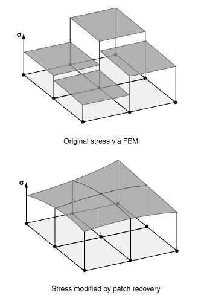

Because the driving node stress result is a function of the neighboring element stress results, the elements in the global model that contribute to the driving stress at a particular integration point extend beyond the global element encompassing the driven integration point. Consider the submodel driven surface shown in [Figure 2.15.1&#8211;4](02s15a51.md).

Figure 2.15.1&#8211;4 The extent of global elements contributing to a driving stress for integration points lying within a single global model element.

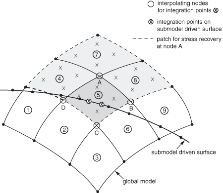Stresses at driven integration points in the center of the figure, those inside the darkly shaded element number 5, are interpolated from global model nodes A, B, C, and D. The figure illustrates, through the lighter shading of elements 1, 4, 5, and 8, the global element contribution to the stress calculated at node A. Considering the additional contributions of nodes B, C, and D, the complete set of elements contributing to the driven integration points found inside global element 5 is, therefore, all the elements shown in the figure.Surface traction determination

The submodel interpolation procedure locates global model stress results, 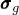, at the driven surface integration points. These stress results then define submodel tractions, , based on the current submodel surface normal, 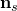:

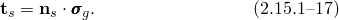In cases where inertia relief is employed in the submodel, a common case when the submodel is driven exclusively by global model stress results, the time evolution of the submodel surface normal will generally differ from the global model by a rigid body rotation. When this rotation discrepancy is large, this traction calculation can introduce significant errors in the submodel solution. See "Surface-based submodeling,"  Section 10.2.3 of the Abaqus Analysis User's Guide, for more information on identifying and addressing these cases where solution error may result.
### References

### References

"Submodeling: overview,"  Section 10.2.1 of the Abaqus Analysis User's Guide

"Node-based submodeling,"  Section 10.2.2 of the Abaqus Analysis User's Guide

"Surface-based submodeling,"  Section 10.2.3 of the Abaqus Analysis User's Guide