# 2.16.3 T-stress extraction

### 2.16.3 T-stress extraction

**Product: **Abaqus/Standard

The asymptotic expansion of the stress field near a sharp crack in a linear elastic body with respect to *r*, the distance from the crack tip, is

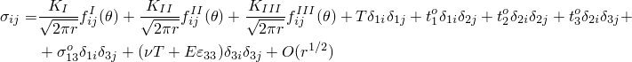([Williams, 1957](07s01a01-References.md)), where *r* and  are the in-plane polar coordinates centered at the crack tip. The local axes are defined so that the 1-axis lies in the plane of the crack at the point of interest on the crack front and is perpendicular to the crack front at this point; the 2-axis is normal to the plane of the crack (and thus is perpendicular to the crack front); and the 3-axis lies tangential to the crack front. 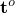 is the surface traction on the crack surfaces at the crack tip, and 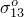 is a constant stress term for .  is the extensional strain along the crack front. In plane strain 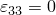; in plane stress the term 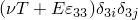 vanishes.

The *T*-stress represents a stress parallel to the crack faces. It is a useful quantity, not only in linear elastic crack analysis but also in elastic-plastic fracture studies.

The *T*-stress usually arises in the discussions of crack stability and kinking for linear elastic materials. For small amounts of crack growth under Mode I loading, a straight crack path has been shown to be stable when 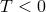, whereas the path will be unstable and, therefore, will deviate from being straight when 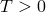 ([Cotterell and Rice, 1980](07s01a01-References.md)). A similar trend has been found in three-dimensional crack propagation studies by [Xu, Bower, and Ortiz (1994)](07s01a01-References.md). [Hutchinson and Suo (1992)](07s01a01-References.md) also showed how the advancing crack path is influenced by the *T*-stress once cracking initiates under mixed-mode loading. (The direction of crack initiation can be otherwise predicted using the criteria discussed in "Prediction of the direction of crack propagation,"  Section 2.16.4.)

The *T*-stress also plays an important role in elastic-plastic fracture analysis, even though the *T*-stress is calculated from the linear elastic material properties of the same solid containing the crack. The early study of [Larsson and Carlsson (1973)](07s01a01-References.md) demonstrated that the *T*-stress can have a significant effect on the plastic zone size and shape and that the small plastic zones in actual specimens can be predicted adequately by including the *T*-stress as a second crack-tip parameter. Some recent investigations ([Bilby et al., 1986](07s01a01-References.md); [Al-Ani and Hancock, 1991](07s01a01-References.md); [Betegn and Hancock, 1991](07s01a01-References.md); [Du and Hancock, 1991](07s01a01-References.md); [Parks, 1992](07s01a01-References.md); and [Wang, 1991](07s01a01-References.md)) further indicate that the *T*-stress can correlate well with the tensile stress triaxiality of elastic-plastic crack-tip fields. The important feature observed in these works is that a negative *T*-stress can reduce the magnitude of the tensile stress triaxiality (also called the hydrostatic tensile stress) ahead of a crack tip; the more negative the *T*-stress becomes, the greater the reduction of tensile stress triaxiality. In contrast, a positive *T*-stress results only in modest elevation of the stress triaxiality. It was found that when the tensile stress triaxiality is high, which is indicated by a positive *T*-stress, the crack-tip field can be described adequately by the HRR solution ([Hutchinson, 1968](07s01a01-References.md); [Rice and Rosengren, 1968](07s01a01-References.md)), scaled by a single parameter: the *J*-integral; that is, *J*-dominance will exist. When the tensile stress triaxiality is reduced (indicated by the *T*-stress becoming more negative), the crack-tip fields will quickly deviate from the HRR solution, and *J*-dominance will be lost (the asymptotic fields around the crack tip cannot be well characterized by the HRR fields). Thus, using the *T*-stress (calculated based on the load level and linear elastic material properties) to characterize the triaxiality of the crack-tip stress state and using the *J*-integral (calculated based on the actual elastic-plastic deformation field) to measure the scale of the crack-tip deformation provides a two-parameter fracture mechanics theory to describe the Mode I elastic-plastic crack-tip stresses and deformation in plane strain or three dimensions accurately over a wide range of crack configurations and loadings.

To extract the *T*-stress, we use an auxiliary solution of a line load, with magnitude *f*, applied in the plane of crack propagation and along the crack line:

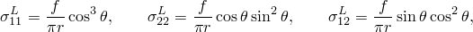

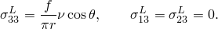The term 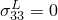 for plane stress.

The interaction integral used is exactly the same as that for extracting the stress intensity factors:

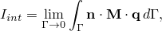with  as

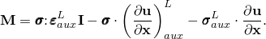

In the limit as , using the local asymptotic fields,

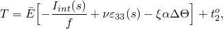where  and  for plane stress;  and 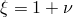 for plane strain, axisymmetry, and three dimensions;  is zero for plane strain and plane stress;  is the thermal expansion coefficient; and 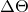 is the temperature difference.

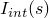 can be calculated by means of the same domain integral method used for *J*-integral calculation and the stress intensity factor extraction, which has been described in "J-integral evaluation,"  Section 2.16.1, and "Stress intensity factor extraction,"  Section 2.16.2.  is doubled if only half the structure is modeled.
### Reference

### Reference

"Contour integral evaluation,"  Section 11.4.2 of the Abaqus Analysis User's Guide